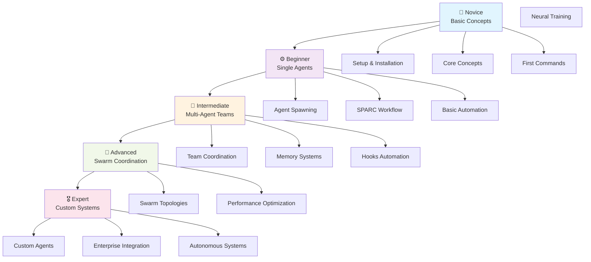
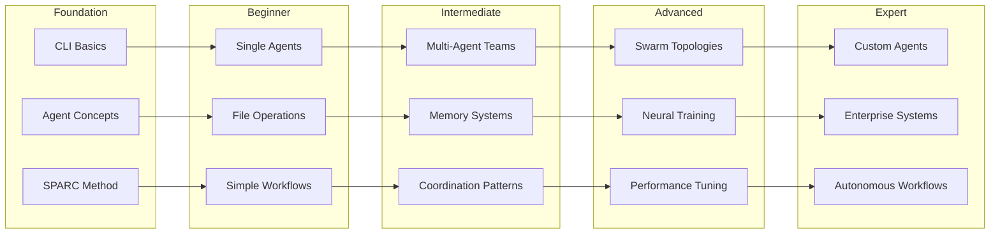
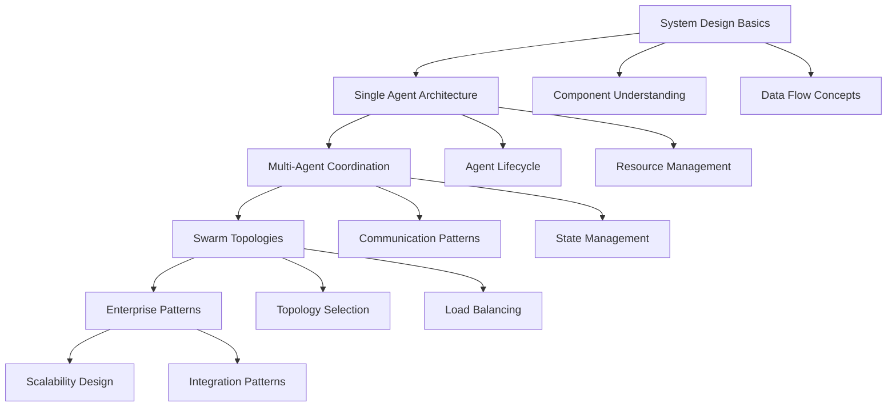
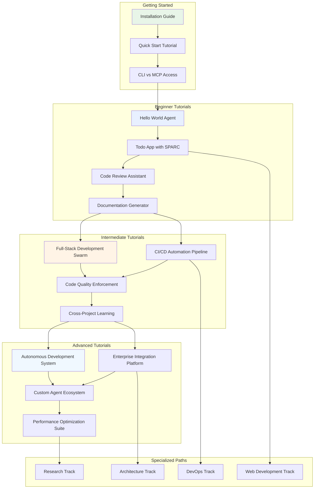

# Visual Learning Progression Map

## 🗺️ Your Journey from Novice to Expert

Master Claude Flow through our comprehensive visual learning progression system designed to guide you from first steps to expert mastery.

## 🎯 Learning Progression Overview



## 📊 Skill Dependency Tree

### Foundation Skills (Required for All Paths)
```
🏗️ Foundation Layer
├── Node.js Environment
├── Command Line Basics
├── Git Version Control
├── Text Editor/IDE
└── Basic Programming Concepts
```

### Technical Progression Paths

#### 🎯 Development Path


#### 🏗️ Architecture Path


## 🎮 Learning Milestone Maps

### Novice Level (0-2 weeks)
```
🌱 NOVICE MILESTONES
┌─────────────────────────────────────────┐
│ Week 1: Setup & First Steps             │
├─────────────────────────────────────────┤
│ ✅ Install Node.js and claude-flow-novice      │
│ ✅ Run first "Hello World" agent        │
│ ✅ Understand agent vs traditional code │
│ ✅ Complete CLI tutorial                │
│ ✅ Set up MCP integration (optional)    │
└─────────────────────────────────────────┘

┌─────────────────────────────────────────┐
│ Week 2: Core Concepts                   │
├─────────────────────────────────────────┤
│ ✅ Master SPARC methodology             │
│ ✅ Understand agent types & roles       │
│ ✅ Create first automation workflow     │
│ ✅ Use basic file operations            │
│ ✅ Complete novice assessment           │
└─────────────────────────────────────────┘
```

### Beginner Level (2-6 weeks)
```
⚙️ BEGINNER MILESTONES
┌─────────────────────────────────────────┐
│ Weeks 3-4: Single Agent Mastery        │
├─────────────────────────────────────────┤
│ ✅ Spawn specialized agents (5+ types)  │
│ ✅ Implement complete TDD workflow      │
│ ✅ Build a full project start-to-finish │
│ ✅ Master agent configuration options   │
│ ✅ Understand performance implications  │
└─────────────────────────────────────────┘

┌─────────────────────────────────────────┐
│ Weeks 5-6: Workflow Automation         │
├─────────────────────────────────────────┤
│ ✅ Create reusable workflow templates   │
│ ✅ Implement quality gates & validation │
│ ✅ Use hooks for automation             │
│ ✅ Build documentation generation       │
│ ✅ Complete beginner certification      │
└─────────────────────────────────────────┘
```

### Intermediate Level (6-12 weeks)
```
🔄 INTERMEDIATE MILESTONES
┌─────────────────────────────────────────┐
│ Weeks 7-9: Multi-Agent Coordination    │
├─────────────────────────────────────────┤
│ ✅ Coordinate 3+ agents simultaneously  │
│ ✅ Implement memory-driven workflows    │
│ ✅ Design appropriate swarm topologies  │
│ ✅ Build cross-project knowledge system │
│ ✅ Master agent communication patterns  │
└─────────────────────────────────────────┘

┌─────────────────────────────────────────┐
│ Weeks 10-12: Team Orchestration        │
├─────────────────────────────────────────┤
│ ✅ Lead full-stack development team     │
│ ✅ Implement CI/CD automation pipeline  │
│ ✅ Build multi-language project support │
│ ✅ Create custom coordination patterns  │
│ ✅ Complete intermediate certification  │
└─────────────────────────────────────────┘
```

### Advanced Level (12-20 weeks)
```
🚀 ADVANCED MILESTONES
┌─────────────────────────────────────────┐
│ Weeks 13-16: Swarm Architecture        │
├─────────────────────────────────────────┤
│ ✅ Design and implement custom topology │
│ ✅ Train neural agents for adaptation   │
│ ✅ Optimize performance for large teams │
│ ✅ Build autonomous decision systems    │
│ ✅ Implement enterprise integration     │
└─────────────────────────────────────────┘

┌─────────────────────────────────────────┐
│ Weeks 17-20: Expert Systems            │
├─────────────────────────────────────────┤
│ ✅ Create domain-specific agent types   │
│ ✅ Build self-healing workflows         │
│ ✅ Implement advanced monitoring        │
│ ✅ Design scalable architecture         │
│ ✅ Complete advanced certification      │
└─────────────────────────────────────────┘
```

### Expert Level (20+ weeks)
```
🎖️ EXPERT MILESTONES
┌─────────────────────────────────────────┐
│ Ongoing: Mastery & Innovation          │
├─────────────────────────────────────────┤
│ ✅ Contribute to claude-flow-novice ecosystem  │
│ ✅ Mentor other learners                │
│ ✅ Design novel coordination patterns   │
│ ✅ Lead enterprise implementations      │
│ ✅ Research new AI collaboration models │
└─────────────────────────────────────────┘
```

## 🧭 Tutorial Interconnection Map



## 🎯 Role-Based Learning Journeys

### 👨‍💻 Web Developer Journey
```
Phase 1: Foundation (2 weeks)
├── Basic CLI usage
├── Agent concepts for frontend/backend
├── SPARC for component development
└── Git integration with agents

Phase 2: Single-Stack Mastery (4 weeks)
├── React component generation
├── API development automation
├── Testing workflow setup
└── Deployment automation

Phase 3: Full-Stack Coordination (6 weeks)
├── Frontend-backend agent teams
├── Database integration patterns
├── API contract coordination
└── End-to-end testing

Phase 4: Production Systems (8 weeks)
├── Performance optimization
├── Security automation
├── Monitoring and alerting
└── Scalable architecture patterns
```

### 🔧 DevOps Engineer Journey
```
Phase 1: Infrastructure as Code (3 weeks)
├── CLI automation mastery
├── Configuration management
├── Environment provisioning
└── Security scanning

Phase 2: Pipeline Automation (5 weeks)
├── CI/CD agent orchestration
├── Testing pipeline coordination
├── Deployment automation
└── Rollback strategies

Phase 3: Monitoring & Operations (6 weeks)
├── Observability agent setup
├── Incident response automation
├── Performance monitoring
└── Capacity planning

Phase 4: Enterprise Operations (10 weeks)
├── Multi-environment management
├── Compliance automation
├── Disaster recovery
└── Cost optimization
```

### 🏗️ Software Architect Journey
```
Phase 1: System Design (4 weeks)
├── Architecture documentation
├── Design decision automation
├── Technology evaluation
└── Pattern recognition

Phase 2: Team Coordination (6 weeks)
├── Cross-team communication
├── Technical debt management
├── Code quality oversight
└── Performance analysis

Phase 3: Enterprise Architecture (8 weeks)
├── Microservices coordination
├── Integration pattern design
├── Scalability planning
└── Migration strategies

Phase 4: Innovation Leadership (12 weeks)
├── Research automation
├── Prototype development
├── Technology adoption
└── Industry trend analysis
```

## 📈 Competency Development Matrix

### Technical Competencies
| Skill Area | Novice | Beginner | Intermediate | Advanced | Expert |
|------------|--------|----------|--------------|----------|---------|
| **Agent Management** | Basic spawning | Multiple agents | Team coordination | Swarm orchestration | Custom architectures |
| **SPARC Methodology** | Understanding | Basic implementation | Advanced workflows | Custom processes | Methodology innovation |
| **Automation** | Simple tasks | Workflow creation | Complex pipelines | Autonomous systems | Self-evolving processes |
| **Coordination** | Single agent | Pair programming | Team management | Large-scale orchestration | Enterprise coordination |
| **Performance** | Basic monitoring | Optimization awareness | Bottleneck identification | Advanced tuning | Architecture design |

### Soft Skills Development
| Skill Area | Focus Areas | Development Methods |
|------------|-------------|-------------------|
| **Problem Solving** | Decomposition, pattern recognition | Project-based learning |
| **Communication** | Documentation, team coordination | Collaborative projects |
| **Leadership** | Technical mentoring, decision making | Community contributions |
| **Innovation** | Creative solutions, research | Advanced projects |
| **Adaptation** | New technologies, changing requirements | Continuous learning |

## 🎓 Learning Pathways by Time Investment

### ⚡ Fast Track (4-6 weeks)
**Perfect for**: Experienced developers needing quick productivity

```
Week 1-2: Core Concepts + Basic Automation
Week 3-4: Multi-Agent Coordination
Week 5-6: Production Implementation
```

**Key Projects**:
- Web app with full automation
- CI/CD pipeline setup
- Team coordination system

### 🚶 Steady Pace (12-16 weeks)
**Perfect for**: Developers wanting thorough understanding

```
Weeks 1-4: Foundation + Single Agents
Weeks 5-8: Team Coordination
Weeks 9-12: Advanced Patterns
Weeks 13-16: Specialization
```

**Key Projects**:
- Multiple technology stacks
- Complex workflow systems
- Custom agent development

### 🎯 Deep Dive (20+ weeks)
**Perfect for**: Architects and researchers

```
Weeks 1-6: Comprehensive Foundation
Weeks 7-12: Advanced Coordination
Weeks 13-18: Research & Innovation
Weeks 19+: Contribution & Leadership
```

**Key Projects**:
- Enterprise system design
- Research contributions
- Community leadership

## 🔄 Continuous Learning & Assessment

### Self-Assessment Tools
- **Skill checklists** for each level
- **Project portfolios** demonstrating competency
- **Peer review** processes
- **Community contributions** tracking

### Progress Tracking
- **Learning dashboard** with visual progress
- **Milestone completion** tracking
- **Competency mapping** against goals
- **Time investment** analysis

### Certification Paths
- **Novice Certificate**: Basic competency
- **Practitioner Certificate**: Production readiness
- **Architect Certificate**: Design leadership
- **Expert Certificate**: Community contribution

## 🚀 Next Steps

### Choose Your Starting Point
1. **Complete Beginner**: Start with [Installation Guide](installation/README.md)
2. **Some Experience**: Jump to [Quick Start](quick-start/README.md)
3. **Ready for Teams**: Begin [Multi-Agent Tutorials](../tutorials/intermediate/README.md)
4. **Advanced User**: Explore [Custom Systems](../tutorials/advanced/README.md)

### Assessment & Guidance
- Take our [Skill Assessment](../tutorials/skill-assessment.md)
- Get [Personalized Learning Plan](learning-plan-generator.md)
- Join [Community Discussions](../community/discussions/README.md)
- Find a [Learning Partner](../community/learning-groups.md)

---

**Your learning journey starts here!** Use this visual progression map to understand where you are and where you're going. Remember: every expert was once a beginner. 🌟