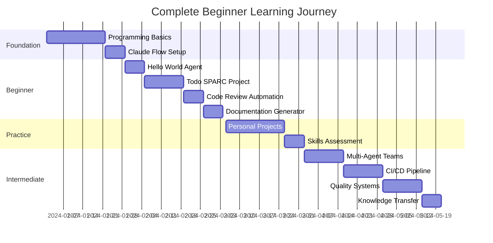
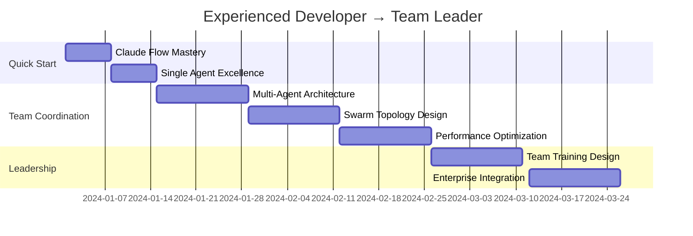
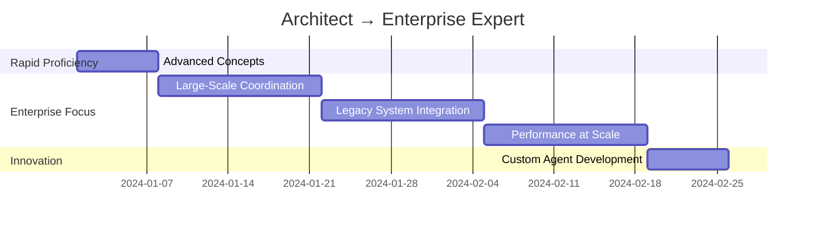

# Personalized Learning Plan Generator

## 🎯 Smart Learning Path Discovery

Answer a few questions to get a customized learning plan tailored to your experience, goals, and time availability.

## 🔍 Learning Assessment Wizard

### Step 1: Current Experience Level

#### Programming Experience
```
□ Complete Beginner (No programming experience)
□ Novice (Basic HTML/CSS/JS or similar)
□ Beginner (1-2 years, comfortable with one language)
□ Intermediate (3-5 years, multiple languages/frameworks)
□ Advanced (5+ years, architecture and system design)
□ Expert (10+ years, technical leadership)
```

#### AI/Automation Experience
```
□ Never used AI development tools
□ Used ChatGPT/Claude for coding help
□ Experience with GitHub Copilot or similar
□ Built automation scripts/workflows
□ Designed complex automation systems
□ Expert in AI-assisted development
```

#### Team/Leadership Experience
```
□ Individual contributor only
□ Occasional pair programming
□ Small team collaboration (2-3 people)
□ Team lead experience (4-6 people)
□ Department/multi-team leadership
□ Executive/strategic leadership
```

### Step 2: Learning Goals & Focus Areas

#### Primary Learning Objective
```
□ Personal productivity improvement
□ Team coordination and collaboration
□ Enterprise system integration
□ Research and innovation
□ Career advancement/certification
□ Teaching and mentoring others
```

#### Technology Focus (Select all that apply)
```
Frontend Development:
□ React/Vue/Angular
□ JavaScript/TypeScript
□ Mobile Development
□ UI/UX Automation

Backend Development:
□ Node.js/Python/Java
□ API Development
□ Database Design
□ Microservices

DevOps & Infrastructure:
□ CI/CD Pipelines
□ Cloud Platforms
□ Container Orchestration
□ Monitoring & Observability

Specialized Areas:
□ Machine Learning/AI
□ Data Science/Analytics
□ Security & Compliance
□ Performance Optimization
```

### Step 3: Time Commitment & Learning Style

#### Available Learning Time
```
□ 1-2 hours per week (Extended plan: 20-24 weeks)
□ 3-5 hours per week (Standard plan: 12-16 weeks)
□ 6-10 hours per week (Accelerated plan: 8-10 weeks)
□ 10+ hours per week (Intensive plan: 4-6 weeks)
```

#### Preferred Learning Style
```
□ Self-paced individual study
□ Structured group learning
□ Project-based hands-on
□ Mentorship and guidance
□ Mixed approach
```

#### Learning Environment
```
□ Personal projects and exploration
□ Work-related implementation
□ Academic/educational setting
□ Open source contributions
□ Community involvement
```

## 🎯 Generated Learning Plans

### Plan Type A: Complete Beginner → Productive User
**Profile**: New to programming and AI tools
**Timeline**: 16-20 weeks
**Time Investment**: 3-4 hours/week



**Detailed Roadmap**:
```
Phase 1: Foundation (4 weeks)
├── Week 1-3: Programming Fundamentals
│   ├── Choose language (JavaScript recommended)
│   ├── Basic syntax and concepts
│   ├── Development environment setup
│   └── Version control with Git
├── Week 4: Claude Flow Introduction
│   ├── Installation and configuration
│   ├── First agent interaction
│   ├── CLI vs MCP access methods
│   └── Basic command understanding

Phase 2: Beginner Skills (5 weeks)
├── Week 5: Hello World Agent
│   ├── Agent spawning basics
│   ├── Simple task automation
│   ├── Understanding agent responses
│   └── Troubleshooting common issues
├── Week 6-7: Todo SPARC Project
│   ├── SPARC methodology introduction
│   ├── Specification and design
│   ├── Implementation with agents
│   └── Testing and refinement
├── Week 8: Code Review Automation
│   ├── Quality assessment concepts
│   ├── Automated review workflows
│   ├── Integration with development
│   └── Continuous improvement
├── Week 9: Documentation Generator
│   ├── Documentation best practices
│   ├── Automated generation
│   ├── Maintenance workflows
│   └── Team collaboration

Phase 3: Practice & Assessment (4 weeks)
├── Week 10-12: Personal Projects
│   ├── Choose 2-3 practice projects
│   ├── Apply learned concepts
│   ├── Build portfolio
│   └── Get community feedback
├── Week 13: Skills Assessment
│   ├── Self-evaluation checklist
│   ├── Practical skill demonstration
│   ├── Gap identification
│   └── Next steps planning

Phase 4: Intermediate Introduction (4 weeks)
├── Week 14-15: Multi-Agent Teams
│   ├── Coordination concepts
│   ├── Team topology selection
│   ├── Communication patterns
│   └── Conflict resolution
├── Week 16-17: CI/CD Pipeline
│   ├── Automation principles
│   ├── Pipeline design
│   ├── Integration patterns
│   └── Monitoring and alerting
├── Week 18-19: Quality Systems
│   ├── Multi-layer quality
│   ├── Automated testing
│   ├── Security scanning
│   └── Performance monitoring
├── Week 20: Knowledge Transfer
│   ├── Learning documentation
│   ├── Best practices sharing
│   ├── Community contribution
│   └── Mentoring preparation
```

### Plan Type B: Experienced Developer → Team Leader
**Profile**: 3-5 years programming, team coordination focus
**Timeline**: 8-12 weeks
**Time Investment**: 6-8 hours/week



### Plan Type C: Architect → Enterprise Expert
**Profile**: Senior architect, enterprise integration focus
**Timeline**: 6-8 weeks
**Time Investment**: 8-10 hours/week



## 📊 Progress Tracking Dashboard

### Learning Metrics Visualization
```
Current Progress: [████████░░] 80%

Completed Milestones:
✅ Environment Setup
✅ Basic Agent Spawning
✅ SPARC Methodology
✅ Multi-Agent Coordination
🔄 Performance Optimization (In Progress)
⏳ Enterprise Integration (Upcoming)

Skill Development:
┌─────────────────────────────────────┐
│ Agent Management    [██████████] 95%│
│ SPARC Workflows     [████████░░] 85%│
│ Team Coordination   [██████░░░░] 70%│
│ Performance Tuning  [████░░░░░░] 45%│
│ Enterprise Systems  [██░░░░░░░░] 25%│
└─────────────────────────────────────┘

Next Recommended Actions:
1. Complete Performance Optimization tutorial
2. Join intermediate study group
3. Start practice project: "E-commerce Platform"
4. Schedule mentor session for guidance
```

### Weekly Learning Schedule Template
```
WEEK [X] SCHEDULE: Multi-Agent Coordination

Monday (2 hours):
├── 📚 Read: Multi-Agent Coordination Concepts
├── 🎥 Watch: Topology Selection Video Tutorial
└── 📝 Notes: Key concepts and questions

Wednesday (2 hours):
├── 💻 Hands-on: Tutorial 1 - Full-Stack Team Setup
├── 🔍 Practice: Agent spawning and coordination
└── 🤝 Community: Ask questions in forum

Friday (2 hours):
├── 🚀 Project: Apply concepts to personal project
├── 🧪 Experiment: Try different topologies
└── 📊 Reflect: Document learnings and insights

Weekend (Optional 1-2 hours):
├── 🎮 Challenge: Weekly coding challenge
├── 🤝 Social: Study group session
└── 📚 Extra: Explore advanced topics
```

## 🎯 Adaptive Learning Recommendations

### Based on Learning Style Preferences

#### Visual Learners
- Priority on diagram-rich tutorials
- Video content emphasis
- Interactive visualizations
- Mind maps and flowcharts
- Screenshot-heavy guides

#### Hands-On Learners
- Project-based progression
- Immediate practical application
- Experimentation encouragement
- Trial-and-error approach
- Real-world scenario focus

#### Theory-First Learners
- Concept-heavy introduction
- Architecture understanding
- Best practices emphasis
- Research and documentation
- Structured logical progression

#### Social Learners
- Study group participation
- Mentorship matching
- Community involvement
- Peer review emphasis
- Collaborative projects

### Based on Career Goals

#### Individual Contributor Excellence
```
Focus Areas:
├── Personal productivity maximization
├── Code quality automation
├── Advanced problem-solving
└── Technical specialization

Recommended Path:
├── Beginner: Focus on automation workflows
├── Intermediate: Master single-agent patterns
├── Advanced: Custom agent development
└── Expert: Innovation and specialization
```

#### Team Leadership Development
```
Focus Areas:
├── Multi-agent coordination
├── Team workflow optimization
├── Training and mentoring
└── Strategic implementation

Recommended Path:
├── Beginner: Solid foundation building
├── Intermediate: Team coordination mastery
├── Advanced: Large-scale orchestration
└── Expert: Organizational transformation
```

#### Enterprise Architecture
```
Focus Areas:
├── System integration patterns
├── Scalability and performance
├── Security and compliance
└── Migration strategies

Recommended Path:
├── Intermediate: Skip beginner if experienced
├── Advanced: Focus on enterprise tutorials
├── Expert: Custom architecture development
└── Master: Industry leadership
```

## 🔄 Plan Adaptation & Refinement

### Progress Review Checkpoints
- **Week 4**: Foundation assessment and plan adjustment
- **Week 8**: Skill evaluation and path refinement
- **Week 12**: Goal alignment and next phase planning
- **Week 16**: Career objective review and specialization

### Plan Modification Triggers
- **Faster Progress**: Accelerate timeline, add advanced topics
- **Slower Progress**: Extend timeline, add support resources
- **Interest Shift**: Adjust focus areas, change specialization
- **Career Change**: Realign with new objectives

### Success Metrics & KPIs
```
Technical Proficiency:
├── Tutorial completion rate (target: >90%)
├── Assessment scores (target: >85%)
├── Project complexity progression
└── Community contribution level

Practical Application:
├── Real-world implementation success
├── Team productivity improvements
├── Problem-solving effectiveness
└── Innovation and creativity

Professional Growth:
├── Career advancement progress
├── Skill recognition and validation
├── Leadership opportunities
└── Industry contribution
```

## 🚀 Getting Started with Your Personalized Plan

### Immediate Next Steps
1. **Complete Assessment**: Answer all evaluation questions
2. **Review Generated Plan**: Understand timeline and commitments
3. **Set Up Environment**: Install tools and access resources
4. **Join Community**: Connect with study groups and mentors
5. **Start Learning**: Begin with first milestone

### Ongoing Support
- **Weekly Check-ins**: Progress review and plan adjustment
- **Monthly Mentoring**: Expert guidance and career advice
- **Quarterly Assessment**: Skills validation and goal alignment
- **Annual Planning**: Long-term career and learning strategy

---

**Ready to start your personalized learning journey?** Use the assessment above to generate your custom plan and begin mastering AI-assisted development at your own pace! 🎯