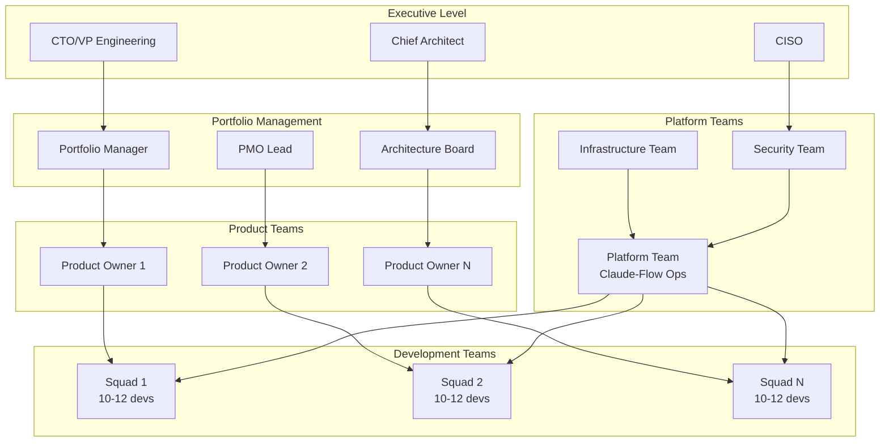
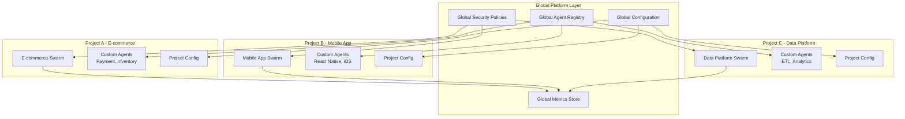
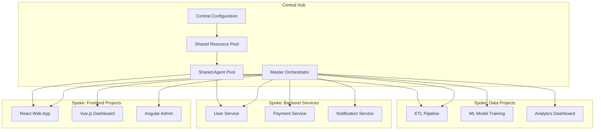
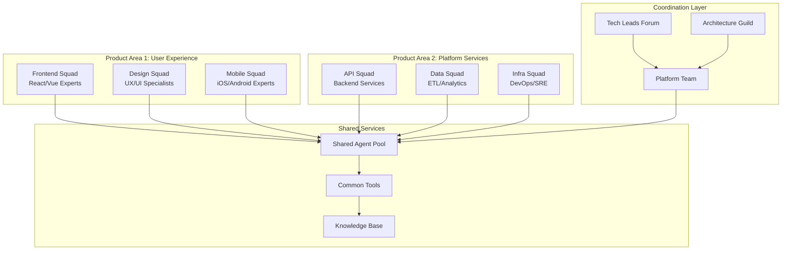

# Multi-Project Coordination and Governance

## Overview

As organizations scale claude-flow across multiple projects and teams, robust governance and coordination mechanisms become critical. This document outlines proven patterns for managing complex multi-project environments with 100+ developers.

## Governance Framework

### 1. Organizational Structure



### 2. Decision Rights Matrix (RACI)

| Decision Type | Platform Team | Architecture Board | Product Owners | Dev Teams |
|---------------|---------------|-------------------|----------------|-----------|
| Technology Stack | R | A | C | I |
| Architecture Patterns | C | R/A | I | C |
| Agent Templates | R/A | C | I | C |
| Security Policies | C | C | I | R |
| Performance SLAs | R | A | C | I |
| Resource Allocation | A | C | R | I |
| Release Cadence | C | C | R/A | I |

**Legend**: R=Responsible, A=Accountable, C=Consulted, I=Informed

## Multi-Project Architecture Patterns

### 1. Federated Architecture



### 2. Hub-and-Spoke Model



## Project Coordination Mechanisms

### 1. Cross-Project Dependencies

```yaml
# Project Dependency Configuration
dependencies:
  upstream:
    - project: "user-service"
      artifacts: ["api-schema", "client-library"]
      version: "^2.1.0"
    - project: "design-system"
      artifacts: ["component-library", "tokens"]
      version: "^1.5.0"

  downstream:
    - project: "mobile-app"
      consumes: ["rest-api", "websocket-events"]
    - project: "analytics-dashboard"
      consumes: ["user-events", "metrics"]

coordination:
  sync_meetings:
    frequency: "weekly"
    participants: ["tech-leads", "product-owners"]

  shared_channels:
    slack: "#project-coordination"
    teams: "Project Dependencies"

  automation:
    dependency_checks: true
    breaking_change_alerts: true
    cross_project_testing: true
```

### 2. Agent Sharing Policies

```typescript
interface AgentSharingPolicy {
  // Global shared agents available to all projects
  globalAgents: {
    "security-auditor": {
      quota: "unlimited",
      priority: "high",
      sla: "99.9%"
    },
    "performance-analyzer": {
      quota: "50/hour",
      priority: "medium",
      sla: "99.5%"
    }
  };

  // Project-specific agents with sharing rules
  projectAgents: {
    "e-commerce/payment-processor": {
      shareWith: ["mobile-app", "admin-dashboard"],
      restrictions: ["no-test-data", "audit-required"]
    },
    "mobile/push-notification": {
      shareWith: ["web-app"],
      conditions: ["same-team-only"]
    }
  };

  // Resource allocation rules
  resourceLimits: {
    perProject: {
      cpu: "100 cores",
      memory: "500GB",
      agents: "1000/hour"
    },
    perTeam: {
      cpu: "20 cores",
      memory: "100GB",
      agents: "200/hour"
    }
  };
}
```

### 3. Configuration Management

```yaml
# Global Configuration Template
global:
  claude_flow:
    version: "2.0.0"
    registry: "enterprise.registry.com"

  security:
    auth_provider: "enterprise-sso"
    encryption: "AES-256"
    audit_logging: true

  monitoring:
    metrics_endpoint: "https://metrics.company.com"
    logging_level: "INFO"
    tracing: true

# Project-Level Overrides
projects:
  e-commerce:
    security:
      audit_logging: "detailed"  # Override for PCI compliance

    performance:
      sla_targets:
        response_time: "100ms"
        throughput: "10000 rps"

    agents:
      custom_types:
        - "payment-processor"
        - "inventory-manager"
        - "fraud-detector"

  mobile-app:
    security:
      device_restrictions: true  # Mobile-specific security

    performance:
      sla_targets:
        response_time: "200ms"
        battery_impact: "minimal"

    agents:
      custom_types:
        - "react-native-builder"
        - "ios-simulator"
        - "android-emulator"
```

## Cross-Team Collaboration Patterns

### 1. Squad-of-Squads Model



### 2. Cross-Functional Agent Teams

```yaml
# Cross-functional team composition for major features
feature_teams:
  checkout_redesign:
    duration: "8 weeks"
    members:
      - role: "product_owner"
        person: "sarah.johnson@company.com"
      - role: "tech_lead"
        person: "mike.chen@company.com"
      - role: "frontend_dev"
        count: 2
      - role: "backend_dev"
        count: 2
      - role: "qa_engineer"
        count: 1

    claude_flow_config:
      dedicated_agents:
        - "e-commerce-specialist"
        - "payment-security-auditor"
        - "performance-optimizer"

      shared_resources:
        cpu_quota: "50 cores"
        memory_quota: "200GB"
        agent_hours: "2000/week"

      integration_points:
        - project: "payment-service"
          sync_frequency: "daily"
        - project: "user-service"
          sync_frequency: "weekly"

  mobile_app_v2:
    duration: "12 weeks"
    members:
      - role: "product_owner"
        person: "alex.rivera@company.com"
      - role: "mobile_architect"
        person: "priya.patel@company.com"
      - role: "ios_dev"
        count: 2
      - role: "android_dev"
        count: 2
      - role: "qa_automation"
        count: 1

    claude_flow_config:
      dedicated_agents:
        - "react-native-expert"
        - "mobile-performance-analyst"
        - "app-store-optimizer"

      ci_cd_integration:
        ios_pipeline: "fastlane-ios"
        android_pipeline: "gradle-android"
        testing_devices: ["iPhone-14", "Pixel-6", "iPad-Pro"]
```

## Governance Automation

### 1. Policy as Code

```typescript
// Enterprise governance policies
export const governancePolicies = {
  // Security policies
  security: {
    required_approvals: {
      security_changes: ["security-team"],
      external_dependencies: ["architecture-board"],
      data_access: ["data-governance-team"]
    },

    automated_checks: {
      vulnerability_scanning: true,
      license_compliance: true,
      secret_detection: true,
      dependency_audit: true
    }
  },

  // Quality gates
  quality: {
    code_coverage: {
      minimum: 80,
      critical_paths: 95
    },

    performance: {
      api_response_time: "< 200ms",
      page_load_time: "< 2s",
      memory_usage: "< 500MB"
    },

    documentation: {
      api_docs: "required",
      architecture_decisions: "required",
      runbooks: "required"
    }
  },

  // Compliance requirements
  compliance: {
    data_handling: {
      pii_encryption: "required",
      audit_logging: "enabled",
      retention_policy: "7_years"
    },

    change_management: {
      approval_workflow: "enabled",
      rollback_plan: "required",
      impact_assessment: "required"
    }
  }
};

// Automated policy enforcement
export class PolicyEnforcer {
  async validateProject(project: Project): Promise<PolicyResult> {
    const results = await Promise.all([
      this.checkSecurityCompliance(project),
      this.validateQualityGates(project),
      this.verifyComplianceRequirements(project)
    ]);

    return this.aggregateResults(results);
  }

  async enforcePolicy(violation: PolicyViolation): Promise<void> {
    switch (violation.severity) {
      case 'critical':
        await this.blockDeployment(violation);
        await this.notifyStakeholders(violation);
        break;
      case 'high':
        await this.requireApproval(violation);
        break;
      case 'medium':
        await this.createRemediationTask(violation);
        break;
    }
  }
}
```

### 2. Automated Compliance Monitoring

```yaml
# Compliance monitoring configuration
compliance_monitoring:
  schedule: "continuous"

  checks:
    security:
      - name: "Vulnerability Assessment"
        frequency: "daily"
        tools: ["snyk", "sonarqube"]
        thresholds:
          critical: 0
          high: 5
          medium: 20

      - name: "License Compliance"
        frequency: "weekly"
        tools: ["fossa", "whitesource"]
        allowed_licenses: ["MIT", "Apache-2.0", "BSD-3-Clause"]

    quality:
      - name: "Code Quality"
        frequency: "per-commit"
        tools: ["sonarqube", "codeclimate"]
        thresholds:
          maintainability: "A"
          reliability: "A"
          security: "A"

      - name: "Performance Regression"
        frequency: "per-deployment"
        tools: ["lighthouse", "webpagetest"]
        thresholds:
          performance_score: 90
          accessibility_score: 95

    operational:
      - name: "SLA Compliance"
        frequency: "hourly"
        metrics: ["uptime", "response_time", "error_rate"]
        thresholds:
          uptime: 99.9
          response_time: 200
          error_rate: 0.1

  reporting:
    dashboards:
      - "Executive Dashboard"
      - "Engineering Metrics"
      - "Compliance Status"

    alerts:
      critical: ["slack", "pagerduty", "email"]
      high: ["slack", "email"]
      medium: ["email"]

    cadence:
      executive: "monthly"
      engineering: "weekly"
      compliance: "quarterly"
```

## Resource Management

### 1. Capacity Planning

```typescript
interface CapacityPlan {
  current_state: {
    teams: number;
    projects: number;
    developers: number;
    agent_hours_per_week: number;
    infrastructure_cost: number;
  };

  projected_growth: {
    timeframe: "6_months" | "1_year" | "2_years";
    team_growth_rate: number;
    project_growth_rate: number;
    complexity_increase: number;
  };

  resource_requirements: {
    compute: {
      cpu_cores: number;
      memory_gb: number;
      storage_tb: number;
    };

    networking: {
      bandwidth_gbps: number;
      cdn_regions: string[];
    };

    human_resources: {
      platform_engineers: number;
      devops_engineers: number;
      security_specialists: number;
    };
  };
}

// Capacity planning automation
export class CapacityPlanner {
  async generatePlan(organization: Organization): Promise<CapacityPlan> {
    const currentMetrics = await this.gatherCurrentMetrics(organization);
    const growthProjections = await this.projectGrowth(currentMetrics);
    const resourceNeeds = await this.calculateResourceNeeds(growthProjections);

    return {
      current_state: currentMetrics,
      projected_growth: growthProjections,
      resource_requirements: resourceNeeds
    };
  }

  async optimizeResources(plan: CapacityPlan): Promise<OptimizationRecommendations> {
    return {
      immediate_actions: [
        "Implement agent pooling to reduce cold start overhead",
        "Enable auto-scaling for non-critical workloads",
        "Consolidate underutilized environments"
      ],

      medium_term: [
        "Migrate to spot instances for development workloads",
        "Implement intelligent workload scheduling",
        "Add regional deployment for global teams"
      ],

      long_term: [
        "Consider multi-cloud strategy for vendor diversity",
        "Invest in edge computing for latency-sensitive workloads",
        "Develop custom silicon for AI workloads"
      ]
    };
  }
}
```

### 2. Cost Allocation and Chargeback

```yaml
# Cost allocation model
cost_allocation:
  methodology: "activity_based_costing"

  cost_centers:
    - name: "Platform Operations"
      allocation_basis: "equal_distribution"
      percentage: 20

    - name: "Development Teams"
      allocation_basis: "usage_based"
      percentage: 60
      metrics:
        - "agent_hours"
        - "compute_usage"
        - "storage_usage"

    - name: "Shared Services"
      allocation_basis: "fair_share"
      percentage: 20

  chargeback_model:
    frequency: "monthly"

    pricing_tiers:
      development:
        agent_hour: 0.50
        cpu_hour: 0.05
        gb_memory_hour: 0.01
        gb_storage_month: 0.10

      staging:
        agent_hour: 0.75
        cpu_hour: 0.08
        gb_memory_hour: 0.015
        gb_storage_month: 0.15

      production:
        agent_hour: 1.00
        cpu_hour: 0.10
        gb_memory_hour: 0.02
        gb_storage_month: 0.20

    budgets:
      per_team_monthly: 10000
      per_project_monthly: 5000
      overage_threshold: 20

    optimization_incentives:
      cost_reduction_bonus: 10
      efficiency_improvement_bonus: 15
      resource_sharing_bonus: 5
```

## Success Metrics and KPIs

### 1. Engineering Productivity

```yaml
productivity_metrics:
  development_velocity:
    - name: "Story Points per Sprint"
      target: 80
      measurement: "avg_per_team"

    - name: "Lead Time"
      target: "< 5 days"
      measurement: "p90"

    - name: "Deployment Frequency"
      target: "> 10 per week"
      measurement: "per_team"

  quality_metrics:
    - name: "Defect Escape Rate"
      target: "< 2%"
      measurement: "production_defects/total_stories"

    - name: "Test Coverage"
      target: "> 85%"
      measurement: "line_coverage"

    - name: "Technical Debt Ratio"
      target: "< 15%"
      measurement: "sonarqube_debt_ratio"

  collaboration_metrics:
    - name: "Cross-team Dependencies"
      target: "< 20%"
      measurement: "dependencies/total_stories"

    - name: "Knowledge Sharing Sessions"
      target: "> 2 per month"
      measurement: "per_team"

    - name: "Documentation Currency"
      target: "> 90%"
      measurement: "updated_last_30_days"
```

### 2. Platform Performance

```yaml
platform_metrics:
  availability:
    - name: "Platform Uptime"
      target: "99.9%"
      sla: true

    - name: "Agent Spawn Success Rate"
      target: "99.5%"
      measurement: "successful_spawns/total_requests"

  performance:
    - name: "Agent Response Time"
      target: "< 100ms"
      measurement: "p95"

    - name: "Task Completion Time"
      target: "< 30 minutes"
      measurement: "p90"

    - name: "Resource Utilization"
      target: "70-85%"
      measurement: "avg_cpu_memory"

  scalability:
    - name: "Concurrent Users"
      target: "1000+"
      peak_capacity: true

    - name: "Agent Capacity"
      target: "10000+ agents/hour"
      burst_capacity: true

    - name: "Cross-region Latency"
      target: "< 50ms"
      measurement: "p95"
```

## Implementation Roadmap

### Phase 1: Foundation (Months 1-3)
- Establish governance framework
- Implement basic multi-project support
- Set up monitoring and alerting
- Create standard operating procedures

### Phase 2: Scale (Months 4-6)
- Deploy federated architecture
- Implement resource sharing
- Automate compliance checking
- Establish cost allocation

### Phase 3: Optimize (Months 7-9)
- Advanced performance tuning
- Predictive capacity planning
- Cross-team workflow optimization
- Self-service capabilities

### Phase 4: Innovation (Months 10-12)
- AI-driven optimization
- Advanced analytics and insights
- Experimental feature rollouts
- Industry best practice adoption

## Related Documentation

- [Enterprise Security Framework](../security/enterprise-security-framework.md)
- [Team Scaling Strategies](../team-coordination/team-scaling-strategies.md)
- [Cost Management Guide](../cost-optimization/enterprise-cost-management.md)
- [Performance Monitoring](../monitoring/enterprise-observability.md)