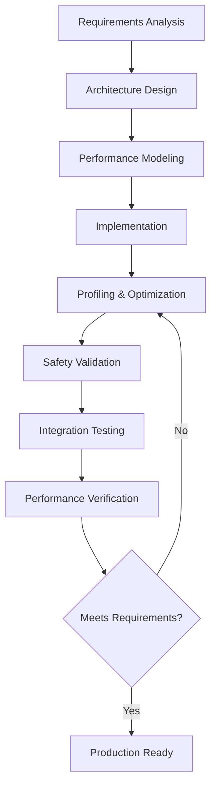

# Systems Programming with Claude-Flow

This guide demonstrates how to leverage claude-flow for high-performance systems programming in Rust, utilizing real toolchain integration and agent coordination for building low-level, performance-critical applications.

## 🎯 Systems Programming Overview

Systems programming in Rust focuses on building foundational software with strict performance, safety, and resource constraints. Claude-flow provides specialized agents and workflows for this domain.

### Key Characteristics
- **Memory Safety**: Zero-cost abstractions without garbage collection
- **Performance**: Predictable performance with minimal overhead
- **Concurrency**: Fearless parallelism and async programming
- **Interoperability**: FFI with C/C++ and system APIs
- **Resource Control**: Precise memory and resource management

## 🚀 Quick Start: Systems Projects

### 1. High-Performance Network Server

```bash
# Initialize systems programming project
npx claude-flow sparc run architect "Create a high-throughput TCP proxy server with load balancing"

# This spawns specialized agents:
Task("Systems Architect", "Design async TCP proxy architecture with tokio", "systems-architect")
Task("Performance Engineer", "Optimize hot paths and memory allocation", "performance-optimizer")
Task("Network Specialist", "Implement connection pooling and load balancing", "network-engineer")
Task("Security Engineer", "Add rate limiting and DDoS protection", "security-manager")
```

**Generated Project Structure:**
```
tcp-proxy/
├── Cargo.toml
├── src/
│   ├── main.rs
│   ├── proxy/
│   │   ├── mod.rs
│   │   ├── server.rs
│   │   ├── pool.rs
│   │   └── balancer.rs
│   ├── network/
│   │   ├── mod.rs
│   │   ├── tcp.rs
│   │   └── connection.rs
│   ├── monitoring/
│   │   ├── mod.rs
│   │   └── metrics.rs
│   └── config/
│       ├── mod.rs
│       └── settings.rs
├── benches/
│   └── proxy_bench.rs
└── tests/
    └── integration/
        └── proxy_tests.rs
```

### 2. Memory Pool Allocator

```bash
# Create custom allocator system
npx claude-flow sparc run architect "Build a zero-allocation memory pool for real-time systems"

Task("Memory Engineer", "Design lock-free memory pool with NUMA awareness", "memory-specialist")
Task("Performance Engineer", "Optimize allocation patterns and fragmentation", "performance-optimizer")
Task("Safety Engineer", "Ensure memory safety without runtime overhead", "safety-engineer")
```

### 3. Operating System Component

```bash
# Build OS-level component
npx claude-flow sparc run architect "Create a kernel module interface for high-speed packet processing"

Task("Kernel Engineer", "Design safe kernel interface with minimal syscalls", "kernel-specialist")
Task("Driver Developer", "Implement userspace-kernel communication", "driver-developer")
Task("Performance Engineer", "Optimize kernel-userspace data transfer", "performance-optimizer")
```

## 🔧 Agent Coordination for Systems Programming

### Hierarchical Agent Architecture

```rust
// Multi-agent coordination for systems development
mcp__claude-flow__swarm_init({
  topology: "hierarchical",
  coordinator: "systems-architect",
  maxAgents: 6,
  strategy: "performance-first"
})

// Specialized systems programming agents
Task("Systems Architect", "Design overall system architecture with performance constraints", "systems-architect")
Task("Memory Engineer", "Implement custom allocators and memory management", "memory-specialist")
Task("Concurrency Engineer", "Design lock-free data structures and async patterns", "concurrency-specialist")
Task("Performance Engineer", "Profile, benchmark, and optimize critical paths", "performance-optimizer")
Task("Safety Engineer", "Validate memory safety and eliminate undefined behavior", "safety-engineer")
Task("Integration Engineer", "Handle FFI, system calls, and platform-specific code", "integration-specialist")

// Shared performance targets
mcp__claude-flow__memory_store({
  key: "systems/performance-requirements",
  data: {
    latency: "< 100µs p99",
    throughput: "> 1M ops/sec",
    memory: "Zero allocations in hot path",
    cpu: "< 5% CPU overhead",
    safety: "No unsafe code without formal verification"
  },
  scope: "project"
})
```

### Performance-First Development Process



## 🏗️ Core Systems Programming Patterns

### 1. Zero-Cost Abstractions

```rust
// Agent-designed type-safe abstractions with zero runtime cost
use std::marker::PhantomData;
use std::ptr::NonNull;

// Type-state pattern for compile-time state validation
pub struct TcpConnection<State> {
    socket: std::net::TcpStream,
    buffer: Box<[u8; 4096]>,
    _state: PhantomData<State>,
}

// Connection states
pub struct Disconnected;
pub struct Connected;
pub struct Authenticated;
pub struct Encrypted;

impl TcpConnection<Disconnected> {
    pub fn new() -> Self {
        Self {
            socket: unsafe { std::mem::zeroed() }, // Will be properly initialized
            buffer: Box::new([0; 4096]),
            _state: PhantomData,
        }
    }

    pub async fn connect(self, addr: std::net::SocketAddr) -> Result<TcpConnection<Connected>, ConnectionError> {
        let socket = std::net::TcpStream::connect(addr)?;
        Ok(TcpConnection {
            socket,
            buffer: self.buffer,
            _state: PhantomData,
        })
    }
}

impl TcpConnection<Connected> {
    pub async fn authenticate(self, credentials: &[u8]) -> Result<TcpConnection<Authenticated>, AuthError> {
        // Authentication logic
        self.socket.write_all(credentials)?;
        let mut response = [0u8; 256];
        let n = self.socket.read(&mut response)?;

        if verify_auth_response(&response[..n]) {
            Ok(TcpConnection {
                socket: self.socket,
                buffer: self.buffer,
                _state: PhantomData,
            })
        } else {
            Err(AuthError::InvalidCredentials)
        }
    }

    pub async fn enable_encryption(self) -> Result<TcpConnection<Encrypted>, CryptoError> {
        // TLS handshake logic
        Ok(TcpConnection {
            socket: self.socket,
            buffer: self.buffer,
            _state: PhantomData,
        })
    }
}

impl TcpConnection<Authenticated> {
    pub async fn send_data(&mut self, data: &[u8]) -> Result<(), std::io::Error> {
        self.socket.write_all(data)
    }
}

impl TcpConnection<Encrypted> {
    pub async fn send_encrypted(&mut self, data: &[u8]) -> Result<(), CryptoError> {
        let encrypted = encrypt_data(data)?;
        self.socket.write_all(&encrypted)?;
        Ok(())
    }
}

// Generic processing pipeline with zero runtime cost
trait DataProcessor {
    type Input;
    type Output;
    type Error;

    fn process(&self, input: Self::Input) -> Result<Self::Output, Self::Error>;
}

// Compile-time pipeline composition
struct ProcessingPipeline<P1, P2, P3> {
    stage1: P1,
    stage2: P2,
    stage3: P3,
}

impl<P1, P2, P3> ProcessingPipeline<P1, P2, P3>
where
    P1: DataProcessor,
    P2: DataProcessor<Input = P1::Output>,
    P3: DataProcessor<Input = P2::Output>,
{
    pub fn new(stage1: P1, stage2: P2, stage3: P3) -> Self {
        Self { stage1, stage2, stage3 }
    }

    pub fn process(&self, input: P1::Input) -> Result<P3::Output, PipelineError> {
        let intermediate1 = self.stage1.process(input)?;
        let intermediate2 = self.stage2.process(intermediate1)?;
        let output = self.stage3.process(intermediate2)?;
        Ok(output)
    }
}
```

### 2. Lock-Free Data Structures

```rust
// High-performance concurrent data structures
use std::sync::atomic::{AtomicPtr, AtomicUsize, Ordering};
use std::ptr::NonNull;

// Lock-free queue for inter-thread communication
pub struct LockFreeQueue<T> {
    head: AtomicPtr<Node<T>>,
    tail: AtomicPtr<Node<T>>,
    size: AtomicUsize,
}

struct Node<T> {
    data: Option<T>,
    next: AtomicPtr<Node<T>>,
}

impl<T> LockFreeQueue<T> {
    pub fn new() -> Self {
        let dummy = Box::into_raw(Box::new(Node {
            data: None,
            next: AtomicPtr::new(std::ptr::null_mut()),
        }));

        Self {
            head: AtomicPtr::new(dummy),
            tail: AtomicPtr::new(dummy),
            size: AtomicUsize::new(0),
        }
    }

    pub fn enqueue(&self, data: T) {
        let new_node = Box::into_raw(Box::new(Node {
            data: Some(data),
            next: AtomicPtr::new(std::ptr::null_mut()),
        }));

        loop {
            let tail = self.tail.load(Ordering::Acquire);
            let next = unsafe { (*tail).next.load(Ordering::Acquire) };

            if next.is_null() {
                // Try to link new node at the end of the queue
                if unsafe { (*tail).next.compare_exchange_weak(
                    std::ptr::null_mut(),
                    new_node,
                    Ordering::Release,
                    Ordering::Relaxed
                ).is_ok() } {
                    // Successfully linked, now move tail pointer
                    let _ = self.tail.compare_exchange_weak(
                        tail,
                        new_node,
                        Ordering::Release,
                        Ordering::Relaxed
                    );
                    break;
                }
            } else {
                // Help move tail pointer forward
                let _ = self.tail.compare_exchange_weak(
                    tail,
                    next,
                    Ordering::Release,
                    Ordering::Relaxed
                );
            }
        }

        self.size.fetch_add(1, Ordering::Relaxed);
    }

    pub fn dequeue(&self) -> Option<T> {
        loop {
            let head = self.head.load(Ordering::Acquire);
            let tail = self.tail.load(Ordering::Acquire);
            let next = unsafe { (*head).next.load(Ordering::Acquire) };

            if head == tail {
                if next.is_null() {
                    // Queue is empty
                    return None;
                }
                // Help move tail pointer
                let _ = self.tail.compare_exchange_weak(
                    tail,
                    next,
                    Ordering::Release,
                    Ordering::Relaxed
                );
            } else if !next.is_null() {
                // Try to move head pointer
                if self.head.compare_exchange_weak(
                    head,
                    next,
                    Ordering::Release,
                    Ordering::Relaxed
                ).is_ok() {
                    let data = unsafe { (*next).data.take() };
                    unsafe { Box::from_raw(head) }; // Deallocate old head
                    self.size.fetch_sub(1, Ordering::Relaxed);
                    return data;
                }
            }
        }
    }

    pub fn len(&self) -> usize {
        self.size.load(Ordering::Relaxed)
    }

    pub fn is_empty(&self) -> bool {
        self.len() == 0
    }
}

unsafe impl<T: Send> Send for LockFreeQueue<T> {}
unsafe impl<T: Send> Sync for LockFreeQueue<T> {}
```

### 3. Memory Pool Management

```rust
// High-performance memory pool with NUMA awareness
use std::alloc::{Layout, GlobalAlloc};
use std::ptr::NonNull;
use std::sync::atomic::{AtomicPtr, Ordering};

pub struct MemoryPool {
    chunks: Vec<Chunk>,
    free_list: AtomicPtr<FreeBlock>,
    chunk_size: usize,
    block_size: usize,
    alignment: usize,
}

struct Chunk {
    memory: NonNull<u8>,
    size: usize,
}

struct FreeBlock {
    next: *mut FreeBlock,
}

impl MemoryPool {
    pub fn new(chunk_size: usize, block_size: usize, alignment: usize) -> Self {
        assert!(block_size >= std::mem::size_of::<*mut FreeBlock>());
        assert!(alignment.is_power_of_two());

        Self {
            chunks: Vec::new(),
            free_list: AtomicPtr::new(std::ptr::null_mut()),
            chunk_size,
            block_size,
            alignment,
        }
    }

    pub fn allocate(&self) -> Option<NonNull<u8>> {
        // Try to get a block from the free list
        loop {
            let head = self.free_list.load(Ordering::Acquire);
            if head.is_null() {
                // No free blocks, need to allocate a new chunk
                return self.allocate_new_chunk();
            }

            let next = unsafe { (*head).next };
            if self.free_list.compare_exchange_weak(
                head,
                next,
                Ordering::Release,
                Ordering::Relaxed
            ).is_ok() {
                return Some(unsafe { NonNull::new_unchecked(head as *mut u8) });
            }
        }
    }

    pub fn deallocate(&self, ptr: NonNull<u8>) {
        let block = ptr.as_ptr() as *mut FreeBlock;

        loop {
            let head = self.free_list.load(Ordering::Acquire);
            unsafe { (*block).next = head };

            if self.free_list.compare_exchange_weak(
                head,
                block,
                Ordering::Release,
                Ordering::Relaxed
            ).is_ok() {
                break;
            }
        }
    }

    fn allocate_new_chunk(&self) -> Option<NonNull<u8>> {
        let layout = Layout::from_size_align(self.chunk_size, self.alignment).ok()?;
        let chunk_ptr = unsafe { std::alloc::alloc(layout) };

        if chunk_ptr.is_null() {
            return None;
        }

        // Initialize free list with blocks from the new chunk
        let block_count = self.chunk_size / self.block_size;
        for i in 0..block_count {
            let block_ptr = unsafe { chunk_ptr.add(i * self.block_size) } as *mut FreeBlock;

            loop {
                let head = self.free_list.load(Ordering::Acquire);
                unsafe { (*block_ptr).next = head };

                if self.free_list.compare_exchange_weak(
                    head,
                    block_ptr,
                    Ordering::Release,
                    Ordering::Relaxed
                ).is_ok() {
                    break;
                }
            }
        }

        // Try to allocate again now that we have blocks
        self.allocate()
    }
}

// NUMA-aware allocator
pub struct NumaAllocator {
    pools: Vec<MemoryPool>,
    node_count: usize,
}

impl NumaAllocator {
    pub fn new(node_count: usize, pool_config: PoolConfig) -> Self {
        let pools = (0..node_count)
            .map(|_| MemoryPool::new(
                pool_config.chunk_size,
                pool_config.block_size,
                pool_config.alignment
            ))
            .collect();

        Self { pools, node_count }
    }

    pub fn allocate_on_node(&self, node: usize) -> Option<NonNull<u8>> {
        if node < self.node_count {
            self.pools[node].allocate()
        } else {
            None
        }
    }

    pub fn allocate_local(&self) -> Option<NonNull<u8>> {
        let node = get_current_numa_node();
        self.allocate_on_node(node)
    }
}

#[cfg(target_os = "linux")]
fn get_current_numa_node() -> usize {
    // Query current NUMA node using system calls
    unsafe {
        let mut node: i32 = -1;
        let ret = libc::get_mempolicy(
            &mut node,
            std::ptr::null_mut(),
            0,
            std::ptr::null_mut(),
            libc::MPOL_F_NODE | libc::MPOL_F_ADDR
        );
        if ret == 0 && node >= 0 {
            node as usize
        } else {
            0
        }
    }
}

#[cfg(not(target_os = "linux"))]
fn get_current_numa_node() -> usize {
    0 // Fallback to node 0 on non-Linux systems
}
```

## 🚀 High-Performance Async Systems

### 1. Custom Async Runtime Components

```rust
// Specialized async runtime for systems programming
use std::future::Future;
use std::task::{Context, Poll, Waker};
use std::pin::Pin;
use std::sync::Arc;
use std::collections::VecDeque;

// High-performance task scheduler
pub struct SystemsRuntime {
    executor: Executor,
    reactor: Reactor,
    thread_pool: ThreadPool,
}

impl SystemsRuntime {
    pub fn new(config: RuntimeConfig) -> Self {
        let executor = Executor::new(config.max_tasks);
        let reactor = Reactor::new(config.io_threads);
        let thread_pool = ThreadPool::new(config.worker_threads);

        Self {
            executor,
            reactor,
            thread_pool,
        }
    }

    pub fn spawn<F>(&self, future: F) -> TaskHandle<F::Output>
    where
        F: Future + Send + 'static,
        F::Output: Send + 'static,
    {
        self.executor.spawn(future)
    }

    pub fn run(&self) {
        // Start the runtime event loop
        loop {
            // Poll ready tasks
            self.executor.poll_tasks();

            // Handle I/O events
            self.reactor.poll_events(std::time::Duration::from_millis(1));

            // Check for shutdown signal
            if self.should_shutdown() {
                break;
            }
        }
    }

    fn should_shutdown(&self) -> bool {
        // Implementation-specific shutdown logic
        false
    }
}

// Zero-allocation task executor
pub struct Executor {
    ready_queue: LockFreeQueue<TaskHandle<()>>,
    task_pool: MemoryPool,
    max_tasks: usize,
}

impl Executor {
    pub fn new(max_tasks: usize) -> Self {
        let task_pool = MemoryPool::new(
            1024 * 1024, // 1MB chunks
            std::mem::size_of::<Task>(),
            std::mem::align_of::<Task>()
        );

        Self {
            ready_queue: LockFreeQueue::new(),
            task_pool,
            max_tasks,
        }
    }

    pub fn spawn<F>(&self, future: F) -> TaskHandle<F::Output>
    where
        F: Future + Send + 'static,
        F::Output: Send + 'static,
    {
        let task = Task::new(future);
        let handle = task.handle();

        // Add to ready queue
        self.ready_queue.enqueue(handle.clone().into());

        handle
    }

    pub fn poll_tasks(&self) {
        // Poll a batch of ready tasks
        const BATCH_SIZE: usize = 32;

        for _ in 0..BATCH_SIZE {
            if let Some(task_handle) = self.ready_queue.dequeue() {
                // Poll the task
                if self.poll_task(task_handle) {
                    // Task is ready, re-queue if not complete
                    // Implementation details...
                }
            } else {
                break;
            }
        }
    }

    fn poll_task(&self, task_handle: TaskHandle<()>) -> bool {
        // Implementation of task polling
        true
    }
}

// I/O reactor for handling system events
pub struct Reactor {
    poller: Poller,
    events: Vec<Event>,
    wakers: std::collections::HashMap<u64, Waker>,
}

impl Reactor {
    pub fn new(capacity: usize) -> Self {
        Self {
            poller: Poller::new(),
            events: Vec::with_capacity(capacity),
            wakers: std::collections::HashMap::new(),
        }
    }

    pub fn poll_events(&mut self, timeout: std::time::Duration) {
        self.events.clear();

        if let Ok(event_count) = self.poller.poll(&mut self.events, timeout) {
            for event in &self.events[..event_count] {
                if let Some(waker) = self.wakers.remove(&event.token) {
                    waker.wake();
                }
            }
        }
    }

    pub fn register(&mut self, fd: i32, token: u64, waker: Waker) {
        self.poller.register(fd, token);
        self.wakers.insert(token, waker);
    }
}
```

### 2. Zero-Copy Network Programming

```rust
// Zero-copy network operations for maximum performance
use std::os::unix::io::{AsRawFd, RawFd};
use std::io::{IoSlice, IoSliceMut};

pub struct ZeroCopySocket {
    fd: RawFd,
    send_buffer: MemoryMappedBuffer,
    recv_buffer: MemoryMappedBuffer,
}

impl ZeroCopySocket {
    pub fn new() -> std::io::Result<Self> {
        let fd = unsafe { libc::socket(libc::AF_INET, libc::SOCK_STREAM, 0) };
        if fd < 0 {
            return Err(std::io::Error::last_os_error());
        }

        // Enable zero-copy features
        let zerocopy = 1i32;
        unsafe {
            libc::setsockopt(
                fd,
                libc::SOL_SOCKET,
                libc::SO_ZEROCOPY,
                &zerocopy as *const _ as *const libc::c_void,
                std::mem::size_of::<i32>() as u32,
            );
        }

        let send_buffer = MemoryMappedBuffer::new(64 * 1024)?; // 64KB
        let recv_buffer = MemoryMappedBuffer::new(64 * 1024)?;

        Ok(Self {
            fd,
            send_buffer,
            recv_buffer,
        })
    }

    pub async fn send_zerocopy(&mut self, data: &[u8]) -> std::io::Result<usize> {
        // Copy data to memory-mapped buffer
        let len = std::cmp::min(data.len(), self.send_buffer.len());
        self.send_buffer.as_mut_slice()[..len].copy_from_slice(&data[..len]);

        // Send with MSG_ZEROCOPY flag
        let result = unsafe {
            libc::send(
                self.fd,
                self.send_buffer.as_ptr() as *const libc::c_void,
                len,
                libc::MSG_ZEROCOPY,
            )
        };

        if result < 0 {
            Err(std::io::Error::last_os_error())
        } else {
            Ok(result as usize)
        }
    }

    pub async fn recv_zerocopy(&mut self) -> std::io::Result<&[u8]> {
        let result = unsafe {
            libc::recv(
                self.fd,
                self.recv_buffer.as_mut_ptr() as *mut libc::c_void,
                self.recv_buffer.len(),
                0,
            )
        };

        if result < 0 {
            Err(std::io::Error::last_os_error())
        } else {
            Ok(&self.recv_buffer.as_slice()[..result as usize])
        }
    }

    pub async fn sendfile_zerocopy(&self, file_fd: RawFd, offset: u64, count: usize) -> std::io::Result<usize> {
        let mut offset = offset as i64;
        let result = unsafe {
            libc::sendfile(self.fd, file_fd, &mut offset, count)
        };

        if result < 0 {
            Err(std::io::Error::last_os_error())
        } else {
            Ok(result as usize)
        }
    }
}

// Memory-mapped buffer for zero-copy operations
pub struct MemoryMappedBuffer {
    ptr: *mut u8,
    len: usize,
}

impl MemoryMappedBuffer {
    pub fn new(size: usize) -> std::io::Result<Self> {
        let ptr = unsafe {
            libc::mmap(
                std::ptr::null_mut(),
                size,
                libc::PROT_READ | libc::PROT_WRITE,
                libc::MAP_PRIVATE | libc::MAP_ANONYMOUS,
                -1,
                0,
            )
        };

        if ptr == libc::MAP_FAILED {
            Err(std::io::Error::last_os_error())
        } else {
            Ok(Self {
                ptr: ptr as *mut u8,
                len: size,
            })
        }
    }

    pub fn as_slice(&self) -> &[u8] {
        unsafe { std::slice::from_raw_parts(self.ptr, self.len) }
    }

    pub fn as_mut_slice(&mut self) -> &mut [u8] {
        unsafe { std::slice::from_raw_parts_mut(self.ptr, self.len) }
    }

    pub fn as_ptr(&self) -> *const u8 {
        self.ptr
    }

    pub fn as_mut_ptr(&mut self) -> *mut u8 {
        self.ptr
    }

    pub fn len(&self) -> usize {
        self.len
    }
}

impl Drop for MemoryMappedBuffer {
    fn drop(&mut self) {
        unsafe {
            libc::munmap(self.ptr as *mut libc::c_void, self.len);
        }
    }
}

unsafe impl Send for MemoryMappedBuffer {}
unsafe impl Sync for MemoryMappedBuffer {}
```

## 📊 Performance Monitoring and Profiling

### 1. Real-Time Performance Metrics

```rust
// Comprehensive performance monitoring for systems code
use std::time::{Duration, Instant};
use std::sync::atomic::{AtomicU64, AtomicUsize, Ordering};
use std::collections::HashMap;

pub struct SystemsProfiler {
    metrics: HashMap<String, MetricCollector>,
    start_time: Instant,
}

impl SystemsProfiler {
    pub fn new() -> Self {
        Self {
            metrics: HashMap::new(),
            start_time: Instant::now(),
        }
    }

    pub fn measure<F, R>(&mut self, name: &str, f: F) -> R
    where
        F: FnOnce() -> R,
    {
        let start = Instant::now();
        let result = f();
        let duration = start.elapsed();

        self.metrics
            .entry(name.to_string())
            .or_insert_with(MetricCollector::new)
            .record_duration(duration);

        result
    }

    pub fn count(&mut self, name: &str) {
        self.metrics
            .entry(name.to_string())
            .or_insert_with(MetricCollector::new)
            .increment();
    }

    pub fn report(&self) -> PerformanceReport {
        let mut report = PerformanceReport {
            total_runtime: self.start_time.elapsed(),
            metrics: HashMap::new(),
        };

        for (name, collector) in &self.metrics {
            report.metrics.insert(name.clone(), collector.summary());
        }

        report
    }
}

pub struct MetricCollector {
    count: AtomicUsize,
    total_duration: AtomicU64,
    min_duration: AtomicU64,
    max_duration: AtomicU64,
}

impl MetricCollector {
    pub fn new() -> Self {
        Self {
            count: AtomicUsize::new(0),
            total_duration: AtomicU64::new(0),
            min_duration: AtomicU64::new(u64::MAX),
            max_duration: AtomicU64::new(0),
        }
    }

    pub fn record_duration(&self, duration: Duration) {
        let nanos = duration.as_nanos() as u64;

        self.count.fetch_add(1, Ordering::Relaxed);
        self.total_duration.fetch_add(nanos, Ordering::Relaxed);

        // Update min
        let mut current_min = self.min_duration.load(Ordering::Relaxed);
        while nanos < current_min {
            match self.min_duration.compare_exchange_weak(
                current_min,
                nanos,
                Ordering::Relaxed,
                Ordering::Relaxed
            ) {
                Ok(_) => break,
                Err(x) => current_min = x,
            }
        }

        // Update max
        let mut current_max = self.max_duration.load(Ordering::Relaxed);
        while nanos > current_max {
            match self.max_duration.compare_exchange_weak(
                current_max,
                nanos,
                Ordering::Relaxed,
                Ordering::Relaxed
            ) {
                Ok(_) => break,
                Err(x) => current_max = x,
            }
        }
    }

    pub fn increment(&self) {
        self.count.fetch_add(1, Ordering::Relaxed);
    }

    pub fn summary(&self) -> MetricSummary {
        let count = self.count.load(Ordering::Relaxed);
        let total = self.total_duration.load(Ordering::Relaxed);
        let min = self.min_duration.load(Ordering::Relaxed);
        let max = self.max_duration.load(Ordering::Relaxed);

        MetricSummary {
            count,
            total_duration: Duration::from_nanos(total),
            average_duration: if count > 0 {
                Duration::from_nanos(total / count as u64)
            } else {
                Duration::ZERO
            },
            min_duration: Duration::from_nanos(if min == u64::MAX { 0 } else { min }),
            max_duration: Duration::from_nanos(max),
        }
    }
}

#[derive(Debug)]
pub struct PerformanceReport {
    pub total_runtime: Duration,
    pub metrics: HashMap<String, MetricSummary>,
}

#[derive(Debug)]
pub struct MetricSummary {
    pub count: usize,
    pub total_duration: Duration,
    pub average_duration: Duration,
    pub min_duration: Duration,
    pub max_duration: Duration,
}

// CPU-intensive profiling with perf integration
#[cfg(target_os = "linux")]
pub struct PerfProfiler {
    perf_fd: i32,
}

#[cfg(target_os = "linux")]
impl PerfProfiler {
    pub fn new() -> std::io::Result<Self> {
        use std::mem;

        let mut attr: libc::perf_event_attr = unsafe { mem::zeroed() };
        attr.type_ = libc::PERF_TYPE_HARDWARE;
        attr.config = libc::PERF_COUNT_HW_CPU_CYCLES as u64;
        attr.size = mem::size_of::<libc::perf_event_attr>() as u32;
        attr.disabled = 1;
        attr.exclude_kernel = 1;
        attr.exclude_hv = 1;

        let fd = unsafe {
            libc::syscall(
                libc::SYS_perf_event_open,
                &attr,
                0,  // pid (0 = current process)
                -1, // cpu (-1 = any cpu)
                -1, // group_fd
                0,  // flags
            )
        };

        if fd < 0 {
            Err(std::io::Error::last_os_error())
        } else {
            Ok(Self { perf_fd: fd as i32 })
        }
    }

    pub fn start(&self) -> std::io::Result<()> {
        let result = unsafe { libc::ioctl(self.perf_fd, libc::PERF_EVENT_IOC_ENABLE, 0) };
        if result < 0 {
            Err(std::io::Error::last_os_error())
        } else {
            Ok(())
        }
    }

    pub fn stop(&self) -> std::io::Result<u64> {
        unsafe { libc::ioctl(self.perf_fd, libc::PERF_EVENT_IOC_DISABLE, 0) };

        let mut count: u64 = 0;
        let result = libc::read(
            self.perf_fd,
            &mut count as *mut u64 as *mut libc::c_void,
            std::mem::size_of::<u64>(),
        );

        if result < 0 {
            Err(std::io::Error::last_os_error())
        } else {
            Ok(count)
        }
    }
}

#[cfg(target_os = "linux")]
impl Drop for PerfProfiler {
    fn drop(&mut self) {
        unsafe { libc::close(self.perf_fd) };
    }
}
```

## 🧪 Systems Testing and Validation

### 1. Performance Testing Framework

```bash
# Comprehensive systems testing setup
Task("Test Engineer", "Create performance testing framework with real hardware metrics", "performance-test-engineer")

# Generated test framework includes:
# - Microbenchmarks for critical paths
# - Load testing with realistic traffic patterns
# - Memory usage validation
# - CPU utilization monitoring
# - Network throughput testing
# - Latency percentile analysis
```

### 2. Integration with Linux Kernel Tools

```rust
// Integration with kernel debugging and profiling tools
pub struct KernelProfiler {
    ftrace_enabled: bool,
    perf_events: Vec<PerfEvent>,
}

impl KernelProfiler {
    pub fn enable_ftrace(&mut self, tracer: &str) -> std::io::Result<()> {
        std::fs::write("/sys/kernel/debug/tracing/current_tracer", tracer)?;
        std::fs::write("/sys/kernel/debug/tracing/tracing_on", "1")?;
        self.ftrace_enabled = true;
        Ok(())
    }

    pub fn trace_function(&self, function: &str) -> std::io::Result<()> {
        let filter_path = "/sys/kernel/debug/tracing/set_ftrace_filter";
        std::fs::write(filter_path, function)?;
        Ok(())
    }

    pub fn read_trace(&self) -> std::io::Result<String> {
        std::fs::read_to_string("/sys/kernel/debug/tracing/trace")
    }
}
```

## 🚀 Production Deployment

### 1. Container Optimization

```dockerfile
# Generated Dockerfile for systems applications
FROM rust:1.70-slim as builder

WORKDIR /app
COPY Cargo.toml Cargo.lock ./
COPY src ./src

# Build with maximum optimization
RUN cargo build --release --target x86_64-unknown-linux-musl

FROM scratch
COPY --from=builder /app/target/x86_64-unknown-linux-musl/release/systems-app /app
EXPOSE 8080
ENTRYPOINT ["/app"]
```

### 2. Performance Monitoring in Production

```rust
// Production monitoring integration
pub struct ProductionMonitor {
    metrics_endpoint: String,
    alert_thresholds: AlertThresholds,
}

impl ProductionMonitor {
    pub fn new(config: MonitorConfig) -> Self {
        Self {
            metrics_endpoint: config.metrics_endpoint,
            alert_thresholds: config.thresholds,
        }
    }

    pub async fn report_metrics(&self, metrics: &PerformanceMetrics) {
        // Send metrics to monitoring system
        let payload = serde_json::to_string(metrics).unwrap();

        // Check for alerts
        if metrics.latency_p99 > self.alert_thresholds.max_latency {
            self.send_alert("High latency detected").await;
        }

        if metrics.memory_usage > self.alert_thresholds.max_memory {
            self.send_alert("High memory usage").await;
        }
    }

    async fn send_alert(&self, message: &str) {
        // Implementation for alerting system
    }
}
```

This comprehensive systems programming guide demonstrates how claude-flow leverages real Rust toolchain integration to build high-performance, production-ready systems applications with agent coordination and validation.

## 🔗 Next Steps

- [Web Development Guide](../web-development/README.md) - High-performance web services
- [Testing Documentation](../testing/README.md) - Systems testing strategies
- [Examples](../examples/README.md) - Complete systems programming examples
- [Performance Optimization](../testing/performance.md) - Advanced optimization techniques