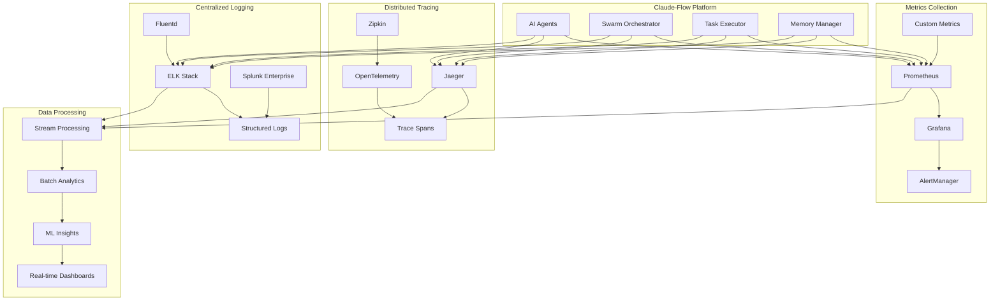

# Enterprise Observability and Performance Monitoring

## Executive Summary

Enterprise observability for Claude-Flow provides comprehensive monitoring, alerting, and analytics capabilities for AI-powered development workflows at scale. This framework enables organizations to maintain high performance, reliability, and security across complex multi-project environments with 100+ developers.

## Observability Architecture

### Three Pillars of Observability



## Metrics and KPIs Framework

### 1. Business Metrics

```yaml
# Business-level KPIs
business_metrics:
  developer_productivity:
    - name: "Code Commits per Developer per Day"
      target: "> 5"
      calculation: "total_commits / active_developers / days"
      dashboard: "executive_dashboard"

    - name: "Feature Velocity (Story Points/Sprint)"
      target: "> 80"
      calculation: "completed_story_points / sprint_duration"
      dashboard: "product_management"

    - name: "Deployment Frequency"
      target: "> 10 per week"
      calculation: "deployments_count / week"
      dashboard: "engineering_metrics"

    - name: "Lead Time for Changes"
      target: "< 2 days"
      calculation: "merge_time - commit_time"
      dashboard: "dora_metrics"

  quality_metrics:
    - name: "Defect Escape Rate"
      target: "< 3%"
      calculation: "production_defects / total_features"
      dashboard: "quality_dashboard"

    - name: "Test Coverage"
      target: "> 85%"
      calculation: "covered_lines / total_lines"
      dashboard: "code_quality"

    - name: "Technical Debt Ratio"
      target: "< 20%"
      calculation: "debt_hours / total_development_hours"
      dashboard: "technical_debt"

  operational_metrics:
    - name: "Platform Availability"
      target: "99.9%"
      calculation: "uptime / total_time"
      dashboard: "sre_dashboard"

    - name: "Mean Time to Recovery"
      target: "< 30 minutes"
      calculation: "recovery_time / incident_count"
      dashboard: "incident_management"

    - name: "Cost per Feature"
      target: "< $10,000"
      calculation: "infrastructure_cost / features_delivered"
      dashboard: "cost_optimization"
```

### 2. Technical Metrics

```typescript
// Comprehensive technical metrics collection
export interface TechnicalMetrics {
  // Agent performance metrics
  agent_metrics: {
    spawn_time: number;           // milliseconds
    execution_time: number;       // milliseconds
    memory_usage: number;         // MB
    cpu_utilization: number;      // percentage
    success_rate: number;         // percentage
    error_rate: number;           // percentage
    queue_depth: number;          // count
    throughput: number;           // operations/second
  };

  // Swarm coordination metrics
  swarm_metrics: {
    topology_efficiency: number;  // percentage
    communication_latency: number; // milliseconds
    consensus_time: number;       // milliseconds
    load_distribution: number;    // variance coefficient
    failover_time: number;        // milliseconds
    coordination_overhead: number; // percentage
  };

  // Infrastructure metrics
  infrastructure_metrics: {
    cluster_utilization: number;  // percentage
    network_latency: number;      // milliseconds
    disk_io_rate: number;         // IOPS
    network_throughput: number;   // Mbps
    container_startup_time: number; // milliseconds
    resource_contention: number;  // percentage
  };

  // Application metrics
  application_metrics: {
    request_rate: number;         // requests/second
    response_time: number;        // milliseconds
    error_rate: number;           // percentage
    database_connection_time: number; // milliseconds
    cache_hit_rate: number;       // percentage
    api_latency: number;          // milliseconds
  };
}

// Metrics collection service
export class MetricsCollector {

  async collectAgentMetrics(agent_id: string): Promise<AgentMetrics> {
    const startTime = performance.now();

    const [
      performance_data,
      resource_usage,
      execution_stats,
      error_logs
    ] = await Promise.all([
      this.getPerformanceData(agent_id),
      this.getResourceUsage(agent_id),
      this.getExecutionStats(agent_id),
      this.getErrorLogs(agent_id)
    ]);

    const collection_time = performance.now() - startTime;

    return {
      agent_id,
      timestamp: new Date().toISOString(),
      collection_time,
      performance: performance_data,
      resources: resource_usage,
      execution: execution_stats,
      errors: error_logs,
      health_score: this.calculateHealthScore(
        performance_data,
        resource_usage,
        execution_stats,
        error_logs
      )
    };
  }

  async collectSwarmMetrics(swarm_id: string): Promise<SwarmMetrics> {
    const agents = await this.getSwarmAgents(swarm_id);
    const topology = await this.getSwarmTopology(swarm_id);

    const agent_metrics = await Promise.all(
      agents.map(agent => this.collectAgentMetrics(agent.id))
    );

    return {
      swarm_id,
      timestamp: new Date().toISOString(),
      agent_count: agents.length,
      topology_type: topology.type,
      agent_metrics,
      coordination_efficiency: this.calculateCoordinationEfficiency(agent_metrics),
      load_balance_score: this.calculateLoadBalanceScore(agent_metrics),
      fault_tolerance_score: this.calculateFaultToleranceScore(topology, agent_metrics)
    };
  }
}
```

### 3. Custom Metrics for AI Workflows

```yaml
# AI-specific metrics configuration
ai_workflow_metrics:
  model_performance:
    - name: "Agent Learning Rate"
      description: "Rate of improvement in agent performance over time"
      calculation: "(current_performance - baseline_performance) / time_period"
      unit: "improvement_percentage_per_day"

    - name: "Cognitive Load Distribution"
      description: "How evenly cognitive tasks are distributed across agents"
      calculation: "standard_deviation(agent_cognitive_loads) / mean(agent_cognitive_loads)"
      unit: "coefficient_of_variation"

    - name: "Pattern Recognition Accuracy"
      description: "Accuracy of agents in recognizing code patterns"
      calculation: "correct_pattern_identifications / total_pattern_attempts"
      unit: "percentage"

  coordination_metrics:
    - name: "Inter-Agent Communication Efficiency"
      description: "Efficiency of communication between agents"
      calculation: "successful_communications / total_communication_attempts"
      unit: "percentage"

    - name: "Consensus Convergence Time"
      description: "Time required for agents to reach consensus"
      calculation: "consensus_reached_time - consensus_start_time"
      unit: "milliseconds"

    - name: "Task Handoff Success Rate"
      description: "Success rate of task handoffs between agents"
      calculation: "successful_handoffs / total_handoff_attempts"
      unit: "percentage"

  quality_metrics:
    - name: "Code Quality Score"
      description: "AI-assessed code quality score"
      calculation: "weighted_average(maintainability, reliability, security, performance)"
      unit: "score_0_to_100"

    - name: "Test Coverage Improvement"
      description: "Improvement in test coverage by AI agents"
      calculation: "new_coverage - baseline_coverage"
      unit: "percentage_points"

    - name: "Security Vulnerability Detection Rate"
      description: "Rate of security vulnerability detection by AI agents"
      calculation: "vulnerabilities_detected / total_vulnerabilities"
      unit: "percentage"
```

## Distributed Tracing

### 1. End-to-End Request Tracing

```typescript
// Distributed tracing implementation
export class DistributedTracing {

  async traceAgentExecution(
    task_request: TaskRequest,
    execution_context: ExecutionContext
  ): Promise<TraceResult> {

    const trace_id = this.generateTraceId();
    const root_span = this.createRootSpan(trace_id, task_request);

    try {
      // Trace agent spawning
      const spawn_span = this.createChildSpan(root_span, 'agent_spawn');
      const agent = await this.spawnAgent(task_request.agent_type);
      span_span.finish();

      // Trace task execution
      const execution_span = this.createChildSpan(root_span, 'task_execution');
      const result = await this.executeTask(agent, task_request.task);
      execution_span.finish();

      // Trace inter-agent communication
      if (task_request.requires_coordination) {
        const coordination_span = this.createChildSpan(root_span, 'agent_coordination');
        await this.coordinateWithOtherAgents(agent, task_request.coordination_requirements);
        coordination_span.finish();
      }

      // Trace result processing
      const processing_span = this.createChildSpan(root_span, 'result_processing');
      const processed_result = await this.processResult(result);
      processing_span.finish();

      root_span.finish();

      return {
        trace_id,
        success: true,
        total_duration: root_span.duration,
        spans: this.getSpanHierarchy(root_span),
        result: processed_result
      };

    } catch (error) {
      root_span.setTag('error', true);
      root_span.log({
        event: 'error',
        message: error.message,
        stack: error.stack
      });
      root_span.finish();

      throw error;
    }
  }

  // Trace analysis and optimization
  async analyzeTraces(
    traces: TraceData[],
    time_period: TimePeriod
  ): Promise<TraceAnalysis> {

    const bottlenecks = this.identifyBottlenecks(traces);
    const patterns = this.identifyPatterns(traces);
    const anomalies = this.detectAnomalies(traces);

    return {
      time_period,
      total_traces: traces.length,
      performance_summary: {
        p50_latency: this.calculatePercentile(traces, 50),
        p95_latency: this.calculatePercentile(traces, 95),
        p99_latency: this.calculatePercentile(traces, 99),
        error_rate: this.calculateErrorRate(traces)
      },
      bottlenecks: bottlenecks.map(b => ({
        operation: b.operation,
        impact: b.impact,
        frequency: b.frequency,
        recommendation: this.generateOptimizationRecommendation(b)
      })),
      patterns,
      anomalies,
      optimization_opportunities: this.identifyOptimizationOpportunities(traces)
    };
  }
}

// Trace correlation across services
export class TraceCorrelation {

  async correlateMultiServiceTrace(
    trace_id: string,
    services: Service[]
  ): Promise<CorrelatedTrace> {

    const service_spans = await Promise.all(
      services.map(service => this.getServiceSpans(service, trace_id))
    );

    const correlated_timeline = this.buildCorrelatedTimeline(service_spans);
    const dependencies = this.identifyServiceDependencies(service_spans);
    const critical_path = this.calculateCriticalPath(correlated_timeline);

    return {
      trace_id,
      services: services.map(s => s.name),
      total_duration: this.calculateTotalDuration(correlated_timeline),
      service_breakdown: this.calculateServiceBreakdown(service_spans),
      dependencies,
      critical_path,
      recommendations: this.generatePerformanceRecommendations(
        critical_path,
        dependencies
      )
    };
  }
}
```

### 2. Performance Profiling

```yaml
# Performance profiling configuration
performance_profiling:
  cpu_profiling:
    enabled: true
    sampling_rate: "10ms"
    collection_duration: "30s"
    retention_period: "7d"

    hotspot_detection:
      threshold: "5%"
      aggregation: "function_level"
      flame_graph: true

  memory_profiling:
    enabled: true
    heap_profiling: true
    allocation_tracking: true
    gc_analysis: true

    leak_detection:
      threshold: "100MB"
      growth_rate: "10MB/hour"
      automated_analysis: true

  io_profiling:
    disk_io: true
    network_io: true
    database_io: true

    bottleneck_detection:
      latency_threshold: "100ms"
      throughput_threshold: "1000 ops/sec"

# Automated performance optimization
performance_optimization:
  auto_scaling:
    enabled: true
    metrics: ["cpu", "memory", "queue_depth"]
    scale_up_threshold: 80
    scale_down_threshold: 30
    cooldown_period: "5m"

  resource_optimization:
    container_rightsizing: true
    cpu_optimization: true
    memory_optimization: true

  caching_optimization:
    cache_hit_rate_monitoring: true
    cache_size_optimization: true
    eviction_policy_tuning: true
```

## Real-Time Monitoring and Alerting

### 1. Alert Management

```typescript
// Intelligent alerting system
export class IntelligentAlerting {

  private alertRules: AlertRule[] = [
    {
      name: "High Agent Error Rate",
      condition: "agent_error_rate > 5% for 5m",
      severity: "high",
      channels: ["slack", "pagerduty"],
      suppression_period: "15m"
    },
    {
      name: "Swarm Coordination Failure",
      condition: "consensus_time > 10s for 2m",
      severity: "critical",
      channels: ["slack", "pagerduty", "sms"],
      suppression_period: "5m"
    },
    {
      name: "Memory Usage Spike",
      condition: "memory_usage > 90% for 3m",
      severity: "warning",
      channels: ["slack"],
      suppression_period: "30m"
    },
    {
      name: "Deployment Failure",
      condition: "deployment_success_rate < 95% for 1m",
      severity: "high",
      channels: ["slack", "email"],
      suppression_period: "10m"
    }
  ];

  async evaluateAlerts(metrics: MetricsSnapshot): Promise<AlertEvaluation[]> {
    const evaluations = await Promise.all(
      this.alertRules.map(rule => this.evaluateRule(rule, metrics))
    );

    // Apply intelligent deduplication
    const deduplicated = this.deduplicateAlerts(evaluations);

    // Apply contextual enrichment
    const enriched = await this.enrichAlerts(deduplicated);

    // Apply smart routing
    const routed = this.routeAlerts(enriched);

    return routed;
  }

  private async enrichAlerts(alerts: AlertEvaluation[]): Promise<EnrichedAlert[]> {
    return Promise.all(
      alerts.map(async alert => ({
        ...alert,
        context: await this.gatherAlertContext(alert),
        related_incidents: await this.findRelatedIncidents(alert),
        runbook: await this.getRunbook(alert.rule.name),
        suggested_actions: await this.generateSuggestedActions(alert)
      }))
    );
  }

  // Machine learning-based anomaly detection
  async detectAnomalies(
    metrics: TimeSeries[],
    model_config: AnomalyDetectionConfig
  ): Promise<Anomaly[]> {

    const model = await this.loadAnomalyDetectionModel(model_config);
    const anomalies: Anomaly[] = [];

    for (const metric of metrics) {
      const prediction = await model.predict(metric.values);
      const deviation = this.calculateDeviation(metric.values, prediction);

      if (deviation > model_config.threshold) {
        anomalies.push({
          metric_name: metric.name,
          timestamp: metric.timestamp,
          actual_value: metric.current_value,
          predicted_value: prediction,
          deviation_score: deviation,
          confidence: model.confidence,
          suggested_investigation: this.generateInvestigationSteps(metric, deviation)
        });
      }
    }

    return anomalies;
  }
}

// Alert correlation and noise reduction
export class AlertCorrelation {

  async correlateAlerts(
    alerts: Alert[],
    correlation_window: Duration
  ): Promise<CorrelatedAlertGroup[]> {

    const groups = this.groupAlertsByPattern(alerts, correlation_window);

    return groups.map(group => ({
      group_id: this.generateGroupId(),
      alerts: group.alerts,
      root_cause_candidates: this.identifyRootCauses(group),
      impact_assessment: this.assessImpact(group),
      recommended_response: this.recommendResponse(group),
      escalation_path: this.determineEscalationPath(group)
    }));
  }

  private identifyRootCauses(group: AlertGroup): RootCauseCandidate[] {
    // Analyze temporal relationships
    const temporal_analysis = this.analyzeTemporalRelationships(group.alerts);

    // Analyze causal relationships
    const causal_analysis = this.analyzeCausalRelationships(group.alerts);

    // Combine analysis results
    return this.combineAnalyses(temporal_analysis, causal_analysis);
  }
}
```

### 2. Dashboard and Visualization

```yaml
# Dashboard configuration
dashboards:
  executive_dashboard:
    audience: "c_level_executives"
    refresh_interval: "5m"

    widgets:
      - type: "kpi_card"
        title: "Platform Availability"
        metric: "platform_uptime"
        target: "99.9%"
        size: "small"

      - type: "trend_chart"
        title: "Developer Productivity Trend"
        metrics: ["commits_per_day", "deployments_per_week"]
        time_range: "30d"
        size: "medium"

      - type: "cost_breakdown"
        title: "Infrastructure Cost Breakdown"
        metrics: ["compute_cost", "storage_cost", "network_cost"]
        size: "medium"

  engineering_dashboard:
    audience: "engineering_teams"
    refresh_interval: "30s"

    widgets:
      - type: "agent_status_grid"
        title: "Agent Status Overview"
        size: "large"

      - type: "performance_heatmap"
        title: "Performance Heatmap"
        metrics: ["response_time", "error_rate"]
        size: "large"

      - type: "deployment_pipeline"
        title: "Deployment Pipeline Status"
        size: "medium"

  sre_dashboard:
    audience: "site_reliability_engineers"
    refresh_interval: "10s"

    widgets:
      - type: "service_map"
        title: "Service Dependency Map"
        size: "large"

      - type: "alert_feed"
        title: "Active Alerts"
        size: "medium"

      - type: "performance_metrics"
        title: "SLI/SLO Status"
        size: "medium"

# Visualization preferences
visualization:
  time_series:
    default_range: "1h"
    aggregation: "1m"
    smoothing: true

  heatmaps:
    color_scheme: "viridis"
    bucket_size: "auto"
    tooltip_detail: "high"

  topology_maps:
    layout: "force_directed"
    edge_bundling: true
    cluster_visualization: true
```

## Capacity Planning and Forecasting

### 1. Predictive Analytics

```typescript
// Capacity planning with machine learning
export class CapacityPlanner {

  async forecastResourceNeeds(
    historical_data: MetricsHistory,
    forecast_horizon: Duration,
    confidence_level: number = 0.95
  ): Promise<CapacityForecast> {

    const models = {
      cpu: await this.trainForecastingModel(historical_data.cpu, 'cpu'),
      memory: await this.trainForecastingModel(historical_data.memory, 'memory'),
      storage: await this.trainForecastingModel(historical_data.storage, 'storage'),
      network: await this.trainForecastingModel(historical_data.network, 'network')
    };

    const forecasts = await Promise.all([
      this.generateForecast(models.cpu, forecast_horizon, confidence_level),
      this.generateForecast(models.memory, forecast_horizon, confidence_level),
      this.generateForecast(models.storage, forecast_horizon, confidence_level),
      this.generateForecast(models.network, forecast_horizon, confidence_level)
    ]);

    const [cpu_forecast, memory_forecast, storage_forecast, network_forecast] = forecasts;

    return {
      forecast_period: forecast_horizon,
      confidence_level,
      resource_forecasts: {
        cpu: cpu_forecast,
        memory: memory_forecast,
        storage: storage_forecast,
        network: network_forecast
      },
      scaling_recommendations: this.generateScalingRecommendations(forecasts),
      cost_projections: await this.projectCosts(forecasts),
      risk_assessment: this.assessCapacityRisks(forecasts)
    };
  }

  async optimizeResourceAllocation(
    current_allocation: ResourceAllocation,
    workload_patterns: WorkloadPattern[],
    constraints: OptimizationConstraints
  ): Promise<OptimizedAllocation> {

    // Multi-objective optimization
    const optimization_results = await this.multiObjectiveOptimization({
      objectives: [
        'minimize_cost',
        'maximize_performance',
        'minimize_waste',
        'maximize_reliability'
      ],
      variables: {
        cpu_allocation: current_allocation.cpu,
        memory_allocation: current_allocation.memory,
        instance_types: current_allocation.instance_types,
        scaling_policies: current_allocation.scaling_policies
      },
      constraints: constraints,
      workload_data: workload_patterns
    });

    return {
      optimized_allocation: optimization_results.solution,
      expected_savings: optimization_results.cost_savings,
      performance_impact: optimization_results.performance_delta,
      implementation_plan: this.generateImplementationPlan(optimization_results),
      risk_mitigation: this.generateRiskMitigation(optimization_results)
    };
  }

  // Scenario planning for capacity decisions
  async runScenarioAnalysis(
    scenarios: CapacityScenario[]
  ): Promise<ScenarioAnalysisResult> {

    const scenario_results = await Promise.all(
      scenarios.map(scenario => this.evaluateScenario(scenario))
    );

    return {
      scenarios: scenario_results,
      comparison_matrix: this.buildComparisonMatrix(scenario_results),
      recommendations: this.generateScenarioRecommendations(scenario_results),
      sensitivity_analysis: this.performSensitivityAnalysis(scenario_results)
    };
  }
}

// Workload characterization and prediction
export class WorkloadAnalyzer {

  async characterizeWorkload(
    metrics: WorkloadMetrics,
    time_period: Duration
  ): Promise<WorkloadCharacterization> {

    const patterns = {
      temporal: await this.analyzeTemporalPatterns(metrics, time_period),
      seasonal: await this.analyzeSeasonalPatterns(metrics),
      cyclical: await this.analyzeCyclicalPatterns(metrics),
      trend: await this.analyzeTrendPatterns(metrics)
    };

    return {
      workload_type: this.classifyWorkloadType(patterns),
      resource_requirements: this.analyzeResourceRequirements(metrics),
      scaling_characteristics: this.analyzeScalingCharacteristics(metrics),
      optimization_opportunities: this.identifyOptimizationOpportunities(patterns),
      predictability_score: this.calculatePredictabilityScore(patterns)
    };
  }

  async predictWorkloadChanges(
    current_workload: WorkloadCharacterization,
    business_drivers: BusinessDriver[]
  ): Promise<WorkloadPrediction> {

    const impact_analysis = await this.analyzeBusinessDriverImpact(
      current_workload,
      business_drivers
    );

    return {
      predicted_changes: impact_analysis.changes,
      confidence_intervals: impact_analysis.confidence,
      timeline: impact_analysis.timeline,
      resource_impact: this.calculateResourceImpact(impact_analysis),
      mitigation_strategies: this.generateMitigationStrategies(impact_analysis)
    };
  }
}
```

### 2. Auto-Scaling and Resource Optimization

```yaml
# Advanced auto-scaling configuration
auto_scaling:
  agent_pools:
    predictive_scaling:
      enabled: true
      prediction_horizon: "30m"
      confidence_threshold: 0.8

    reactive_scaling:
      scale_up:
        cpu_threshold: 70
        memory_threshold: 80
        queue_depth_threshold: 50
        scale_factor: 2
        cooldown: "5m"

      scale_down:
        cpu_threshold: 30
        memory_threshold: 40
        queue_depth_threshold: 10
        scale_factor: 0.5
        cooldown: "10m"

  infrastructure:
    horizontal_scaling:
      min_instances: 3
      max_instances: 100
      target_utilization: 70

    vertical_scaling:
      enabled: true
      cpu_margin: 20
      memory_margin: 30

  cost_optimization:
    spot_instances:
      enabled: true
      fallback_to_on_demand: true
      max_spot_percentage: 80

    scheduled_scaling:
      business_hours: "08:00-18:00"
      timezone: "UTC"
      scale_factor: 1.5

    rightsizing:
      enabled: true
      analysis_period: "7d"
      utilization_threshold: 20
```

## Security Monitoring

### 1. Security Information and Event Management (SIEM)

```typescript
// Security monitoring integration
export class SecurityMonitoring {

  async monitorSecurityEvents(
    events: SecurityEvent[],
    threat_intelligence: ThreatIntelligence
  ): Promise<SecurityAssessment> {

    const risk_analysis = await this.analyzeSecurityRisks(events);
    const threat_correlation = await this.correlateThreatIntelligence(
      events,
      threat_intelligence
    );
    const behavioral_analysis = await this.analyzeBehavioralAnomalies(events);

    return {
      overall_risk_score: this.calculateOverallRiskScore([
        risk_analysis,
        threat_correlation,
        behavioral_analysis
      ]),
      high_priority_events: this.prioritizeSecurityEvents(events),
      threat_indicators: threat_correlation.indicators,
      behavioral_anomalies: behavioral_analysis.anomalies,
      recommendations: this.generateSecurityRecommendations(events),
      incident_triggers: this.evaluateIncidentTriggers(events)
    };
  }

  // AI-powered threat detection
  async detectAdvancedThreats(
    network_traffic: NetworkTraffic[],
    system_logs: SystemLog[],
    user_behavior: UserBehavior[]
  ): Promise<ThreatDetectionResult> {

    const ml_models = await this.loadThreatDetectionModels();

    const detections = await Promise.all([
      this.detectNetworkThreats(network_traffic, ml_models.network),
      this.detectSystemThreats(system_logs, ml_models.system),
      this.detectInsiderThreats(user_behavior, ml_models.behavioral)
    ]);

    return {
      network_threats: detections[0],
      system_threats: detections[1],
      insider_threats: detections[2],
      threat_score: this.calculateThreatScore(detections),
      response_recommendations: this.generateResponseRecommendations(detections),
      false_positive_probability: this.calculateFalsePositiveProbability(detections)
    };
  }
}

// Compliance monitoring
export class ComplianceMonitoring {

  async monitorCompliance(
    framework: ComplianceFramework,
    evidence: ComplianceEvidence[]
  ): Promise<ComplianceStatus> {

    const control_assessments = await this.assessControls(framework, evidence);
    const violations = await this.identifyViolations(evidence);
    const audit_readiness = await this.assessAuditReadiness(framework, evidence);

    return {
      framework: framework.name,
      overall_compliance_score: this.calculateComplianceScore(control_assessments),
      control_assessments,
      violations: violations.map(v => ({
        ...v,
        remediation_plan: this.generateRemediationPlan(v)
      })),
      audit_readiness,
      next_assessment_date: this.calculateNextAssessmentDate(framework),
      continuous_monitoring_status: this.getContinuousMonitoringStatus()
    };
  }
}
```

## Performance Analytics and Insights

### 1. Business Intelligence Integration

```typescript
// Advanced analytics and insights
export class PerformanceAnalytics {

  async generatePerformanceInsights(
    metrics: PerformanceMetrics[],
    business_context: BusinessContext
  ): Promise<PerformanceInsights> {

    const trend_analysis = await this.analyzeTrends(metrics);
    const correlation_analysis = await this.analyzeCorrelations(metrics, business_context);
    const impact_analysis = await this.analyzeBusinessImpact(metrics, business_context);

    return {
      key_insights: this.extractKeyInsights([
        trend_analysis,
        correlation_analysis,
        impact_analysis
      ]),
      performance_drivers: correlation_analysis.primary_drivers,
      optimization_opportunities: this.identifyOptimizationOpportunities(metrics),
      business_impact: impact_analysis.quantified_impact,
      recommendations: this.generateActionableRecommendations(metrics, business_context),
      confidence_scores: this.calculateConfidenceScores(metrics)
    };
  }

  // Predictive performance modeling
  async buildPerformancePredictionModel(
    historical_performance: PerformanceHistory,
    external_factors: ExternalFactor[]
  ): Promise<PerformancePredictionModel> {

    const feature_engineering = await this.engineerFeatures(
      historical_performance,
      external_factors
    );

    const model_training = await this.trainPredictionModel(feature_engineering);

    return {
      model: model_training.model,
      feature_importance: model_training.feature_importance,
      prediction_accuracy: model_training.validation_metrics,
      prediction_horizon: model_training.effective_horizon,
      update_frequency: this.determineUpdateFrequency(model_training.drift_analysis),
      deployment_config: this.generateDeploymentConfig(model_training)
    };
  }

  // Automated root cause analysis
  async performRootCauseAnalysis(
    performance_degradation: PerformanceDegradation,
    system_context: SystemContext
  ): Promise<RootCauseAnalysis> {

    const symptom_analysis = await this.analyzeSymptoms(performance_degradation);
    const hypothesis_generation = await this.generateHypotheses(symptom_analysis, system_context);
    const hypothesis_testing = await this.testHypotheses(hypothesis_generation);

    return {
      degradation_event: performance_degradation,
      symptoms: symptom_analysis.identified_symptoms,
      hypotheses: hypothesis_generation.ranked_hypotheses,
      test_results: hypothesis_testing.results,
      root_causes: this.identifyRootCauses(hypothesis_testing),
      remediation_plan: this.generateRemediationPlan(hypothesis_testing),
      prevention_recommendations: this.generatePreventionRecommendations(hypothesis_testing)
    };
  }
}

// Business value correlation
export class BusinessValueAnalytics {

  async correlateTechnicalMetricsWithBusinessValue(
    technical_metrics: TechnicalMetrics[],
    business_metrics: BusinessMetrics[]
  ): Promise<ValueCorrelationAnalysis> {

    const correlation_matrix = await this.buildCorrelationMatrix(
      technical_metrics,
      business_metrics
    );

    const causal_analysis = await this.performCausalAnalysis(
      technical_metrics,
      business_metrics
    );

    const value_drivers = await this.identifyValueDrivers(
      correlation_matrix,
      causal_analysis
    );

    return {
      correlation_strength: correlation_matrix.overall_strength,
      primary_correlations: correlation_matrix.significant_correlations,
      causal_relationships: causal_analysis.validated_relationships,
      value_drivers: value_drivers.ranked_drivers,
      optimization_impact: this.calculateOptimizationImpact(value_drivers),
      investment_recommendations: this.generateInvestmentRecommendations(value_drivers)
    };
  }
}
```

## Implementation Roadmap

### Phase 1: Foundation (Months 1-2)
- Deploy basic metrics collection
- Implement core dashboards
- Set up alerting infrastructure
- Establish logging standards

### Phase 2: Enhancement (Months 3-4)
- Deploy distributed tracing
- Implement anomaly detection
- Create custom AI metrics
- Automate alert correlation

### Phase 3: Intelligence (Months 5-6)
- Deploy predictive analytics
- Implement capacity planning
- Add security monitoring
- Create business intelligence

### Phase 4: Optimization (Months 7-8)
- Implement automated optimization
- Deploy advanced ML models
- Add self-healing capabilities
- Create predictive maintenance

## Success Metrics

### Technical KPIs
- **MTTD (Mean Time to Detection)**: < 5 minutes
- **MTTR (Mean Time to Resolution)**: < 30 minutes
- **Alert Accuracy**: > 95% (low false positive rate)
- **Dashboard Load Time**: < 2 seconds
- **Data Freshness**: < 30 seconds lag

### Business KPIs
- **Developer Productivity**: 25% improvement
- **System Reliability**: 99.9% uptime
- **Cost Optimization**: 20% infrastructure cost reduction
- **Compliance**: 100% automated compliance monitoring
- **Security**: 50% faster threat detection

## Related Documentation

- [Enterprise Architecture Overview](../enterprise-architecture/enterprise-architecture-overview.md)
- [Security Framework](../security/enterprise-security-framework.md)
- [Cost Optimization](../cost-optimization/enterprise-cost-management.md)
- [Team Coordination](../team-coordination/team-scaling-strategies.md)