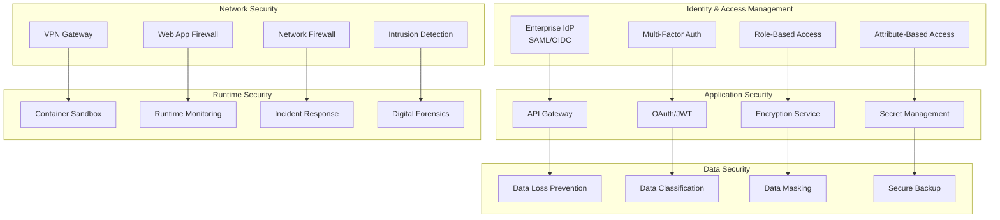

# Enterprise Security Framework

## Executive Summary

The Claude-Flow Enterprise Security Framework provides comprehensive security controls, compliance automation, and risk management for organizations deploying AI-powered development workflows at scale. This framework addresses the unique security challenges of AI agent orchestration while maintaining enterprise-grade security posture.

## Security Architecture Overview

### Zero-Trust Security Model



## Identity and Access Management

### 1. Enterprise Identity Integration

```yaml
# Identity Provider Configuration
identity_providers:
  primary:
    type: "Azure_AD"
    protocol: "SAML_2.0"
    endpoints:
      sso: "https://login.microsoftonline.com/{tenant}/saml2"
      metadata: "https://login.microsoftonline.com/{tenant}/federationmetadata/2007-06/federationmetadata.xml"

    attributes:
      user_id: "http://schemas.xmlsoap.org/ws/2005/05/identity/claims/name"
      email: "http://schemas.xmlsoap.org/ws/2005/05/identity/claims/emailaddress"
      groups: "http://schemas.microsoft.com/ws/2008/06/identity/claims/groups"
      department: "http://schemas.microsoft.com/identity/claims/department"

  secondary:
    type: "Okta"
    protocol: "OIDC"
    client_id: "${OKTA_CLIENT_ID}"
    client_secret: "${OKTA_CLIENT_SECRET}"
    discovery_url: "https://{domain}.okta.com/.well-known/openid_configuration"

# Multi-Factor Authentication
mfa_requirements:
  enforcement: "mandatory"
  methods:
    - "SMS"
    - "TOTP"
    - "Push_Notification"
    - "Hardware_Token"

  risk_based:
    enabled: true
    factors:
      - "device_trust_level"
      - "location_anomaly"
      - "access_pattern"
      - "privilege_level"

# Privileged Access Management
pam_configuration:
  just_in_time_access:
    enabled: true
    max_duration: "8_hours"
    approval_required: true
    break_glass: true

  session_recording:
    enabled: true
    storage_duration: "90_days"
    encryption: "AES_256"

  credential_rotation:
    frequency: "30_days"
    automated: true
    emergency_rotation: true
```

### 2. Role-Based Access Control (RBAC)

```typescript
// Enterprise role definitions
export interface EnterpriseRoles {
  // Executive roles
  CTO: {
    permissions: ["platform:admin", "security:admin", "cost:admin"];
    restrictions: ["audit_logging"];
    scope: "global";
  };

  // Platform administration
  PLATFORM_ADMIN: {
    permissions: [
      "swarm:manage",
      "agent:configure",
      "infrastructure:admin",
      "monitoring:admin"
    ];
    restrictions: ["production_deployment_approval"];
    scope: "platform";
  };

  // Security administration
  SECURITY_ADMIN: {
    permissions: [
      "security:configure",
      "audit:view",
      "compliance:manage",
      "incident:respond"
    ];
    restrictions: ["none"];
    scope: "security";
  };

  // Development roles
  SENIOR_DEVELOPER: {
    permissions: [
      "agent:spawn",
      "task:orchestrate",
      "code:review",
      "deployment:staging"
    ];
    restrictions: ["production_access_approval"];
    scope: "project";
  };

  DEVELOPER: {
    permissions: [
      "agent:basic",
      "task:create",
      "code:commit",
      "test:execute"
    ];
    restrictions: ["sensitive_data_access"];
    scope: "team";
  };

  // Operational roles
  SRE: {
    permissions: [
      "monitoring:configure",
      "alert:manage",
      "performance:analyze",
      "incident:resolve"
    ];
    restrictions: ["code_modification"];
    scope: "infrastructure";
  };
}

// Dynamic access control based on context
export class ContextualAccessControl {
  async evaluateAccess(
    user: User,
    resource: Resource,
    context: AccessContext
  ): Promise<AccessDecision> {

    const riskScore = await this.calculateRiskScore(user, context);
    const resourceSensitivity = await this.getResourceSensitivity(resource);
    const basePermissions = await this.getBasePermissions(user);

    // Apply risk-based adjustments
    if (riskScore > 70) {
      return this.requireAdditionalAuthorization(user, resource);
    }

    // Apply time-based restrictions
    if (this.isOutsideBusinessHours(context.timestamp)) {
      return this.applyAfterHoursRestrictions(basePermissions);
    }

    // Apply location-based restrictions
    if (!this.isTrustedLocation(context.location)) {
      return this.applyRemoteAccessRestrictions(basePermissions);
    }

    return this.makeAccessDecision(basePermissions, resourceSensitivity);
  }
}
```

## Data Protection and Privacy

### 1. Data Classification Framework

```yaml
# Data classification levels
data_classification:
  public:
    description: "Information that can be freely shared"
    examples: ["marketing_materials", "public_documentation"]
    controls: ["basic_backup"]

  internal:
    description: "Information for internal company use"
    examples: ["employee_directory", "internal_processes"]
    controls: ["access_logging", "retention_policy"]

  confidential:
    description: "Sensitive business information"
    examples: ["financial_data", "strategic_plans", "customer_data"]
    controls: ["encryption_at_rest", "access_approval", "audit_logging"]

  restricted:
    description: "Highly sensitive information"
    examples: ["trade_secrets", "pii", "payment_data", "health_records"]
    controls: [
      "end_to_end_encryption",
      "privileged_access_only",
      "continuous_monitoring",
      "data_loss_prevention"
    ]

# Automated data discovery and classification
data_discovery:
  scanning:
    frequency: "daily"
    scope: ["code_repositories", "databases", "file_systems", "cloud_storage"]

  classification_rules:
    credit_card:
      pattern: "\\b(?:\\d[ -]*?){13,16}\\b"
      confidence: 0.95
      classification: "restricted"

    ssn:
      pattern: "\\b\\d{3}-\\d{2}-\\d{4}\\b"
      confidence: 0.98
      classification: "restricted"

    email:
      pattern: "\\b[A-Za-z0-9._%+-]+@[A-Za-z0-9.-]+\\.[A-Z|a-z]{2,}\\b"
      confidence: 0.90
      classification: "internal"

    api_key:
      pattern: "(?i)(api[_-]?key|apikey)['\"]?\\s*[:=]\\s*['\"]?[a-zA-Z0-9]{20,}"
      confidence: 0.95
      classification: "confidential"

# Data handling policies
data_handling:
  encryption:
    at_rest: "AES_256"
    in_transit: "TLS_1.3"
    key_management: "HSM"
    key_rotation: "90_days"

  retention:
    default: "7_years"
    personal_data: "as_per_gdpr"
    log_data: "1_year"
    backup_data: "3_years"

  anonymization:
    techniques: ["k_anonymity", "differential_privacy", "tokenization"]
    automation: true
    verification: "statistical_analysis"
```

### 2. Privacy by Design

```typescript
// Privacy-preserving AI agent operations
export class PrivacyPreservingAgents {

  // Differential privacy for training data
  async trainWithPrivacy(
    dataset: Dataset,
    epsilon: number = 1.0
  ): Promise<PrivateModel> {

    const noisyDataset = await this.addDifferentialPrivacyNoise(
      dataset,
      epsilon
    );

    const model = await this.trainModel(noisyDataset);

    // Validate privacy guarantees
    const privacyMetrics = await this.validatePrivacy(model, epsilon);

    return {
      model,
      privacy_budget: epsilon,
      privacy_metrics: privacyMetrics
    };
  }

  // Federated learning for distributed training
  async federatedLearning(participants: Client[]): Promise<GlobalModel> {
    const localUpdates = await Promise.all(
      participants.map(client =>
        this.trainLocalModel(client.data, client.privacy_constraints)
      )
    );

    // Secure aggregation without exposing individual updates
    const globalUpdate = await this.secureAggregation(localUpdates);

    return this.updateGlobalModel(globalUpdate);
  }

  // Homomorphic encryption for computation on encrypted data
  async computeOnEncryptedData(
    encryptedData: EncryptedDataset,
    computation: ComputationGraph
  ): Promise<EncryptedResult> {

    const homomorphicScheme = new HomomorphicEncryption();

    // Perform computation without decrypting data
    const encryptedResult = await homomorphicScheme.compute(
      encryptedData,
      computation
    );

    return encryptedResult;
  }
}

// Consent management for AI processing
export class ConsentManager {
  async requestConsent(
    user: User,
    processing_purpose: ProcessingPurpose,
    data_types: DataType[]
  ): Promise<ConsentResponse> {

    const consentRequest = {
      user_id: user.id,
      purpose: processing_purpose,
      data_types: data_types,
      retention_period: this.calculateRetention(processing_purpose),
      third_parties: this.getThirdParties(processing_purpose),
      user_rights: this.getUserRights(user.jurisdiction)
    };

    return await this.presentConsentForm(consentRequest);
  }

  async validateConsent(
    user: User,
    operation: AIOperation
  ): Promise<boolean> {

    const currentConsent = await this.getCurrentConsent(user.id);

    return this.isOperationAllowed(operation, currentConsent);
  }

  async handleWithdrawal(
    user: User,
    withdrawal_scope: WithdrawalScope
  ): Promise<void> {

    // Stop all processing for withdrawn consent
    await this.stopProcessing(user.id, withdrawal_scope);

    // Remove or anonymize data as required
    await this.processDataRemoval(user.id, withdrawal_scope);

    // Notify downstream systems
    await this.propagateWithdrawal(user.id, withdrawal_scope);
  }
}
```

## Secure AI Agent Operations

### 1. Agent Sandboxing and Isolation

```yaml
# Container security configuration
container_security:
  base_images:
    allowed_registries: ["enterprise.registry.com", "docker.io"]
    security_scanning: true
    vulnerability_threshold: "medium"

  runtime_security:
    seccomp: "enabled"
    apparmor: "enabled"
    selinux: "enforcing"
    capabilities: "drop_all"

  resource_limits:
    cpu: "2_cores"
    memory: "4GB"
    disk: "10GB"
    network: "isolated"

  network_policies:
    default_deny: true
    allowed_egress:
      - "api.claude.ai:443"
      - "github.com:443"
      - "npm.registry.com:443"
    blocked_domains: ["malware.domain.com", "mining.pool.com"]

# Agent isolation mechanisms
agent_isolation:
  process_isolation:
    user_namespaces: true
    pid_namespaces: true
    mount_namespaces: true
    network_namespaces: true

  filesystem_isolation:
    read_only_root: true
    temporary_filesystem: "/tmp"
    allowed_mounts: ["/workspace", "/cache"]

  communication_isolation:
    inter_agent_communication: "message_queue_only"
    external_access: "proxy_only"
    api_rate_limiting: true

# Runtime monitoring and anomaly detection
runtime_monitoring:
  behavioral_analysis:
    - "system_call_monitoring"
    - "network_traffic_analysis"
    - "file_access_patterns"
    - "cpu_memory_usage"

  anomaly_detection:
    machine_learning: true
    baseline_establishment: "7_days"
    sensitivity: "medium"

  automated_response:
    isolation: "immediate"
    investigation: "automated"
    remediation: "policy_based"
```

### 2. Secure Code Generation

```typescript
// Secure code analysis and generation
export class SecureCodeGenerator {

  async generateSecureCode(
    requirements: CodeRequirements,
    security_context: SecurityContext
  ): Promise<SecureCodeResult> {

    // Apply security-first code generation
    const codeGeneration = await this.securityAwareGeneration(
      requirements,
      security_context
    );

    // Static security analysis
    const securityAnalysis = await this.staticSecurityAnalysis(
      codeGeneration.code
    );

    // Dynamic security testing
    const dynamicAnalysis = await this.dynamicSecurityTesting(
      codeGeneration.code,
      codeGeneration.tests
    );

    // Security policy compliance check
    const complianceCheck = await this.checkSecurityCompliance(
      codeGeneration.code,
      security_context.policies
    );

    return {
      code: codeGeneration.code,
      security_score: this.calculateSecurityScore([
        securityAnalysis,
        dynamicAnalysis,
        complianceCheck
      ]),
      vulnerabilities: securityAnalysis.vulnerabilities,
      remediation_suggestions: this.generateRemediationSuggestions(
        securityAnalysis.vulnerabilities
      )
    };
  }

  // Security patterns enforcement
  private securityPatterns = {
    input_validation: {
      pattern: /input\s*=\s*request\./,
      replacement: "input = sanitize(validate(request.))",
      severity: "high"
    },

    sql_injection_prevention: {
      pattern: /execute\s*\(\s*["'].*\$.*["']\s*\)/,
      replacement: "executeParameterized(query, parameters)",
      severity: "critical"
    },

    xss_prevention: {
      pattern: /innerHTML\s*=\s*.*user.*input/,
      replacement: "textContent = escapeHtml(userInput)",
      severity: "high"
    },

    crypto_secure_random: {
      pattern: /Math\.random\(\)/,
      replacement: "crypto.getRandomValues()",
      severity: "medium"
    }
  };

  async applySecurityPatterns(code: string): Promise<string> {
    let secureCode = code;

    for (const [pattern_name, pattern] of Object.entries(this.securityPatterns)) {
      if (pattern.pattern.test(secureCode)) {
        secureCode = secureCode.replace(
          pattern.pattern,
          pattern.replacement
        );

        await this.logSecurityTransformation(pattern_name, pattern.severity);
      }
    }

    return secureCode;
  }
}

// Supply chain security for AI agents
export class SupplyChainSecurity {

  async validateDependencies(
    dependencies: Dependency[]
  ): Promise<SecurityAssessment> {

    const assessments = await Promise.all(
      dependencies.map(dep => this.assessDependency(dep))
    );

    return {
      overall_risk: this.calculateOverallRisk(assessments),
      vulnerable_dependencies: assessments.filter(a => a.has_vulnerabilities),
      license_issues: assessments.filter(a => a.license_incompatible),
      recommendations: this.generateRecommendations(assessments)
    };
  }

  private async assessDependency(dep: Dependency): Promise<DependencyAssessment> {
    const [
      vulnerabilities,
      licenseCheck,
      reputationScore,
      maintenanceScore
    ] = await Promise.all([
      this.scanVulnerabilities(dep),
      this.checkLicenseCompatibility(dep),
      this.calculateReputationScore(dep),
      this.assessMaintenance(dep)
    ]);

    return {
      dependency: dep,
      vulnerabilities,
      license_compatible: licenseCheck.compatible,
      reputation_score: reputationScore,
      maintenance_score: maintenanceScore,
      overall_risk: this.calculateRisk([
        vulnerabilities.severity,
        licenseCheck.risk,
        reputationScore,
        maintenanceScore
      ])
    };
  }
}
```

## Compliance and Audit

### 1. Regulatory Compliance Framework

```yaml
# Compliance framework configuration
compliance_frameworks:
  sox:
    name: "Sarbanes-Oxley Act"
    scope: ["financial_reporting", "internal_controls"]
    requirements:
      - "segregation_of_duties"
      - "audit_trail_integrity"
      - "change_management_controls"
      - "access_controls_review"

    controls:
      - id: "SOX-001"
        description: "Segregation of duties for code deployment"
        implementation: "approval_workflow"
        testing_frequency: "quarterly"

      - id: "SOX-002"
        description: "Audit trail for all system changes"
        implementation: "immutable_logging"
        testing_frequency: "monthly"

  gdpr:
    name: "General Data Protection Regulation"
    scope: ["personal_data_processing"]
    requirements:
      - "lawful_basis_for_processing"
      - "data_subject_rights"
      - "privacy_by_design"
      - "breach_notification"

    controls:
      - id: "GDPR-001"
        description: "Consent management system"
        implementation: "consent_manager"
        testing_frequency: "monthly"

      - id: "GDPR-002"
        description: "Right to be forgotten implementation"
        implementation: "data_deletion_pipeline"
        testing_frequency: "quarterly"

  hipaa:
    name: "Health Insurance Portability and Accountability Act"
    scope: ["protected_health_information"]
    requirements:
      - "minimum_necessary_standard"
      - "administrative_safeguards"
      - "physical_safeguards"
      - "technical_safeguards"

    controls:
      - id: "HIPAA-001"
        description: "PHI access controls"
        implementation: "attribute_based_access_control"
        testing_frequency: "monthly"

# Automated compliance monitoring
compliance_monitoring:
  continuous_monitoring:
    enabled: true
    scope: "all_systems"

  compliance_checks:
    - name: "Access Control Verification"
      frequency: "daily"
      frameworks: ["SOX", "GDPR", "HIPAA"]
      automated: true

    - name: "Data Processing Audit"
      frequency: "weekly"
      frameworks: ["GDPR", "HIPAA"]
      automated: true

    - name: "Change Management Review"
      frequency: "weekly"
      frameworks: ["SOX"]
      automated: false

  reporting:
    compliance_dashboard: true
    executive_summary: "monthly"
    detailed_reports: "quarterly"
    remediation_tracking: true
```

### 2. Audit Trail and Forensics

```typescript
// Comprehensive audit logging
export class AuditLogger {

  async logAgentActivity(
    agent_id: string,
    activity: AgentActivity,
    context: AuditContext
  ): Promise<void> {

    const auditRecord = {
      timestamp: new Date().toISOString(),
      event_id: this.generateEventId(),
      agent_id,
      user_id: context.user_id,
      session_id: context.session_id,
      activity_type: activity.type,
      activity_details: activity.details,
      resource_accessed: activity.resource,
      ip_address: context.ip_address,
      user_agent: context.user_agent,
      geolocation: context.geolocation,
      risk_score: await this.calculateRiskScore(activity, context),
      hash: this.calculateIntegrityHash(activity, context)
    };

    // Store in immutable audit log
    await this.storeAuditRecord(auditRecord);

    // Real-time analysis for suspicious activity
    await this.analyzeForAnomalies(auditRecord);
  }

  async generateComplianceReport(
    framework: ComplianceFramework,
    period: TimePeriod
  ): Promise<ComplianceReport> {

    const auditRecords = await this.getAuditRecords(period);
    const controlsAssessment = await this.assessControls(framework, auditRecords);
    const violations = await this.identifyViolations(framework, auditRecords);

    return {
      framework,
      period,
      total_events: auditRecords.length,
      controls_assessment: controlsAssessment,
      violations,
      risk_score: this.calculateComplianceRisk(controlsAssessment, violations),
      recommendations: this.generateRecommendations(violations)
    };
  }
}

// Digital forensics for incident investigation
export class DigitalForensics {

  async investigateSecurityIncident(
    incident_id: string,
    investigation_scope: InvestigationScope
  ): Promise<ForensicsReport> {

    // Preserve evidence
    const evidenceCollection = await this.collectEvidence(
      incident_id,
      investigation_scope
    );

    // Timeline reconstruction
    const timeline = await this.reconstructTimeline(evidenceCollection);

    // Behavioral analysis
    const behaviorAnalysis = await this.analyzeBehaviors(evidenceCollection);

    // Impact assessment
    const impactAssessment = await this.assessImpact(evidenceCollection);

    return {
      incident_id,
      investigation_date: new Date(),
      evidence_integrity: this.verifyEvidenceIntegrity(evidenceCollection),
      timeline,
      behavior_analysis: behaviorAnalysis,
      impact_assessment: impactAssessment,
      attribution: await this.performAttribution(evidenceCollection),
      recommendations: this.generateSecurityRecommendations(behaviorAnalysis)
    };
  }

  private async collectEvidence(
    incident_id: string,
    scope: InvestigationScope
  ): Promise<EvidenceCollection> {

    const evidence = {
      system_logs: await this.collectSystemLogs(scope.time_range),
      agent_logs: await this.collectAgentLogs(scope.agents),
      network_logs: await this.collectNetworkLogs(scope.time_range),
      file_system: await this.collectFileSystemEvidence(scope.systems),
      memory_dumps: await this.collectMemoryDumps(scope.systems),
      database_logs: await this.collectDatabaseLogs(scope.time_range)
    };

    // Calculate cryptographic hashes for integrity
    await this.calculateEvidenceHashes(evidence);

    return evidence;
  }
}
```

## Incident Response and Recovery

### 1. Security Incident Response Plan

```yaml
# Incident response procedures
incident_response:
  severity_levels:
    critical:
      definition: "Immediate threat to system availability or data integrity"
      response_time: "15_minutes"
      escalation: ["ciso", "cto", "incident_commander"]
      communication: ["all_stakeholders", "customers", "regulators"]

    high:
      definition: "Significant security compromise with potential data exposure"
      response_time: "1_hour"
      escalation: ["security_team", "engineering_leads"]
      communication: ["internal_stakeholders"]

    medium:
      definition: "Security event requiring investigation and remediation"
      response_time: "4_hours"
      escalation: ["security_analyst", "system_owner"]
      communication: ["security_team", "affected_teams"]

    low:
      definition: "Minor security event or policy violation"
      response_time: "24_hours"
      escalation: ["security_analyst"]
      communication: ["security_team"]

  response_procedures:
    detection:
      - "automated_alerting"
      - "threat_hunting"
      - "user_reporting"
      - "third_party_notification"

    analysis:
      - "incident_classification"
      - "impact_assessment"
      - "evidence_collection"
      - "timeline_reconstruction"

    containment:
      - "isolate_affected_systems"
      - "revoke_compromised_credentials"
      - "block_malicious_traffic"
      - "preserve_evidence"

    eradication:
      - "remove_malware"
      - "patch_vulnerabilities"
      - "strengthen_controls"
      - "update_signatures"

    recovery:
      - "restore_from_backup"
      - "monitor_for_reoccurrence"
      - "gradual_service_restoration"
      - "validation_testing"

    lessons_learned:
      - "root_cause_analysis"
      - "process_improvement"
      - "training_updates"
      - "control_enhancement"

# Automated incident response
automated_response:
  triggers:
    - name: "Multiple Failed Logins"
      condition: "failed_logins > 5 in 5_minutes"
      action: "lock_account"

    - name: "Suspicious Agent Behavior"
      condition: "anomaly_score > 0.8"
      action: "isolate_agent"

    - name: "Data Exfiltration Attempt"
      condition: "outbound_data > threshold"
      action: "block_traffic"

    - name: "Malware Detection"
      condition: "malware_signature_match"
      action: "quarantine_system"

  response_actions:
    lock_account:
      - "disable_user_access"
      - "notify_security_team"
      - "log_incident"

    isolate_agent:
      - "stop_agent_processes"
      - "preserve_agent_state"
      - "notify_administrator"

    block_traffic:
      - "update_firewall_rules"
      - "notify_network_team"
      - "investigate_source"

    quarantine_system:
      - "isolate_network_access"
      - "preserve_system_image"
      - "initiate_forensics"
```

### 2. Business Continuity and Disaster Recovery

```yaml
# Business continuity planning
business_continuity:
  rto_targets:  # Recovery Time Objective
    critical_systems: "1_hour"
    important_systems: "4_hours"
    standard_systems: "24_hours"

  rpo_targets:  # Recovery Point Objective
    critical_data: "15_minutes"
    important_data: "1_hour"
    standard_data: "24_hours"

# Disaster recovery procedures
disaster_recovery:
  backup_strategy:
    frequency:
      incremental: "hourly"
      differential: "daily"
      full: "weekly"

    retention:
      daily: "30_days"
      weekly: "12_weeks"
      monthly: "12_months"
      yearly: "7_years"

    storage:
      primary: "on_premises"
      secondary: "cloud_storage"
      tertiary: "offsite_physical"

    encryption: "AES_256"
    compression: true
    verification: "automated"

  recovery_procedures:
    automated_failover:
      enabled: true
      health_check_interval: "30_seconds"
      failover_threshold: "3_consecutive_failures"

    manual_procedures:
      documentation: "updated_quarterly"
      testing: "annual"
      training: "semi_annual"

    recovery_validation:
      data_integrity: "checksum_verification"
      functionality: "automated_testing"
      performance: "baseline_comparison"

# Crisis communication plan
crisis_communication:
  stakeholder_groups:
    internal:
      - "executive_leadership"
      - "engineering_teams"
      - "customer_support"
      - "legal_team"

    external:
      - "customers"
      - "partners"
      - "regulators"
      - "media"

  communication_channels:
    internal: ["slack", "email", "incident_portal"]
    external: ["status_page", "email", "social_media"]

  message_templates:
    initial_notification: "template_001"
    progress_update: "template_002"
    resolution_notice: "template_003"
    post_incident_report: "template_004"
```

## Security Metrics and KPIs

### 1. Security Performance Indicators

```yaml
security_metrics:
  prevention:
    - name: "Vulnerability Remediation Time"
      target: "< 7 days for critical, < 30 days for high"
      measurement: "mean_time_to_remediation"

    - name: "Security Training Completion"
      target: "100% annually"
      measurement: "percentage_completed"

    - name: "Patch Management Coverage"
      target: "> 95%"
      measurement: "systems_patched / total_systems"

  detection:
    - name: "Mean Time to Detection"
      target: "< 1 hour"
      measurement: "incident_detection_time"

    - name: "False Positive Rate"
      target: "< 5%"
      measurement: "false_positives / total_alerts"

    - name: "Security Event Correlation"
      target: "> 90%"
      measurement: "correlated_events / total_events"

  response:
    - name: "Mean Time to Response"
      target: "< 15 minutes for critical"
      measurement: "incident_response_time"

    - name: "Incident Containment Time"
      target: "< 2 hours"
      measurement: "containment_duration"

    - name: "Recovery Time"
      target: "< 4 hours"
      measurement: "service_restoration_time"

  compliance:
    - name: "Audit Findings"
      target: "0 critical findings"
      measurement: "audit_violations"

    - name: "Policy Compliance"
      target: "> 98%"
      measurement: "compliant_checks / total_checks"

    - name: "Data Subject Requests"
      target: "< 30 days response time"
      measurement: "dsr_response_time"
```

### 2. Risk Assessment Framework

```typescript
// Enterprise risk assessment
export class RiskAssessment {

  async assessSecurityRisk(
    organization: Organization
  ): Promise<SecurityRiskProfile> {

    const [
      threatLandscape,
      vulnerabilityAssessment,
      assetInventory,
      controlEffectiveness
    ] = await Promise.all([
      this.analyzeThreatLandscape(organization),
      this.assessVulnerabilities(organization),
      this.inventoryAssets(organization),
      this.evaluateControls(organization)
    ]);

    const riskScore = this.calculateRiskScore({
      threats: threatLandscape,
      vulnerabilities: vulnerabilityAssessment,
      assets: assetInventory,
      controls: controlEffectiveness
    });

    return {
      overall_risk_score: riskScore,
      risk_categories: this.categorizeRisks(riskScore),
      threat_actors: threatLandscape.actors,
      critical_vulnerabilities: vulnerabilityAssessment.critical,
      high_value_assets: assetInventory.critical,
      control_gaps: controlEffectiveness.gaps,
      recommendations: this.generateRiskRecommendations(riskScore)
    };
  }

  async generateSecurityRoadmap(
    currentState: SecurityRiskProfile,
    targetState: SecurityPosture
  ): Promise<SecurityRoadmap> {

    const gaps = this.identifyGaps(currentState, targetState);
    const initiatives = this.prioritizeInitiatives(gaps);
    const timeline = this.createImplementationTimeline(initiatives);

    return {
      duration: timeline.total_duration,
      phases: timeline.phases,
      budget_estimate: this.estimateBudget(initiatives),
      resource_requirements: this.calculateResources(initiatives),
      success_metrics: this.defineSuccessMetrics(targetState),
      risk_mitigation: this.planRiskMitigation(gaps)
    };
  }
}
```

## Implementation Roadmap

### Phase 1: Foundation (Months 1-3)
- Deploy zero-trust architecture
- Implement identity and access management
- Establish basic monitoring and logging
- Create incident response procedures

### Phase 2: Enhancement (Months 4-6)
- Deploy advanced threat detection
- Implement data classification and protection
- Automate compliance monitoring
- Enhance security training program

### Phase 3: Optimization (Months 7-9)
- Deploy AI-powered threat hunting
- Implement behavioral analytics
- Automate incident response
- Enhance forensics capabilities

### Phase 4: Innovation (Months 10-12)
- Deploy quantum-resistant cryptography
- Implement zero-knowledge protocols
- Advanced AI security integration
- Predictive threat modeling

## Related Documentation

- [Multi-Project Coordination](../governance/multi-project-coordination.md)
- [Enterprise Observability](../monitoring/enterprise-observability.md)
- [Deployment Security](../deployment/secure-deployment-patterns.md)
- [Cost Security Management](../cost-optimization/security-cost-optimization.md)