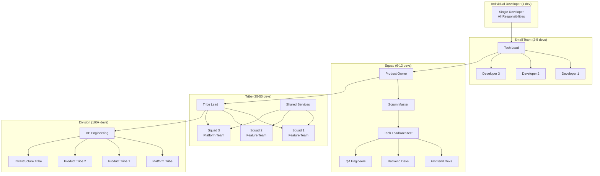

# Team Coordination and Workflow Optimization

## Executive Summary

Enterprise team coordination for Claude-Flow enables organizations to scale development teams from individual contributors to 100+ developers while maintaining high productivity, code quality, and collaboration efficiency. This document outlines proven patterns for team organization, workflow optimization, and coordination mechanisms.

## Team Organization Patterns

### 1. Scaling Model: From Individual to Enterprise



### 2. Team Structure Matrix

```yaml
# Team scaling configuration
team_structures:
  individual_developer:
    size: 1
    claude_flow_setup:
      agents_per_developer: "5-10"
      swarm_topology: "single_node"
      coordination_overhead: "minimal"

    responsibilities:
      - "full_stack_development"
      - "testing"
      - "deployment"
      - "documentation"

    claude_flow_optimization:
      - "personal_agent_templates"
      - "individual_productivity_metrics"
      - "automated_code_review"

  small_team:
    size: "2-5"
    claude_flow_setup:
      agents_per_developer: "3-8"
      swarm_topology: "mesh"
      coordination_overhead: "low"

    roles:
      tech_lead:
        responsibilities:
          - "architecture_decisions"
          - "code_review"
          - "mentoring"
          - "technical_strategy"
        claude_flow_config:
          agent_types: ["architect", "reviewer", "mentor"]

      developers:
        responsibilities:
          - "feature_development"
          - "unit_testing"
          - "code_documentation"
        claude_flow_config:
          agent_types: ["coder", "tester", "documenter"]

  squad:
    size: "6-12"
    claude_flow_setup:
      agents_per_developer: "2-5"
      swarm_topology: "hierarchical"
      coordination_overhead: "medium"

    roles:
      product_owner:
        responsibilities:
          - "requirement_definition"
          - "priority_management"
          - "stakeholder_communication"
        claude_flow_config:
          agent_types: ["requirement_analyst", "business_analyst"]

      scrum_master:
        responsibilities:
          - "process_facilitation"
          - "impediment_removal"
          - "team_coaching"
        claude_flow_config:
          agent_types: ["process_optimizer", "team_coordinator"]

      tech_lead:
        responsibilities:
          - "technical_leadership"
          - "architecture_oversight"
          - "code_quality"
        claude_flow_config:
          agent_types: ["system_architect", "code_reviewer", "performance_analyzer"]

  tribe:
    size: "25-50"
    claude_flow_setup:
      agents_per_developer: "1-3"
      swarm_topology: "federated_hierarchical"
      coordination_overhead: "high"

    structure:
      feature_squads:
        count: "3-5"
        focus: "product_features"
        claude_flow_coordination: "cross_squad_agents"

      platform_squad:
        count: 1
        focus: "shared_infrastructure"
        claude_flow_coordination: "central_agent_registry"

      shared_services:
        qa_guild: "quality_assurance_agents"
        security_guild: "security_audit_agents"
        devops_guild: "deployment_automation_agents"

  division:
    size: "100+"
    claude_flow_setup:
      agents_per_developer: "0.5-2"
      swarm_topology: "enterprise_mesh"
      coordination_overhead: "enterprise"

    organization:
      platform_tribe:
        responsibilities:
          - "claude_flow_platform_management"
          - "shared_agent_development"
          - "cross_tribe_coordination"

      product_tribes:
        count: "3-5"
        independence: "high"
        shared_resources: "platform_agents"

      governance:
        architecture_board: "enterprise_architectural_decisions"
        security_council: "enterprise_security_policies"
        engineering_excellence: "best_practices_and_standards"
```

## Workflow Optimization Patterns

### 1. Agile Development with AI Agents

```typescript
// Agile workflow integration with Claude-Flow
export interface AgileWorkflow {
  sprint_planning: {
    // AI-assisted story estimation
    story_estimation: {
      agent_type: "estimation_specialist";
      inputs: ["user_stories", "historical_data", "team_velocity"];
      outputs: ["story_points", "effort_estimates", "risk_assessments"];
    };

    // Capacity planning with agent workload
    capacity_planning: {
      agent_type: "capacity_planner";
      considerations: [
        "team_availability",
        "agent_resource_requirements",
        "infrastructure_capacity",
        "external_dependencies"
      ];
    };

    // Sprint goal optimization
    sprint_optimization: {
      agent_type: "sprint_optimizer";
      optimization_criteria: [
        "business_value",
        "technical_dependencies",
        "team_skills_alignment",
        "risk_distribution"
      ];
    };
  };

  daily_standups: {
    // Automated progress tracking
    progress_tracking: {
      agent_type: "progress_tracker";
      data_sources: [
        "git_commits",
        "pull_requests",
        "test_results",
        "deployment_status"
      ];
    };

    // Impediment identification
    impediment_detection: {
      agent_type: "impediment_detector";
      detection_patterns: [
        "blocked_pull_requests",
        "failing_tests",
        "slow_deployment_pipelines",
        "external_service_issues"
      ];
    };

    // Resource reallocation suggestions
    resource_optimization: {
      agent_type: "resource_optimizer";
      reallocation_strategies: [
        "skill_based_assignment",
        "workload_balancing",
        "pair_programming_opportunities",
        "knowledge_sharing_needs"
      ];
    };
  };

  sprint_review: {
    // Automated demo preparation
    demo_preparation: {
      agent_type: "demo_orchestrator";
      preparation_tasks: [
        "environment_setup",
        "test_data_creation",
        "demo_script_generation",
        "failure_scenario_preparation"
      ];
    };

    // Stakeholder feedback analysis
    feedback_analysis: {
      agent_type: "feedback_analyzer";
      analysis_dimensions: [
        "feature_completeness",
        "user_experience_feedback",
        "performance_concerns",
        "change_requests"
      ];
    };
  };

  sprint_retrospective: {
    // Process improvement identification
    improvement_identification: {
      agent_type: "improvement_analyzer";
      data_sources: [
        "velocity_trends",
        "quality_metrics",
        "team_satisfaction_surveys",
        "cycle_time_analysis"
      ];
    };

    // Action item generation
    action_planning: {
      agent_type: "action_planner";
      action_categories: [
        "process_improvements",
        "tool_optimizations",
        "skill_development",
        "team_dynamics"
      ];
    };
  };
}

// Workflow orchestration
export class AgileWorkflowOrchestrator {

  async orchestrateSprintPlanning(
    team: Team,
    backlog: ProductBacklog,
    sprint_config: SprintConfiguration
  ): Promise<SprintPlan> {

    // Parallel agent execution for sprint planning
    const [
      story_estimates,
      capacity_analysis,
      dependency_mapping,
      risk_assessment
    ] = await Promise.all([
      this.executeAgent("estimation_specialist", {
        user_stories: backlog.stories,
        historical_data: team.velocity_history,
        estimation_method: "planning_poker_ai"
      }),
      this.executeAgent("capacity_planner", {
        team_availability: team.availability,
        sprint_duration: sprint_config.duration,
        agent_resource_needs: this.calculateAgentResourceNeeds(backlog.stories)
      }),
      this.executeAgent("dependency_mapper", {
        stories: backlog.stories,
        team_structure: team.structure,
        external_systems: team.external_dependencies
      }),
      this.executeAgent("risk_assessor", {
        stories: backlog.stories,
        team_experience: team.skill_matrix,
        technical_complexity: this.assessTechnicalComplexity(backlog.stories)
      })
    ]);

    // Optimize sprint composition
    const sprint_optimization = await this.executeAgent("sprint_optimizer", {
      story_estimates,
      capacity_analysis,
      dependency_mapping,
      risk_assessment,
      business_priorities: backlog.priorities
    });

    return {
      sprint_goal: sprint_optimization.recommended_goal,
      selected_stories: sprint_optimization.optimal_story_selection,
      capacity_allocation: sprint_optimization.capacity_distribution,
      risk_mitigation: sprint_optimization.risk_mitigation_plan,
      success_metrics: sprint_optimization.success_criteria
    };
  }

  async coordinateDailyStandups(
    team: Team,
    current_sprint: Sprint
  ): Promise<StandupInsights> {

    const [
      progress_summary,
      impediment_analysis,
      collaboration_opportunities,
      workload_balance
    ] = await Promise.all([
      this.executeAgent("progress_tracker", {
        sprint_stories: current_sprint.stories,
        time_period: "last_24_hours",
        team_members: team.members
      }),
      this.executeAgent("impediment_detector", {
        active_work: current_sprint.active_work,
        external_dependencies: current_sprint.dependencies,
        team_feedback: team.daily_feedback
      }),
      this.executeAgent("collaboration_optimizer", {
        current_work_distribution: current_sprint.work_distribution,
        team_skills: team.skill_matrix,
        knowledge_gaps: this.identifyKnowledgeGaps(current_sprint)
      }),
      this.executeAgent("workload_analyzer", {
        individual_capacity: team.individual_capacity,
        current_assignments: current_sprint.assignments,
        upcoming_deadlines: current_sprint.deadlines
      })
    ]);

    return {
      progress_summary,
      identified_impediments: impediment_analysis.impediments,
      recommended_actions: impediment_analysis.mitigation_strategies,
      collaboration_opportunities: collaboration_opportunities.recommendations,
      workload_adjustments: workload_balance.recommended_adjustments,
      focus_areas: this.identifyDailyFocusAreas(
        progress_summary,
        impediment_analysis,
        current_sprint.goals
      )
    };
  }
}
```

### 2. Cross-Team Coordination Mechanisms

```yaml
# Cross-team coordination configuration
cross_team_coordination:
  communication_patterns:
    synchronous:
      scrum_of_scrums:
        frequency: "daily"
        duration: "15_minutes"
        participants: ["scrum_masters", "tech_leads"]
        claude_flow_integration:
          - "automated_status_aggregation"
          - "dependency_conflict_detection"
          - "resource_contention_alerts"

      architecture_review_board:
        frequency: "weekly"
        duration: "60_minutes"
        participants: ["architects", "senior_engineers"]
        claude_flow_integration:
          - "architectural_decision_analysis"
          - "technical_debt_assessment"
          - "cross_team_impact_analysis"

      engineering_all_hands:
        frequency: "monthly"
        duration: "120_minutes"
        participants: ["all_engineers"]
        claude_flow_integration:
          - "engineering_metrics_dashboard"
          - "knowledge_sharing_recommendations"
          - "skill_development_suggestions"

    asynchronous:
      shared_documentation:
        platform: "Confluence"
        automation: "claude_flow_documentation_agents"
        update_frequency: "real_time"

      cross_team_chat:
        platform: "Slack"
        channels:
          - "#engineering-coordination"
          - "#architecture-discussions"
          - "#deployment-notifications"
        claude_flow_integration:
          - "automated_status_updates"
          - "intelligent_question_routing"
          - "expertise_location"

  dependency_management:
    upstream_dependencies:
      identification: "automated_code_analysis"
      tracking: "dependency_graph_visualization"
      notification: "breaking_change_alerts"

    downstream_dependencies:
      impact_analysis: "automated_impact_assessment"
      coordination: "synchronized_release_planning"
      testing: "cross_team_integration_tests"

  resource_sharing:
    shared_services:
      claude_flow_platform: "centrally_managed"
      ci_cd_pipeline: "shared_infrastructure"
      monitoring_tools: "unified_observability"

    knowledge_sharing:
      tech_talks: "monthly_presentations"
      code_reviews: "cross_team_reviews"
      pair_programming: "inter_team_pairing"

# Coordination automation
coordination_automation:
  automated_workflows:
    dependency_coordination:
      trigger: "api_change_detection"
      actions:
        - "notify_downstream_teams"
        - "schedule_coordination_meeting"
        - "create_migration_timeline"
        - "update_integration_tests"

    release_coordination:
      trigger: "release_branch_creation"
      actions:
        - "coordinate_feature_freeze"
        - "schedule_integration_testing"
        - "prepare_rollback_procedures"
        - "notify_stakeholders"

    conflict_resolution:
      trigger: "resource_contention_detected"
      actions:
        - "escalate_to_tech_leads"
        - "suggest_alternative_resources"
        - "reschedule_conflicting_work"
        - "update_capacity_planning"

  intelligent_routing:
    expertise_matching:
      algorithm: "skill_based_routing"
      data_sources:
        - "code_contribution_history"
        - "pull_request_reviews"
        - "documentation_authorship"
        - "support_ticket_resolution"

    workload_balancing:
      algorithm: "capacity_aware_assignment"
      factors:
        - "current_workload"
        - "skill_alignment"
        - "learning_opportunities"
        - "team_distribution"
```

### 3. Knowledge Management and Skill Development

```typescript
// Knowledge management with AI assistance
export class KnowledgeManagementSystem {

  async createLearningPath(
    developer: Developer,
    career_goals: CareerGoals,
    team_needs: TeamNeeds
  ): Promise<PersonalizedLearningPath> {

    const skill_gap_analysis = await this.executeAgent("skill_analyzer", {
      current_skills: developer.skills,
      target_skills: career_goals.desired_skills,
      team_requirements: team_needs.skill_requirements,
      market_trends: await this.getMarketSkillTrends()
    });

    const learning_recommendations = await this.executeAgent("learning_path_generator", {
      skill_gaps: skill_gap_analysis.gaps,
      learning_preferences: developer.learning_preferences,
      available_resources: team_needs.training_budget,
      time_constraints: developer.availability
    });

    return {
      personalized_curriculum: learning_recommendations.curriculum,
      milestone_schedule: learning_recommendations.timeline,
      resource_recommendations: learning_recommendations.resources,
      mentorship_matching: await this.findMentors(skill_gap_analysis.gaps),
      practice_projects: await this.generatePracticeProjects(skill_gap_analysis.gaps)
    };
  }

  async facilitateKnowledgeSharing(
    team: Team,
    knowledge_domains: KnowledgeDomain[]
  ): Promise<KnowledgeSharingPlan> {

    const knowledge_mapping = await this.executeAgent("knowledge_mapper", {
      team_members: team.members,
      knowledge_domains: knowledge_domains,
      current_documentation: team.documentation_corpus
    });

    const sharing_opportunities = await this.executeAgent("sharing_optimizer", {
      knowledge_distribution: knowledge_mapping.distribution,
      learning_objectives: team.learning_goals,
      collaboration_patterns: team.collaboration_history
    });

    return {
      knowledge_experts: knowledge_mapping.experts_by_domain,
      knowledge_gaps: knowledge_mapping.identified_gaps,
      sharing_sessions: sharing_opportunities.recommended_sessions,
      documentation_priorities: sharing_opportunities.documentation_needs,
      cross_training_pairs: sharing_opportunities.optimal_pairings
    };
  }

  // AI-powered code review learning
  async enhanceCodeReviewProcess(
    team: Team,
    historical_reviews: CodeReview[]
  ): Promise<CodeReviewEnhancement> {

    const review_pattern_analysis = await this.executeAgent("review_pattern_analyzer", {
      historical_reviews: historical_reviews,
      team_skill_levels: team.skill_matrix,
      codebase_characteristics: team.codebase_metrics
    });

    const improvement_suggestions = await this.executeAgent("review_process_optimizer", {
      current_process: team.code_review_process,
      pattern_analysis: review_pattern_analysis,
      best_practices: await this.getCodeReviewBestPractices()
    });

    return {
      review_guidelines: improvement_suggestions.updated_guidelines,
      reviewer_assignments: improvement_suggestions.optimal_reviewer_matching,
      automation_opportunities: improvement_suggestions.automation_recommendations,
      training_needs: improvement_suggestions.skill_development_areas,
      metrics_tracking: improvement_suggestions.success_metrics
    };
  }
}

// Skill development tracking
export class SkillDevelopmentTracker {

  async trackSkillProgress(
    developer: Developer,
    learning_activities: LearningActivity[]
  ): Promise<SkillProgressReport> {

    const progress_analysis = await this.executeAgent("progress_analyzer", {
      baseline_skills: developer.baseline_skills,
      learning_activities: learning_activities,
      code_contributions: developer.recent_contributions,
      peer_feedback: developer.peer_reviews
    });

    const competency_assessment = await this.executeAgent("competency_assessor", {
      code_quality_metrics: developer.code_quality_trends,
      problem_solving_examples: developer.problem_solving_history,
      collaboration_effectiveness: developer.collaboration_metrics
    });

    return {
      skill_progression: progress_analysis.skill_improvements,
      competency_levels: competency_assessment.current_competencies,
      learning_velocity: progress_analysis.learning_rate,
      next_milestones: this.generateNextMilestones(progress_analysis),
      recommended_focus_areas: competency_assessment.improvement_areas
    };
  }

  async generateTeamSkillMatrix(
    team: Team,
    required_skills: Skill[]
  ): Promise<TeamSkillMatrix> {

    const individual_assessments = await Promise.all(
      team.members.map(member => this.assessIndividualSkills(member))
    );

    const team_capabilities = await this.executeAgent("team_capability_analyzer", {
      individual_skills: individual_assessments,
      required_skills: required_skills,
      project_requirements: team.project_requirements
    });

    return {
      skill_coverage: team_capabilities.coverage_analysis,
      skill_gaps: team_capabilities.identified_gaps,
      redundancy_analysis: team_capabilities.redundancy_assessment,
      development_priorities: team_capabilities.development_recommendations,
      hiring_recommendations: team_capabilities.hiring_needs
    };
  }
}
```

## Performance and Productivity Optimization

### 1. Team Performance Metrics

```yaml
# Team performance measurement framework
performance_metrics:
  velocity_metrics:
    story_points_per_sprint:
      target: "> 80 points"
      measurement: "completed_story_points / sprint_duration"
      trend_analysis: "12_week_rolling_average"

    cycle_time:
      target: "< 5 days"
      measurement: "merge_time - start_time"
      breakdown: ["coding", "review", "testing", "deployment"]

    throughput:
      target: "> 50 items per month"
      measurement: "completed_items / month"
      item_types: ["features", "bugs", "tech_debt"]

  quality_metrics:
    defect_density:
      target: "< 0.1 defects per story point"
      measurement: "production_defects / delivered_story_points"
      severity_weighting: true

    test_coverage:
      target: "> 85%"
      measurement: "covered_lines / total_lines"
      trend_tracking: "weekly"

    code_review_effectiveness:
      target: "> 90% issues caught in review"
      measurement: "review_issues / (review_issues + production_issues)"

  collaboration_metrics:
    knowledge_distribution:
      target: "< 20% bus factor risk"
      measurement: "critical_knowledge_holders / team_size"
      risk_assessment: "monthly"

    cross_functional_collaboration:
      target: "> 80% cross-functional PRs"
      measurement: "cross_team_reviews / total_reviews"

    mentoring_effectiveness:
      target: "> 90% mentee satisfaction"
      measurement: "mentoring_feedback_scores"
      frequency: "quarterly"

# AI-enhanced performance analysis
performance_analysis:
  predictive_metrics:
    velocity_forecasting:
      algorithm: "time_series_analysis"
      factors: ["historical_velocity", "team_changes", "complexity_trends"]
      accuracy_target: "> 85%"

    risk_prediction:
      algorithm: "anomaly_detection"
      risk_factors: ["velocity_drops", "quality_issues", "team_turnover"]
      early_warning: "2_week_horizon"

    capacity_optimization:
      algorithm: "resource_allocation_optimization"
      variables: ["skill_mix", "workload_distribution", "learning_objectives"]
      optimization_frequency: "sprint_planning"

  automated_insights:
    performance_patterns:
      - "seasonal_productivity_trends"
      - "optimal_team_composition"
      - "effective_collaboration_patterns"
      - "learning_velocity_correlation"

    improvement_recommendations:
      - "process_optimization_suggestions"
      - "skill_development_priorities"
      - "tool_adoption_recommendations"
      - "team_structure_adjustments"
```

### 2. Workflow Automation and Optimization

```typescript
// Intelligent workflow automation
export class WorkflowOptimizer {

  async optimizeTeamWorkflow(
    team: Team,
    current_workflow: Workflow,
    performance_data: PerformanceData
  ): Promise<WorkflowOptimization> {

    const bottleneck_analysis = await this.executeAgent("bottleneck_analyzer", {
      workflow_steps: current_workflow.steps,
      performance_metrics: performance_data.metrics,
      team_feedback: performance_data.team_feedback
    });

    const optimization_opportunities = await this.executeAgent("workflow_optimizer", {
      current_workflow: current_workflow,
      bottlenecks: bottleneck_analysis.identified_bottlenecks,
      best_practices: await this.getWorkflowBestPractices(),
      team_constraints: team.constraints
    });

    const automation_recommendations = await this.executeAgent("automation_advisor", {
      manual_tasks: current_workflow.manual_tasks,
      repetitive_patterns: bottleneck_analysis.repetitive_patterns,
      automation_tools: team.available_tools
    });

    return {
      current_state_analysis: bottleneck_analysis,
      optimization_recommendations: optimization_opportunities.recommendations,
      automation_opportunities: automation_recommendations.opportunities,
      implementation_plan: this.createImplementationPlan(
        optimization_opportunities,
        automation_recommendations
      ),
      expected_improvements: this.calculateExpectedImprovements(
        optimization_opportunities,
        automation_recommendations
      )
    };
  }

  // Intelligent task assignment
  async optimizeTaskAssignment(
    team: Team,
    available_tasks: Task[],
    constraints: AssignmentConstraints
  ): Promise<TaskAssignmentPlan> {

    const skill_matching = await this.executeAgent("skill_matcher", {
      team_skills: team.skill_matrix,
      task_requirements: available_tasks.map(t => t.skill_requirements),
      learning_objectives: team.learning_goals
    });

    const workload_optimization = await this.executeAgent("workload_optimizer", {
      current_workloads: team.current_workloads,
      task_estimates: available_tasks.map(t => t.effort_estimate),
      capacity_constraints: constraints.capacity_limits
    });

    const collaboration_optimization = await this.executeAgent("collaboration_optimizer", {
      task_dependencies: this.extractTaskDependencies(available_tasks),
      team_collaboration_patterns: team.collaboration_history,
      knowledge_sharing_opportunities: team.knowledge_gaps
    });

    return {
      optimal_assignments: this.generateOptimalAssignments(
        skill_matching,
        workload_optimization,
        collaboration_optimization
      ),
      pairing_recommendations: collaboration_optimization.pairing_suggestions,
      learning_opportunities: skill_matching.learning_matches,
      workload_balance: workload_optimization.balance_assessment,
      risk_mitigation: this.identifyAssignmentRisks(
        skill_matching,
        workload_optimization
      )
    };
  }

  // Continuous improvement engine
  async generateContinuousImprovements(
    team: Team,
    historical_performance: PerformanceHistory
  ): Promise<ContinuousImprovementPlan> {

    const trend_analysis = await this.executeAgent("trend_analyzer", {
      performance_history: historical_performance,
      external_factors: team.external_influences,
      team_changes: team.change_history
    });

    const improvement_identification = await this.executeAgent("improvement_identifier", {
      performance_trends: trend_analysis.trends,
      benchmark_data: await this.getBenchmarkData(team.industry, team.size),
      team_feedback: team.satisfaction_surveys
    });

    const impact_prioritization = await this.executeAgent("impact_prioritizer", {
      improvement_opportunities: improvement_identification.opportunities,
      implementation_effort: improvement_identification.effort_estimates,
      expected_impact: improvement_identification.impact_predictions
    });

    return {
      identified_improvements: improvement_identification.opportunities,
      prioritized_initiatives: impact_prioritization.ranked_initiatives,
      implementation_roadmap: this.createImplementationRoadmap(
        impact_prioritization.ranked_initiatives
      ),
      success_metrics: this.defineSuccessMetrics(
        impact_prioritization.ranked_initiatives
      ),
      monitoring_plan: this.createMonitoringPlan(
        impact_prioritization.ranked_initiatives
      )
    };
  }
}

// Meeting and communication optimization
export class CommunicationOptimizer {

  async optimizeMeetingEffectiveness(
    team: Team,
    meeting_history: MeetingHistory
  ): Promise<MeetingOptimization> {

    const meeting_analysis = await this.executeAgent("meeting_analyzer", {
      meeting_data: meeting_history.meetings,
      outcome_tracking: meeting_history.outcomes,
      participant_feedback: meeting_history.feedback
    });

    const optimization_suggestions = await this.executeAgent("meeting_optimizer", {
      current_patterns: meeting_analysis.patterns,
      effectiveness_metrics: meeting_analysis.effectiveness,
      best_practices: await this.getMeetingBestPractices()
    });

    return {
      current_effectiveness: meeting_analysis.effectiveness_score,
      time_waste_analysis: meeting_analysis.waste_identification,
      optimization_recommendations: optimization_suggestions.recommendations,
      meeting_alternatives: optimization_suggestions.alternative_formats,
      implementation_guide: this.createMeetingOptimizationGuide(
        optimization_suggestions
      )
    };
  }

  async optimizeAsyncCommunication(
    team: Team,
    communication_patterns: CommunicationPatterns
  ): Promise<AsyncCommunicationOptimization> {

    const communication_analysis = await this.executeAgent("communication_analyzer", {
      message_patterns: communication_patterns.patterns,
      response_times: communication_patterns.response_metrics,
      information_flow: communication_patterns.information_flow
    });

    const channel_optimization = await this.executeAgent("channel_optimizer", {
      current_channels: team.communication_channels,
      usage_patterns: communication_analysis.usage_patterns,
      effectiveness_metrics: communication_analysis.effectiveness
    });

    return {
      communication_effectiveness: communication_analysis.effectiveness_score,
      channel_optimization: channel_optimization.recommendations,
      information_architecture: channel_optimization.information_structure,
      automation_opportunities: channel_optimization.automation_suggestions,
      guidelines: this.generateCommunicationGuidelines(channel_optimization)
    };
  }
}
```

## Change Management and Team Evolution

### 1. Team Growth Management

```yaml
# Team growth strategies
team_growth_management:
  onboarding_optimization:
    new_hire_integration:
      duration: "2_weeks"
      buddy_system: "mandatory"

      claude_flow_onboarding:
        - "personal_agent_setup"
        - "team_workflow_training"
        - "codebase_familiarization_agents"
        - "gradual_responsibility_increase"

    ramp_up_tracking:
      metrics:
        - "code_contribution_velocity"
        - "pull_request_quality"
        - "knowledge_acquisition_rate"
        - "team_integration_score"

      milestones:
        week_1: "environment_setup_complete"
        week_2: "first_meaningful_contribution"
        month_1: "independent_feature_delivery"
        month_3: "full_productivity_achievement"

  team_restructuring:
    squad_formation:
      optimal_size: "8_developers"
      skill_distribution: "t_shaped_professionals"
      domain_alignment: "business_capability_focus"

    role_evolution:
      individual_contributor_to_lead:
        transition_support: "leadership_coaching_agents"
        skill_development: "management_capability_building"
        responsibility_gradation: "incremental_leadership_tasks"

      specialist_to_generalist:
        cross_training: "skill_broadening_programs"
        pairing_opportunities: "knowledge_transfer_sessions"
        project_rotation: "exposure_to_different_domains"

  performance_management:
    continuous_feedback:
      frequency: "weekly_check_ins"
      automation: "performance_tracking_agents"

      feedback_categories:
        - "technical_skill_development"
        - "collaboration_effectiveness"
        - "business_impact_delivery"
        - "innovation_contribution"

    career_development:
      growth_path_planning:
        technical_track: "senior_engineer_to_architect"
        management_track: "team_lead_to_engineering_manager"
        product_track: "technical_pm_to_product_lead"

      skill_gap_identification:
        assessment_frequency: "quarterly"
        development_planning: "personalized_learning_paths"
        progress_tracking: "competency_measurement_agents"

# Change management automation
change_management_automation:
  organizational_changes:
    team_reorganization:
      impact_assessment: "automated_change_impact_analysis"
      communication_planning: "stakeholder_notification_automation"
      transition_support: "change_facilitation_agents"

    process_changes:
      change_rollout: "gradual_process_adoption"
      resistance_management: "change_resistance_detection"
      success_measurement: "adoption_metrics_tracking"

  technology_adoption:
    new_tool_introduction:
      evaluation_framework: "tool_assessment_agents"
      pilot_program_management: "controlled_rollout_automation"
      training_coordination: "skill_development_orchestration"

    legacy_system_migration:
      migration_planning: "migration_strategy_agents"
      risk_mitigation: "migration_risk_assessment"
      rollback_preparation: "automated_rollback_procedures"
```

### 2. Cultural Development and Team Health

```typescript
// Team culture and health monitoring
export class TeamHealthMonitor {

  async assessTeamHealth(
    team: Team,
    assessment_period: TimePeriod
  ): Promise<TeamHealthAssessment> {

    const [
      psychological_safety,
      collaboration_effectiveness,
      innovation_culture,
      burnout_indicators,
      knowledge_sharing_health
    ] = await Promise.all([
      this.executeAgent("psychological_safety_analyzer", {
        team_interactions: team.interaction_patterns,
        feedback_patterns: team.feedback_history,
        conflict_resolution: team.conflict_history
      }),
      this.executeAgent("collaboration_analyzer", {
        project_collaboration: team.collaboration_metrics,
        cross_functional_work: team.cross_functional_activities,
        knowledge_sharing: team.knowledge_sharing_frequency
      }),
      this.executeAgent("innovation_culture_analyzer", {
        experimentation_frequency: team.experimentation_activities,
        idea_generation: team.innovation_sessions,
        risk_taking_comfort: team.risk_taking_metrics
      }),
      this.executeAgent("burnout_detector", {
        work_patterns: team.work_pattern_analysis,
        stress_indicators: team.stress_signals,
        satisfaction_surveys: team.satisfaction_data
      }),
      this.executeAgent("knowledge_sharing_analyzer", {
        documentation_quality: team.documentation_metrics,
        mentoring_activities: team.mentoring_data,
        learning_culture: team.learning_engagement
      })
    ]);

    return {
      overall_health_score: this.calculateOverallHealthScore([
        psychological_safety,
        collaboration_effectiveness,
        innovation_culture,
        burnout_indicators,
        knowledge_sharing_health
      ]),
      health_dimensions: {
        psychological_safety: psychological_safety.score,
        collaboration: collaboration_effectiveness.score,
        innovation: innovation_culture.score,
        wellbeing: burnout_indicators.wellbeing_score,
        knowledge_sharing: knowledge_sharing_health.score
      },
      risk_areas: this.identifyRiskAreas([
        psychological_safety,
        collaboration_effectiveness,
        innovation_culture,
        burnout_indicators,
        knowledge_sharing_health
      ]),
      improvement_recommendations: this.generateHealthImprovementPlan([
        psychological_safety,
        collaboration_effectiveness,
        innovation_culture,
        burnout_indicators,
        knowledge_sharing_health
      ])
    };
  }

  async monitorTeamDynamics(
    team: Team,
    interaction_data: InteractionData
  ): Promise<TeamDynamicsAnalysis> {

    const dynamics_analysis = await this.executeAgent("team_dynamics_analyzer", {
      communication_patterns: interaction_data.communication_flows,
      decision_making_patterns: interaction_data.decision_processes,
      conflict_patterns: interaction_data.conflict_occurrences,
      influence_networks: interaction_data.influence_patterns
    });

    const intervention_recommendations = await this.executeAgent("team_intervention_advisor", {
      dynamics_analysis: dynamics_analysis,
      team_goals: team.objectives,
      performance_context: team.performance_context
    });

    return {
      communication_health: dynamics_analysis.communication_assessment,
      decision_making_effectiveness: dynamics_analysis.decision_quality,
      conflict_resolution_capability: dynamics_analysis.conflict_resolution,
      leadership_distribution: dynamics_analysis.leadership_patterns,
      recommended_interventions: intervention_recommendations.interventions,
      monitoring_plan: intervention_recommendations.monitoring_strategy
    };
  }

  // Team culture development
  async developTeamCulture(
    team: Team,
    culture_goals: CultureGoals
  ): Promise<CultureDevelopmentPlan> {

    const current_culture_assessment = await this.executeAgent("culture_assessor", {
      team_behaviors: team.behavioral_patterns,
      value_alignment: team.value_demonstrations,
      cultural_artifacts: team.cultural_indicators
    });

    const culture_gap_analysis = await this.executeAgent("culture_gap_analyzer", {
      current_culture: current_culture_assessment,
      target_culture: culture_goals,
      organizational_context: team.organizational_context
    });

    const development_strategy = await this.executeAgent("culture_development_strategist", {
      culture_gaps: culture_gap_analysis.gaps,
      team_characteristics: team.characteristics,
      change_readiness: team.change_readiness_assessment
    });

    return {
      current_culture_profile: current_culture_assessment.profile,
      target_culture_vision: culture_goals.vision,
      culture_gaps: culture_gap_analysis.gaps,
      development_initiatives: development_strategy.initiatives,
      implementation_timeline: development_strategy.timeline,
      success_metrics: development_strategy.metrics,
      change_management_plan: development_strategy.change_plan
    };
  }
}

// Diversity, equity, and inclusion optimization
export class DEIOptimizer {

  async assessTeamDiversity(
    team: Team,
    diversity_dimensions: DiversityDimension[]
  ): Promise<DiversityAssessment> {

    const diversity_analysis = await this.executeAgent("diversity_analyzer", {
      team_composition: team.demographic_data,
      diversity_dimensions: diversity_dimensions,
      inclusion_indicators: team.inclusion_metrics
    });

    const equity_analysis = await this.executeAgent("equity_analyzer", {
      opportunity_distribution: team.opportunity_allocation,
      outcome_equity: team.outcome_distributions,
      advancement_patterns: team.career_progression_data
    });

    const inclusion_analysis = await this.executeAgent("inclusion_analyzer", {
      participation_patterns: team.participation_data,
      psychological_safety: team.safety_indicators,
      belonging_metrics: team.belonging_assessments
    });

    return {
      diversity_profile: diversity_analysis.profile,
      equity_assessment: equity_analysis.assessment,
      inclusion_score: inclusion_analysis.score,
      dei_recommendations: this.generateDEIRecommendations(
        diversity_analysis,
        equity_analysis,
        inclusion_analysis
      ),
      action_plan: this.createDEIActionPlan(
        diversity_analysis,
        equity_analysis,
        inclusion_analysis
      )
    };
  }

  async optimizeInclusiveProcesses(
    team: Team,
    current_processes: TeamProcess[]
  ): Promise<InclusiveProcessOptimization> {

    const process_analysis = await this.executeAgent("inclusive_process_analyzer", {
      current_processes: current_processes,
      participation_data: team.process_participation,
      outcome_equity: team.process_outcomes
    });

    const optimization_recommendations = await this.executeAgent("process_inclusion_optimizer", {
      process_analysis: process_analysis,
      best_practices: await this.getInclusiveProcessBestPractices(),
      team_context: team.context
    });

    return {
      process_inclusivity_assessment: process_analysis.assessment,
      optimization_opportunities: optimization_recommendations.opportunities,
      implementation_plan: optimization_recommendations.implementation_plan,
      monitoring_framework: optimization_recommendations.monitoring_approach,
      training_needs: optimization_recommendations.training_requirements
    };
  }
}
```

## Success Metrics and KPIs

### 1. Team Performance Indicators

```yaml
# Comprehensive team KPIs
team_kpis:
  productivity_metrics:
    delivery_velocity:
      - name: "Sprint Velocity Consistency"
        target: "< 20% variance"
        measurement: "standard_deviation(sprint_velocities) / mean(sprint_velocities)"

      - name: "Feature Lead Time"
        target: "< 10 days"
        measurement: "deployment_time - feature_start_time"

      - name: "Code Review Cycle Time"
        target: "< 24 hours"
        measurement: "approval_time - pr_creation_time"

    quality_metrics:
      - name: "Defect Escape Rate"
        target: "< 5%"
        measurement: "production_defects / total_deliveries"

      - name: "Test Automation Coverage"
        target: "> 90%"
        measurement: "automated_test_coverage / total_test_coverage"

      - name: "Technical Debt Ratio"
        target: "< 25%"
        measurement: "technical_debt_hours / total_development_hours"

  collaboration_metrics:
    knowledge_sharing:
      - name: "Documentation Currency"
        target: "> 85%"
        measurement: "up_to_date_docs / total_docs"

      - name: "Cross-Team Collaboration"
        target: "> 30%"
        measurement: "cross_team_activities / total_activities"

      - name: "Mentoring Engagement"
        target: "> 80%"
        measurement: "active_mentoring_relationships / team_size"

    communication_effectiveness:
      - name: "Meeting Efficiency"
        target: "> 75%"
        measurement: "actionable_outcomes / meeting_hours"

      - name: "Async Communication Ratio"
        target: "> 60%"
        measurement: "async_communications / total_communications"

  wellbeing_metrics:
    team_satisfaction:
      - name: "Job Satisfaction Score"
        target: "> 4.0/5.0"
        measurement: "quarterly_satisfaction_survey"

      - name: "Work-Life Balance Score"
        target: "> 3.5/5.0"
        measurement: "work_life_balance_assessment"

    psychological_safety:
      - name: "Psychological Safety Index"
        target: "> 4.0/5.0"
        measurement: "psychological_safety_survey"

      - name: "Innovation Confidence"
        target: "> 3.5/5.0"
        measurement: "innovation_comfort_assessment"

# Advanced analytics
advanced_analytics:
  predictive_indicators:
    team_performance_forecasting:
      algorithm: "ensemble_modeling"
      input_features:
        - "historical_velocity"
        - "team_composition_changes"
        - "skill_development_progress"
        - "external_dependency_factors"

    risk_prediction:
      burnout_risk:
        indicators: ["overtime_hours", "task_complexity", "workload_variance"]
        early_warning: "2_week_horizon"

      quality_risk:
        indicators: ["code_review_speed", "test_coverage_trend", "complexity_growth"]
        early_warning: "1_sprint_horizon"

    optimization_opportunities:
      process_improvement:
        analysis: "bottleneck_identification"
        recommendations: "automated_process_optimization"

      skill_development:
        analysis: "competency_gap_analysis"
        recommendations: "personalized_learning_paths"
```

### 2. Business Impact Measurement

```typescript
// Business impact correlation
export class BusinessImpactAnalyzer {

  async correlateTechnicalToBusinessMetrics(
    team_metrics: TeamMetrics,
    business_metrics: BusinessMetrics,
    correlation_period: TimePeriod
  ): Promise<BusinessImpactCorrelation> {

    const correlation_analysis = await this.executeAgent("correlation_analyzer", {
      technical_metrics: team_metrics,
      business_metrics: business_metrics,
      time_period: correlation_period,
      external_factors: this.getExternalFactors(correlation_period)
    });

    const causal_analysis = await this.executeAgent("causal_analyzer", {
      correlations: correlation_analysis.significant_correlations,
      domain_knowledge: this.getDomainKnowledge(),
      statistical_tests: correlation_analysis.statistical_significance
    });

    const impact_quantification = await this.executeAgent("impact_quantifier", {
      causal_relationships: causal_analysis.validated_relationships,
      business_context: business_metrics.context,
      confidence_intervals: causal_analysis.confidence_levels
    });

    return {
      correlation_strength: correlation_analysis.overall_strength,
      significant_relationships: causal_analysis.validated_relationships,
      business_impact_quantification: impact_quantification.quantified_impacts,
      improvement_opportunities: this.identifyImprovementOpportunities(
        impact_quantification
      ),
      roi_calculations: this.calculateROI(impact_quantification)
    };
  }

  async generateBusinessValueReport(
    team: Team,
    reporting_period: TimePeriod
  ): Promise<BusinessValueReport> {

    const value_delivery_analysis = await this.executeAgent("value_delivery_analyzer", {
      delivered_features: team.delivered_features,
      business_metrics: team.business_impact_metrics,
      customer_feedback: team.customer_feedback_data
    });

    const cost_benefit_analysis = await this.executeAgent("cost_benefit_analyzer", {
      team_costs: team.cost_structure,
      value_delivered: value_delivery_analysis.quantified_value,
      opportunity_costs: team.opportunity_cost_analysis
    });

    const investment_recommendations = await this.executeAgent("investment_advisor", {
      current_performance: value_delivery_analysis.performance_assessment,
      cost_benefit_ratios: cost_benefit_analysis.ratios,
      growth_opportunities: value_delivery_analysis.growth_potential
    });

    return {
      value_delivered: value_delivery_analysis.total_value,
      cost_efficiency: cost_benefit_analysis.efficiency_metrics,
      roi_metrics: cost_benefit_analysis.roi_calculations,
      investment_recommendations: investment_recommendations.recommendations,
      future_value_projections: investment_recommendations.projections
    };
  }
}
```

## Implementation Roadmap

### Phase 1: Foundation (Months 1-2)
- Establish team structure and roles
- Implement basic coordination mechanisms
- Deploy fundamental performance metrics
- Set up knowledge sharing platforms

### Phase 2: Optimization (Months 3-4)
- Deploy AI-powered workflow optimization
- Implement advanced coordination patterns
- Establish continuous improvement processes
- Enhance skill development programs

### Phase 3: Scaling (Months 5-6)
- Scale to multiple teams and projects
- Implement cross-team coordination
- Deploy predictive analytics
- Establish business impact measurement

### Phase 4: Excellence (Months 7-8)
- Achieve operational excellence
- Implement advanced cultural development
- Deploy AI-powered decision support
- Establish industry-leading practices

## Related Documentation

- [Enterprise Architecture Overview](../enterprise-architecture/enterprise-architecture-overview.md)
- [Multi-Project Coordination](../governance/multi-project-coordination.md)
- [Cost Management](../cost-optimization/enterprise-cost-management.md)
- [Performance Monitoring](../monitoring/enterprise-observability.md)