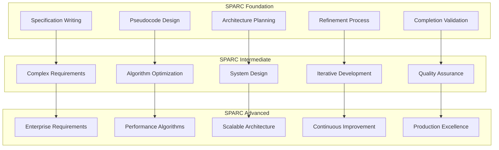
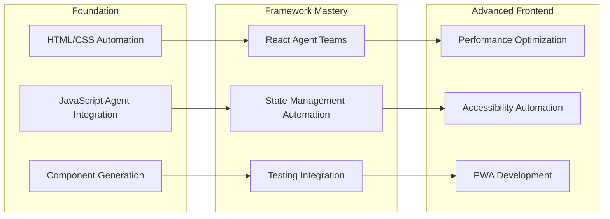
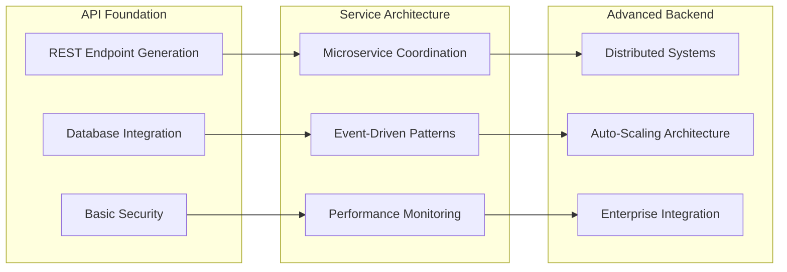
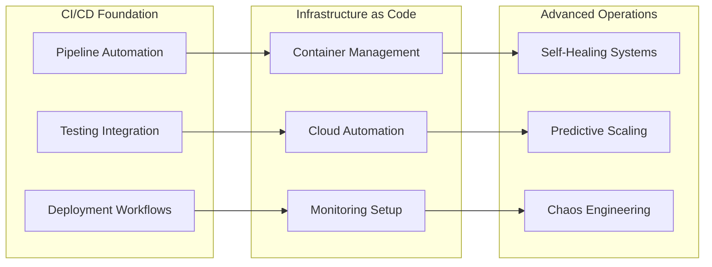
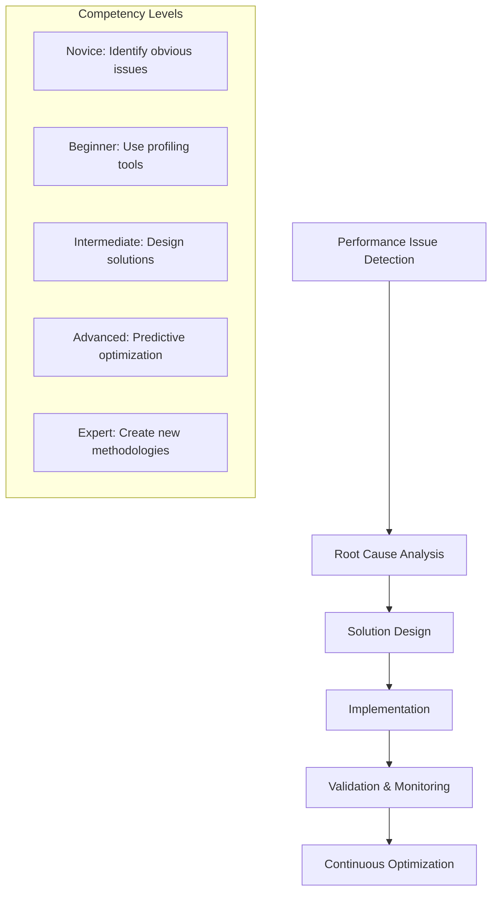
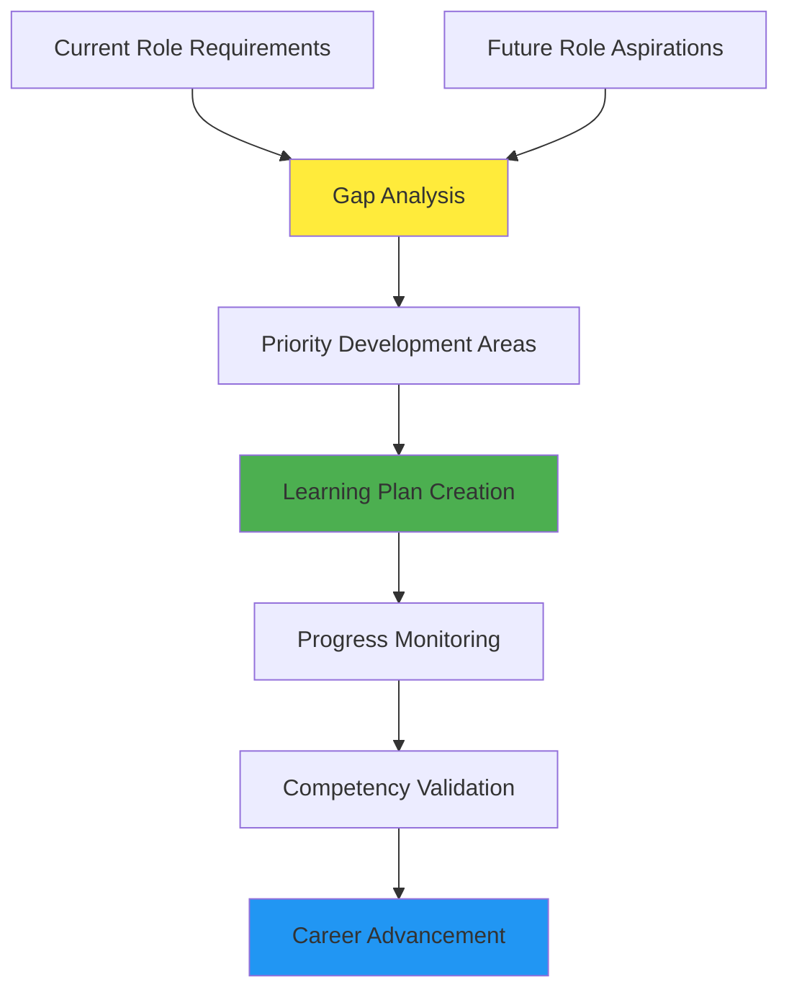

# Skill Competency Development Matrix

## 🎯 Comprehensive Skill Assessment Framework

Track your progression through detailed competency mappings across all aspects of AI-assisted development with Claude Flow.

## 📊 Core Competency Areas

### 1. Agent Management & Coordination

#### Novice Level (Foundation Skills)
```
Agent Spawning & Basic Control
├── ⭐ Spawn single agents via CLI
├── ⭐ Understand agent types and capabilities
├── ⭐ Execute basic tasks with agents
├── ⭐ Monitor agent status and responses
└── ⭐ Terminate and restart agents

Self-Assessment Checklist:
□ Can spawn a "coder" agent and give it a simple task
□ Understand the difference between agent types
□ Know how to check if an agent is working properly
□ Can stop an agent when needed
□ Completed at least 3 successful agent interactions

Time to Competency: 1-2 weeks
Practice Projects: Hello World automation, Simple file operations
```

#### Beginner Level (Single-Agent Mastery)
```
Advanced Single-Agent Operations
├── ⭐⭐ Configure agent parameters and options
├── ⭐⭐ Use specialized agents (reviewer, tester, etc.)
├── ⭐⭐ Implement SPARC workflows with agents
├── ⭐⭐ Handle agent errors and troubleshooting
└── ⭐⭐ Optimize single-agent performance

Self-Assessment Checklist:
□ Can configure agents for specific project needs
□ Successfully use 5+ different agent types
□ Implemented complete SPARC workflow independently
□ Troubleshoot and fix common agent issues
□ Measure and improve agent performance

Time to Competency: 3-4 weeks
Practice Projects: Todo app with SPARC, Code review automation
```

#### Intermediate Level (Multi-Agent Coordination)
```
Team Coordination & Orchestration
├── ⭐⭐⭐ Coordinate 3+ agents simultaneously
├── ⭐⭐⭐ Design appropriate swarm topologies
├── ⭐⭐⭐ Implement memory-driven coordination
├── ⭐⭐⭐ Manage agent dependencies and workflows
└── ⭐⭐⭐ Resolve conflicts and bottlenecks

Self-Assessment Checklist:
□ Successfully coordinate 4+ agents on complex project
□ Choose and implement optimal topology for project type
□ Use memory system for agent communication
□ Handle conflicts when agents have competing objectives
□ Optimize coordination for team efficiency

Time to Competency: 6-8 weeks
Practice Projects: Full-stack development team, CI/CD pipeline
```

#### Advanced Level (Swarm Architecture)
```
Large-Scale Swarm Management
├── ⭐⭐⭐⭐ Design custom swarm architectures
├── ⭐⭐⭐⭐ Implement auto-scaling strategies
├── ⭐⭐⭐⭐ Create self-healing workflows
├── ⭐⭐⭐⭐ Optimize for enterprise-scale systems
└── ⭐⭐⭐⭐ Monitor and analyze swarm performance

Self-Assessment Checklist:
□ Design custom topology for specific business needs
□ Implement automatic scaling based on workload
□ Create systems that recover from failures
□ Handle 10+ agents in production environment
□ Provide performance metrics and optimization

Time to Competency: 10-12 weeks
Practice Projects: Enterprise integration, Autonomous development system
```

#### Expert Level (Innovation & Leadership)
```
Custom Agent Development & Research
├── ⭐⭐⭐⭐⭐ Develop custom agent types
├── ⭐⭐⭐⭐⭐ Research novel coordination patterns
├── ⭐⭐⭐⭐⭐ Contribute to claude-flow ecosystem
├── ⭐⭐⭐⭐⭐ Train and mentor others
└── ⭐⭐⭐⭐⭐ Lead industry innovation

Self-Assessment Checklist:
□ Created at least one custom agent type
□ Published research or case studies
□ Made significant open source contributions
□ Trained 5+ people to intermediate level
□ Speaking or thought leadership in community

Time to Competency: 16+ weeks
Practice Projects: Custom agent ecosystem, Research contributions
```

### 2. SPARC Methodology Mastery

#### Visual SPARC Competency Progression


#### Detailed SPARC Competency Levels

**Novice SPARC (⭐)**
```
Basic Understanding & Application
├── Write simple specifications
├── Create basic pseudocode
├── Understand architectural concepts
├── Follow refinement process
└── Validate completion criteria

Assessment: Can complete simple project using SPARC
Time Investment: 2-3 weeks
```

**Beginner SPARC (⭐⭐)**
```
Structured Project Implementation
├── Write comprehensive requirements
├── Design efficient algorithms
├── Plan modular architecture
├── Implement iterative refinement
└── Ensure quality standards

Assessment: Complete medium complexity project independently
Time Investment: 4-6 weeks
```

**Intermediate SPARC (⭐⭐⭐)**
```
Team-Based SPARC Leadership
├── Facilitate requirement gathering
├── Design scalable solutions
├── Lead architectural decisions
├── Manage iterative development
└── Ensure enterprise quality

Assessment: Lead team project using SPARC methodology
Time Investment: 8-10 weeks
```

**Advanced SPARC (⭐⭐⭐⭐)**
```
Enterprise SPARC Implementation
├── Handle complex business requirements
├── Design high-performance solutions
├── Create scalable architectures
├── Optimize development processes
└── Deliver production systems

Assessment: Successfully deploy enterprise-scale solution
Time Investment: 12-16 weeks
```

### 3. Technology-Specific Competencies

#### Frontend Development Track


**Competency Checkpoints:**
- **Novice**: Automate basic HTML/CSS tasks
- **Beginner**: Generate React components with agents
- **Intermediate**: Coordinate frontend team with testing
- **Advanced**: Optimize performance with agent monitoring
- **Expert**: Create custom frontend development agents

#### Backend Development Track


**Competency Checkpoints:**
- **Novice**: Generate basic API endpoints
- **Beginner**: Implement database-driven services
- **Intermediate**: Coordinate microservice teams
- **Advanced**: Design distributed system architecture
- **Expert**: Create autonomous backend systems

#### DevOps & Infrastructure Track


**Competency Checkpoints:**
- **Novice**: Automate basic CI/CD pipelines
- **Beginner**: Implement infrastructure as code
- **Intermediate**: Coordinate multi-environment deployments
- **Advanced**: Design self-healing infrastructure
- **Expert**: Create predictive operational systems

### 4. Leadership & Communication Competencies

#### Technical Leadership Development
```
Individual Contributor → Team Lead → Department Lead → Technical Executive

Skills Progression:
├── Technical Mastery
│   ├── Novice: Personal productivity
│   ├── Beginner: Code quality focus
│   ├── Intermediate: Team coordination
│   ├── Advanced: Architecture decisions
│   └── Expert: Technology strategy
├── Communication
│   ├── Novice: Clear documentation
│   ├── Beginner: Effective code reviews
│   ├── Intermediate: Team facilitation
│   ├── Advanced: Stakeholder management
│   └── Expert: Executive communication
├── Mentoring & Training
│   ├── Novice: Peer support
│   ├── Beginner: Knowledge sharing
│   ├── Intermediate: Formal mentoring
│   ├── Advanced: Team training
│   └── Expert: Organization development
└── Strategic Thinking
    ├── Novice: Project planning
    ├── Beginner: Feature strategy
    ├── Intermediate: Product roadmap
    ├── Advanced: Technology adoption
    └── Expert: Industry leadership
```

### 5. Performance & Optimization Competencies

#### Performance Optimization Matrix
```
Performance Aspect | Novice | Beginner | Intermediate | Advanced | Expert
-------------------|---------|----------|--------------|----------|-------
Agent Efficiency  | Monitor | Tune     | Optimize     | Predict  | Innovate
Memory Usage       | Basic   | Manage   | Optimize     | Scale    | Research
Coordination Speed | Measure | Improve  | Design       | Engineer | Pioneer
Scalability        | Understand | Plan  | Implement    | Master   | Define
Resource Management| Track   | Control  | Automate     | Predict  | Optimize
```

#### Bottleneck Analysis Skills


## 🎯 Competency Assessment Tools

### Self-Assessment Rubric
```
For each competency area, rate yourself:

1 = Novice: Basic understanding, requires guidance
2 = Beginner: Can perform with documentation
3 = Intermediate: Proficient, can work independently
4 = Advanced: Expert level, can teach others
5 = Expert: Innovation level, industry contributions

Agent Management:        [1] [2] [3] [4] [5]
SPARC Methodology:       [1] [2] [3] [4] [5]
Technology Integration:  [1] [2] [3] [4] [5]
Team Coordination:       [1] [2] [3] [4] [5]
Performance Optimization:[1] [2] [3] [4] [5]
Problem Solving:         [1] [2] [3] [4] [5]
Communication:           [1] [2] [3] [4] [5]
```

### Portfolio-Based Assessment
```
Competency Evidence Portfolio:

1. Project Demonstrations
   ├── Video walkthroughs of complex implementations
   ├── Code repositories with documentation
   ├── Architecture diagrams and designs
   └── Performance metrics and improvements

2. Community Contributions
   ├── Tutorial creation and sharing
   ├── Open source contributions
   ├── Forum participation and help provided
   └── Speaking or presentation experience

3. Professional Application
   ├── Work-related implementations
   ├── Team training and mentoring
   ├── Process improvements achieved
   └── Business impact demonstrations

4. Innovation and Research
   ├── Novel approaches or solutions
   ├── Experimental implementations
   ├── Research contributions
   └── Industry recognition
```

### Peer Review Assessment
```
360-Degree Competency Review:

Reviewer Types:
├── Peers: Same-level developers
├── Juniors: Those you've mentored
├── Seniors: Technical leaders
└── Stakeholders: Business partners

Assessment Areas:
├── Technical Skills
├── Collaboration Effectiveness
├── Communication Quality
├── Leadership Potential
└── Innovation Contribution

Review Process:
├── Anonymous feedback collection
├── Structured competency ratings
├── Specific example requirements
├── Development recommendations
└── Growth opportunity identification
```

## 🚀 Competency Development Planning

### Individual Development Plan Template
```
COMPETENCY DEVELOPMENT PLAN

Current State Assessment:
├── Strongest competencies: [List top 3]
├── Development opportunities: [List top 3]
├── Career goals alignment: [Describe fit]
└── Timeline availability: [Hours per week]

Development Objectives (6 months):
├── Primary focus area: [Choose 1-2 competencies]
├── Specific skill targets: [Measurable goals]
├── Success metrics: [How to measure progress]
└── Resource requirements: [Time, tools, support]

Action Plan:
├── Week 1-4: [Specific activities]
├── Week 5-8: [Progressive challenges]
├── Week 9-16: [Advanced practice]
├── Week 17-24: [Mastery demonstration]
└── Review points: [Progress checkpoints]

Support Network:
├── Mentor assignment: [Identify expert guide]
├── Peer learning group: [Study/practice partners]
├── Resource access: [Tools, training, budget]
└── Progress tracking: [Methods and frequency]
```

### Competency Gap Analysis


## 📈 Progress Tracking & Validation

### Competency Progression Dashboard
```
COMPETENCY DASHBOARD - [Your Name]

Overall Progress: [████████░░] 82%

Core Competencies:
┌─────────────────────────────────────────────────┐
│ Agent Management      [██████████] Expert (5/5) │
│ SPARC Methodology     [████████░░] Advanced (4/5)│
│ Team Coordination     [██████░░░░] Inter. (3/5)  │
│ Technology Integration[████████░░] Advanced (4/5)│
│ Performance Optimization[████░░░░] Begin. (2/5)  │
│ Leadership Skills     [██░░░░░░░░] Novice (1/5)  │
└─────────────────────────────────────────────────┘

Recent Achievements:
✅ Completed Advanced Agent Coordination
✅ Led successful 6-agent development team
✅ Optimized pipeline performance by 40%
🔄 Currently working on: Leadership workshop series

Next Milestones:
🎯 Performance Optimization certification
🎯 Mentor 3 junior developers
🎯 Present at community conference
🎯 Contribute to open source project
```

### Continuous Learning Strategy
```
Learning Velocity Optimization:
├── Focus Areas: Limit to 2-3 competencies simultaneously
├── Practice Intensity: 70% hands-on, 30% theory
├── Feedback Loops: Weekly progress review
├── Community Engagement: Teach to reinforce learning
└── Real-World Application: Apply skills immediately at work

Competency Validation Schedule:
├── Monthly: Self-assessment and reflection
├── Quarterly: Peer review and feedback
├── Semi-Annually: Formal competency assessment
├── Annually: Career goal alignment review
└── Ongoing: Portfolio evidence collection
```

---

**Ready to assess and develop your competencies?** Use this matrix to identify your current level, plan your development, and track your progress toward mastery! 🎯