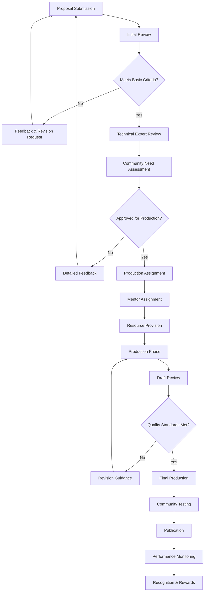

# Community Video Contribution Guidelines

**Comprehensive framework for community-driven video tutorial creation, review processes, and recognition programs.**

## 👥 Community Contribution Overview

Community contributions are essential for creating diverse, comprehensive video tutorial content. This guide establishes clear processes for community members to contribute high-quality tutorials while maintaining consistency and educational effectiveness.

## 🎆 Contribution Framework

### Community Roles and Responsibilities

#### 👨‍🏫 Content Contributors
```markdown
**Tutorial Creators:**
- Subject matter experts sharing knowledge
- Community members with teaching passion
- Developers with specific use case experience
- Technical writers expanding into video

**Responsibilities:**
- Create original, accurate content
- Follow established quality standards
- Respond to feedback and revision requests
- Maintain content currency

**Requirements:**
- Demonstrated expertise in tutorial topic
- Commitment to community guidelines
- Availability for revision cycles
- Basic video production capabilities

**Support Provided:**
- Production guidelines and templates
- Technical review assistance
- Recording equipment recommendations
- Editing software access (if needed)
```

#### 🔍 Content Reviewers
```markdown
**Technical Reviewers:**
- Verify accuracy of technical content
- Check code examples and commands
- Validate best practices compliance
- Ensure educational effectiveness

**Production Reviewers:**
- Assess video and audio quality
- Check accessibility compliance
- Verify visual consistency
- Review editing and pacing

**Community Moderators:**
- Coordinate review processes
- Manage contributor onboarding
- Facilitate feedback sessions
- Resolve conflicts and issues

**Qualifications:**
- Recognized expertise in relevant areas
- Strong communication skills
- Commitment to constructive feedback
- Understanding of educational principles
```

#### 🏆 Recognition Levels
```javascript
// Community contributor recognition system
const ContributorLevels = {
  "newcomer": {
    requirements: {
      tutorials_created: 0,
      reviews_completed: 0,
      community_engagement: "basic"
    },
    benefits: {
      access_to_templates: true,
      community_support: "standard",
      early_feedback: false,
      co_marketing: false
    }
  },
  "contributor": {
    requirements: {
      tutorials_created: 1,
      average_rating: 4.0,
      community_engagement: "active"
    },
    benefits: {
      access_to_templates: true,
      community_support: "enhanced",
      early_feedback: true,
      co_marketing: "limited",
      contributor_badge: true
    }
  },
  "expert_contributor": {
    requirements: {
      tutorials_created: 5,
      average_rating: 4.5,
      community_engagement: "high",
      peer_reviews: 3
    },
    benefits: {
      access_to_templates: true,
      community_support: "priority",
      early_feedback: true,
      co_marketing: "full",
      contributor_badge: true,
      review_privileges: true,
      content_planning_input: true
    }
  },
  "community_leader": {
    requirements: {
      tutorials_created: 15,
      average_rating: 4.7,
      community_engagement: "exceptional",
      peer_reviews: 10,
      mentorship_activity: true
    },
    benefits: {
      all_previous_benefits: true,
      editorial_board_participation: true,
      content_strategy_input: true,
      conference_speaking_opportunities: true,
      monetary_recognition: true
    }
  }
};

// Progression tracking
class ContributorProgressTracker {
  calculateProgress(contributorData) {
    const currentLevel = this.getCurrentLevel(contributorData);
    const nextLevel = this.getNextLevel(currentLevel);
    
    if (!nextLevel) {
      return { isMaxLevel: true, currentLevel };
    }
    
    const progress = {};
    const requirements = ContributorLevels[nextLevel].requirements;
    
    Object.keys(requirements).forEach(requirement => {
      const current = contributorData[requirement] || 0;
      const required = requirements[requirement];
      
      if (typeof required === 'number') {
        progress[requirement] = {
          current,
          required,
          percentage: Math.min((current / required) * 100, 100)
        };
      } else {
        progress[requirement] = {
          current: current,
          required: required,
          met: this.evaluateQualitativeRequirement(current, required)
        };
      }
    });
    
    return {
      currentLevel,
      nextLevel,
      progress,
      overallProgress: this.calculateOverallProgress(progress)
    };
  }
}
```

### Contribution Process

#### 📋 Proposal Submission
```markdown
**Tutorial Proposal Template:**

**Basic Information:**
- **Title**: [Clear, descriptive title]
- **Duration**: [Estimated video length]
- **Difficulty Level**: [Beginner/Intermediate/Advanced]
- **Category**: [Setup/Development/Integration/etc.]

**Content Overview:**
- **Learning Objectives**: What will viewers accomplish?
- **Target Audience**: Who is this tutorial for?
- **Prerequisites**: What knowledge/tools are needed?
- **Key Topics**: Main concepts covered

**Technical Details:**
- **Tools/Software**: What will be demonstrated?
- **Code Examples**: Will you provide sample code?
- **Environment**: Development setup requirements
- **Version Compatibility**: Which versions are covered?

**Production Plan:**
- **Recording Timeline**: When will you complete this?
- **Equipment**: What recording setup will you use?
- **Experience Level**: Your video production background
- **Support Needed**: Areas where you'd like assistance

**Value Proposition:**
- **Gap Analysis**: What gap does this fill?
- **Unique Angle**: What's your special perspective?
- **Community Benefit**: How does this help the community?

**Contributor Information:**
- **Name**: [Your name]
- **Background**: [Relevant experience]
- **Contact**: [Email/Discord/GitHub]
- **Previous Contributions**: [Links to prior work]
```

#### 🔄 Review and Approval Process


#### 📏 Proposal Evaluation Criteria
```javascript
// Tutorial proposal evaluation system
class ProposalEvaluator {
  constructor() {
    this.criteria = {
      technical_accuracy: {
        weight: 0.25,
        description: "Correctness of technical content",
        scale: "1-5"
      },
      educational_value: {
        weight: 0.25,
        description: "Learning effectiveness and clarity",
        scale: "1-5"
      },
      community_need: {
        weight: 0.20,
        description: "Addresses identified community gaps",
        scale: "1-5"
      },
      originality: {
        weight: 0.15,
        description: "Unique perspective or approach",
        scale: "1-5"
      },
      production_feasibility: {
        weight: 0.10,
        description: "Realistic production plan",
        scale: "1-5"
      },
      contributor_capability: {
        weight: 0.05,
        description: "Creator's ability to execute",
        scale: "1-5"
      }
    };
  }
  
  evaluateProposal(proposal, reviewerScores) {
    const scores = {};
    let weightedTotal = 0;
    let totalWeight = 0;
    
    Object.entries(this.criteria).forEach(([criterion, config]) => {
      const score = reviewerScores[criterion];
      const weighted = score * config.weight;
      
      scores[criterion] = {
        raw_score: score,
        weighted_score: weighted,
        weight: config.weight
      };
      
      weightedTotal += weighted;
      totalWeight += config.weight;
    });
    
    const finalScore = weightedTotal / totalWeight;
    
    return {
      proposal_id: proposal.id,
      overall_score: finalScore,
      detailed_scores: scores,
      recommendation: this.generateRecommendation(finalScore, scores),
      feedback: this.generateFeedback(scores),
      approval_status: finalScore >= 3.5 ? 'approved' : 'needs_revision'
    };
  }
  
  generateRecommendation(score, detailedScores) {
    if (score >= 4.5) {
      return {
        status: 'highly_recommended',
        priority: 'high',
        fast_track: true
      };
    } else if (score >= 3.5) {
      return {
        status: 'recommended',
        priority: 'medium',
        fast_track: false
      };
    } else if (score >= 2.5) {
      return {
        status: 'conditional',
        priority: 'low',
        revision_required: true
      };
    } else {
      return {
        status: 'not_recommended',
        priority: 'none',
        major_revision_required: true
      };
    }
  }
}
```

## 🏭 Production Support System

### Mentorship Program

#### 👥 Mentor-Contributor Matching
```markdown
**Mentor Qualifications:**
- Experienced tutorial creators (5+ published tutorials)
- Strong community standing and reputation
- Demonstrated teaching/mentoring abilities
- Availability for regular check-ins

**Matching Criteria:**
- **Technical Expertise**: Mentor knowledge in tutorial topic area
- **Production Experience**: Mentor's video creation background
- **Communication Style**: Compatible working preferences
- **Schedule Compatibility**: Overlapping availability
- **Language/Cultural**: Shared language and cultural context

**Mentor Responsibilities:**
- Provide guidance throughout production process
- Review drafts and provide constructive feedback
- Share technical knowledge and best practices
- Support contributor through challenges
- Advocate for contributor within community

**Time Commitment:**
- Initial planning session: 2 hours
- Weekly check-ins: 30 minutes
- Review sessions: 1-2 hours per draft
- Total time: 8-15 hours per tutorial
```

#### 📚 Mentorship Resources
```javascript
// Mentorship resource management
class MentorshipProgram {
  constructor() {
    this.mentors = new Map();
    this.contributors = new Map();
    this.matches = new Map();
    this.resources = new Map();
  }
  
  createMentorProfile(mentorData) {
    const profile = {
      id: mentorData.id,
      name: mentorData.name,
      expertise: mentorData.technicalAreas,
      experience: {
        tutorials_created: mentorData.tutorialCount,
        years_experience: mentorData.yearsExperience,
        mentorship_sessions: mentorData.previousMentoring || 0
      },
      availability: {
        timezone: mentorData.timezone,
        hours_per_week: mentorData.availableHours,
        preferred_schedule: mentorData.schedule
      },
      communication: {
        languages: mentorData.languages,
        preferred_methods: mentorData.communicationMethods,
        response_time: mentorData.responseTime
      },
      specializations: {
        beginner_friendly: mentorData.beginnerMentoring,
        technical_deep_dive: mentorData.advancedMentoring,
        production_focused: mentorData.productionExpertise,
        accessibility_expert: mentorData.accessibilityKnowledge
      }
    };
    
    this.mentors.set(mentorData.id, profile);
    return profile;
  }
  
  matchMentorToContributor(contributorId, contributorNeeds) {
    const availableMentors = Array.from(this.mentors.values())
      .filter(mentor => mentor.availability.hours_per_week > 0);
    
    const scoredMatches = availableMentors.map(mentor => ({
      mentor,
      score: this.calculateMatchScore(mentor, contributorNeeds),
      reasoning: this.generateMatchReasoning(mentor, contributorNeeds)
    }));
    
    // Sort by score and return top matches
    return scoredMatches
      .sort((a, b) => b.score - a.score)
      .slice(0, 3);
  }
  
  calculateMatchScore(mentor, needs) {
    let score = 0;
    
    // Technical expertise match (40% weight)
    const techMatch = this.calculateTechnicalMatch(mentor.expertise, needs.technical_areas);
    score += techMatch * 0.4;
    
    // Experience level compatibility (25% weight)
    const experienceMatch = this.calculateExperienceMatch(mentor.experience, needs.support_level);
    score += experienceMatch * 0.25;
    
    // Availability compatibility (20% weight)
    const availabilityMatch = this.calculateAvailabilityMatch(mentor.availability, needs.schedule);
    score += availabilityMatch * 0.2;
    
    // Communication compatibility (15% weight)
    const communicationMatch = this.calculateCommunicationMatch(mentor.communication, needs.communication);
    score += communicationMatch * 0.15;
    
    return score;
  }
  
  createMentorshipPlan(mentorId, contributorId, tutorialProposal) {
    const mentor = this.mentors.get(mentorId);
    const contributor = this.contributors.get(contributorId);
    
    const plan = {
      mentor_id: mentorId,
      contributor_id: contributorId,
      tutorial_id: tutorialProposal.id,
      start_date: Date.now(),
      estimated_duration: this.estimateMentorshipDuration(tutorialProposal),
      milestones: this.generateMilestones(tutorialProposal),
      communication_schedule: this.createCommunicationSchedule(mentor, contributor),
      success_metrics: this.defineSucessMetrics(tutorialProposal),
      resources_needed: this.identifyResources(tutorialProposal, contributor)
    };
    
    this.matches.set(`${mentorId}_${contributorId}`, plan);
    return plan;
  }
}
```

### Resource Provision

#### 📎 Production Resources Library
```markdown
**Equipment Lending Program:**

**Available Equipment:**
- **Microphones**: USB and XLR microphones for quality audio
- **Cameras**: HD webcams and DSLR cameras for presenter shots
- **Lighting**: Ring lights and softbox lighting kits
- **Audio Interfaces**: For professional microphone connections
- **Tripods and Mounts**: Camera and microphone positioning

**Lending Process:**
1. **Eligibility Check**: Approved proposal and mentor assignment
2. **Request Submission**: Specify needed equipment and duration
3. **Availability Verification**: Check equipment availability
4. **Shipping Arrangement**: Coordinate delivery logistics
5. **Return Process**: Return equipment within agreed timeframe

**Software Access:**
- **Video Editing**: Adobe Creative Cloud licenses
- **Screen Recording**: Camtasia licenses
- **Graphics Design**: Canva Pro accounts
- **Audio Editing**: Audacity training and presets
- **Collaboration**: Shared workspace access

**Template Library:**
- **Project Templates**: Premiere Pro and Final Cut templates
- **Graphics Templates**: Lower thirds, titles, and transitions
- **Audio Templates**: Processing chains and effects presets
- **Planning Templates**: Storyboards and script formats
```

#### 🎓 Training and Workshops
```javascript
// Community training program
class CommunityTrainingProgram {
  constructor() {
    this.workshops = new Map();
    this.certifications = new Map();
    this.skillTracks = new Map();
  }
  
  createSkillTrack(name, modules) {
    const track = {
      id: `track_${name.toLowerCase().replace(/\s+/g, '_')}`,
      name: name,
      description: `Comprehensive training track for ${name}`,
      modules: modules.map((module, index) => ({
        id: `module_${index + 1}`,
        title: module.title,
        duration: module.duration,
        type: module.type, // 'workshop', 'self-paced', 'mentored'
        prerequisites: module.prerequisites || [],
        learning_objectives: module.objectives,
        assessments: module.assessments || [],
        certification: module.certification || false
      })),
      total_duration: modules.reduce((total, module) => total + module.duration, 0),
      difficulty: this.calculateTrackDifficulty(modules),
      completion_requirements: this.generateCompletionRequirements(modules)
    };
    
    this.skillTracks.set(track.id, track);
    return track;
  }
  
  // Pre-defined skill tracks
  initializeStandardTracks() {
    // Basic Video Production Track
    this.createSkillTrack('Video Production Basics', [
      {
        title: 'Planning and Scripting',
        duration: 2, // hours
        type: 'workshop',
        objectives: [
          'Create effective tutorial outlines',
          'Write engaging scripts',
          'Plan recording sessions'
        ],
        assessments: ['script_creation_exercise']
      },
      {
        title: 'Recording Techniques',
        duration: 3,
        type: 'workshop',
        prerequisites: ['basic_equipment_familiarity'],
        objectives: [
          'Set up recording environment',
          'Operate recording equipment',
          'Capture quality audio and video'
        ],
        assessments: ['recording_quality_test']
      },
      {
        title: 'Basic Video Editing',
        duration: 4,
        type: 'mentored',
        objectives: [
          'Use video editing software',
          'Perform basic cuts and transitions',
          'Add graphics and text overlays'
        ],
        assessments: ['editing_project']
      },
      {
        title: 'Publishing and Distribution',
        duration: 2,
        type: 'workshop',
        objectives: [
          'Upload to video platforms',
          'Optimize for discoverability',
          'Engage with audience'
        ],
        certification: true
      }
    ]);
    
    // Advanced Production Track
    this.createSkillTrack('Advanced Tutorial Creation', [
      {
        title: 'Interactive Content Design',
        duration: 3,
        type: 'workshop',
        prerequisites: ['video_production_basics_cert'],
        objectives: [
          'Design interactive elements',
          'Create engaging quizzes',
          'Implement viewer participation'
        ]
      },
      {
        title: 'Accessibility Implementation',
        duration: 3,
        type: 'workshop',
        objectives: [
          'Create accurate captions',
          'Design for screen readers',
          'Implement universal design principles'
        ]
      },
      {
        title: 'Multi-language Adaptation',
        duration: 4,
        type: 'mentored',
        objectives: [
          'Plan for translation',
          'Coordinate with translators',
          'Adapt content culturally'
        ]
      }
    ]);
    
    // Technical Specialization Tracks
    this.createSkillTrack('Claude-Flow Expertise', [
      {
        title: 'Advanced Claude-Flow Features',
        duration: 4,
        type: 'workshop',
        objectives: [
          'Master complex workflows',
          'Understand architecture deeply',
          'Troubleshoot advanced issues'
        ]
      },
      {
        title: 'Integration Scenarios',
        duration: 3,
        type: 'self-paced',
        objectives: [
          'Design integration tutorials',
          'Cover multiple tech stacks',
          'Address real-world scenarios'
        ]
      }
    ]);
  }
  
  trackProgress(contributorId, trackId) {
    const track = this.skillTracks.get(trackId);
    const progress = this.getContributorProgress(contributorId, trackId);
    
    return {
      track_name: track.name,
      modules_completed: progress.completed_modules.length,
      total_modules: track.modules.length,
      completion_percentage: (progress.completed_modules.length / track.modules.length) * 100,
      time_invested: progress.time_spent,
      estimated_remaining: track.total_duration - progress.time_spent,
      next_module: this.getNextModule(track, progress),
      certifications_earned: progress.certifications
    };
  }
}
```

## 🏆 Recognition and Rewards

### Achievement System

#### 🏅 Contribution Badges
```markdown
**Tutorial Creation Badges:**

**First Steps Badge** 🌱
- Requirement: Create first approved tutorial
- Description: "Welcome to the tutorial creator community!"
- Rewards: Community profile badge, thank you message

**Quality Creator Badge** ⭐
- Requirement: Maintain 4.5+ average rating across 3 tutorials
- Description: "Consistently creates high-quality content"
- Rewards: Featured creator status, early access to new features

**Accessibility Champion Badge** ♿
- Requirement: Create 3 fully accessible tutorials
- Description: "Committed to inclusive education"
- Rewards: Accessibility consultant role, special recognition

**Multi-lingual Creator Badge** 🌍
- Requirement: Create content in 2+ languages
- Description: "Expands global reach of tutorials"
- Rewards: Translation program participation, cultural consultant role

**Community Favorite Badge** ❤️
- Requirement: Receive 100+ community upvotes
- Description: "Creates content the community loves"
- Rewards: Community spotlight, promotional support

**Innovation Badge** 💡
- Requirement: Pioneer new tutorial format or technique
- Description: "Pushes boundaries of educational content"
- Rewards: Innovation showcase, conference speaking opportunity
```

#### 📈 Leaderboard System
```javascript
// Community leaderboard and recognition system
class CommunityLeaderboard {
  constructor() {
    this.contributors = new Map();
    this.rankings = new Map();
    this.achievements = new Map();
  }
  
  updateContributorMetrics(contributorId, metrics) {
    const contributor = this.contributors.get(contributorId) || this.createNewContributor(contributorId);
    
    contributor.metrics = {
      ...contributor.metrics,
      ...metrics,
      lastUpdated: Date.now()
    };
    
    contributor.score = this.calculateContributorScore(contributor.metrics);
    this.contributors.set(contributorId, contributor);
    
    // Check for new achievements
    this.checkAchievements(contributorId, contributor);
    
    // Update rankings
    this.updateRankings();
  }
  
  calculateContributorScore(metrics) {
    const weights = {
      tutorials_created: 100,
      average_rating: 50,
      total_views: 0.1,
      completion_rate: 30,
      community_engagement: 25,
      reviews_provided: 20,
      mentoring_sessions: 40,
      accessibility_compliance: 30,
      multi_language: 60
    };
    
    let score = 0;
    Object.entries(weights).forEach(([metric, weight]) => {
      const value = metrics[metric] || 0;
      score += value * weight;
    });
    
    // Apply quality multipliers
    if (metrics.average_rating >= 4.5) score *= 1.2;
    if (metrics.accessibility_compliance >= 0.9) score *= 1.1;
    if (metrics.completion_rate >= 0.8) score *= 1.15;
    
    return Math.round(score);
  }
  
  generateRankings(category = 'overall', timeframe = 'all_time') {
    const contributors = Array.from(this.contributors.values());
    
    let rankings;
    switch (category) {
      case 'newcomers':
        rankings = contributors
          .filter(c => c.metrics.tutorials_created <= 3)
          .sort((a, b) => b.score - a.score);
        break;
      case 'quality':
        rankings = contributors
          .filter(c => c.metrics.tutorials_created >= 3)
          .sort((a, b) => b.metrics.average_rating - a.metrics.average_rating);
        break;
      case 'impact':
        rankings = contributors
          .sort((a, b) => (b.metrics.total_views * b.metrics.completion_rate) - 
                           (a.metrics.total_views * a.metrics.completion_rate));
        break;
      default:
        rankings = contributors.sort((a, b) => b.score - a.score);
    }
    
    return rankings.slice(0, 50).map((contributor, index) => ({
      rank: index + 1,
      contributor_id: contributor.id,
      name: contributor.name,
      score: contributor.score,
      key_metrics: this.getKeyMetrics(contributor, category),
      achievement_highlights: this.getTopAchievements(contributor.id, 3)
    }));
  }
  
  checkAchievements(contributorId, contributor) {
    const achievements = this.getAvailableAchievements();
    const earned = this.achievements.get(contributorId) || new Set();
    
    achievements.forEach(achievement => {
      if (!earned.has(achievement.id) && 
          this.meetsRequirements(contributor, achievement.requirements)) {
        this.awardAchievement(contributorId, achievement);
        earned.add(achievement.id);
      }
    });
    
    this.achievements.set(contributorId, earned);
  }
  
  awardAchievement(contributorId, achievement) {
    // Record achievement
    const awardRecord = {
      contributor_id: contributorId,
      achievement_id: achievement.id,
      awarded_date: Date.now(),
      achievement_data: achievement
    };
    
    // Notify contributor
    this.notifyAchievement(contributorId, achievement);
    
    // Apply rewards
    this.applyAchievementRewards(contributorId, achievement.rewards);
    
    // Update public recognition
    this.updatePublicRecognition(contributorId, achievement);
  }
}
```

### Monetary Recognition Program

#### 💰 Compensation Framework
```markdown
**Community Creator Fund:**

**Tier-Based Compensation:**

**Tier 1 - Recognition Bonus:**
- Eligibility: First approved tutorial
- Amount: $50-100 USD equivalent
- Purpose: Acknowledge initial contribution effort
- Requirements: Meets basic quality standards

**Tier 2 - Quality Bonus:**
- Eligibility: Tutorial with 4.5+ rating and 1000+ views
- Amount: $150-300 USD equivalent
- Purpose: Reward high-quality, popular content
- Requirements: Community validation metrics

**Tier 3 - Impact Bonus:**
- Eligibility: Tutorial series or specialized content
- Amount: $300-500 USD equivalent
- Purpose: Recognize significant community value
- Requirements: Multi-part content or advanced topics

**Tier 4 - Excellence Bonus:**
- Eligibility: Outstanding contributor (5+ quality tutorials)
- Amount: $500-1000 USD equivalent
- Purpose: Retain top contributors
- Requirements: Sustained high-quality output

**Special Recognition:**

**Accessibility Excellence:**
- Bonus: 25% increase in base compensation
- Requirements: Full WCAG 2.1 AA compliance
- Purpose: Encourage inclusive content creation

**Multi-language Contribution:**
- Bonus: $100-200 per additional language
- Requirements: Quality translation/adaptation
- Purpose: Support global reach

**Innovation Award:**
- Amount: $500-1500 USD equivalent
- Requirements: Novel approach or significant innovation
- Purpose: Encourage experimentation and improvement
```

#### 📈 Performance-Based Incentives
```javascript
// Performance-based incentive calculation
class IncentiveCalculator {
  constructor() {
    this.baseTiers = {
      'tier1': { min: 50, max: 100 },
      'tier2': { min: 150, max: 300 },
      'tier3': { min: 300, max: 500 },
      'tier4': { min: 500, max: 1000 }
    };
    
    this.bonusMultipliers = {
      accessibility: 1.25,
      multilingual: 1.15,
      innovation: 1.5,
      community_favorite: 1.2,
      mentor_active: 1.1
    };
  }
  
  calculateIncentive(contributorData, tutorialMetrics) {
    // Determine base tier
    const tier = this.determineTier(contributorData, tutorialMetrics);
    const baseAmount = this.calculateBaseAmount(tier, tutorialMetrics);
    
    // Apply quality multipliers
    let finalAmount = baseAmount;
    
    // Accessibility bonus
    if (tutorialMetrics.accessibility_score >= 0.95) {
      finalAmount *= this.bonusMultipliers.accessibility;
    }
    
    // Multi-language bonus
    if (tutorialMetrics.languages && tutorialMetrics.languages.length > 1) {
      const langBonus = (tutorialMetrics.languages.length - 1) * 0.15;
      finalAmount *= (1 + Math.min(langBonus, 0.5)); // Cap at 50% bonus
    }
    
    // Innovation bonus
    if (tutorialMetrics.innovation_score >= 0.8) {
      finalAmount *= this.bonusMultipliers.innovation;
    }
    
    // Community engagement bonus
    if (tutorialMetrics.community_rating >= 4.7) {
      finalAmount *= this.bonusMultipliers.community_favorite;
    }
    
    // Mentoring activity bonus
    if (contributorData.active_mentoring_sessions > 0) {
      finalAmount *= this.bonusMultipliers.mentor_active;
    }
    
    return {
      base_amount: baseAmount,
      final_amount: Math.round(finalAmount),
      bonuses_applied: this.getBonusesApplied(contributorData, tutorialMetrics),
      tier: tier,
      calculation_date: Date.now()
    };
  }
  
  determineTier(contributorData, tutorialMetrics) {
    const totalTutorials = contributorData.tutorials_created || 0;
    const avgRating = contributorData.average_rating || 0;
    const totalViews = tutorialMetrics.total_views || 0;
    
    if (totalTutorials >= 5 && avgRating >= 4.5) {
      return 'tier4';
    } else if (totalTutorials >= 2 && avgRating >= 4.2 && totalViews >= 2000) {
      return 'tier3';
    } else if (avgRating >= 4.0 && totalViews >= 1000) {
      return 'tier2';
    } else {
      return 'tier1';
    }
  }
  
  processPayment(contributorId, incentiveData) {
    const paymentRecord = {
      contributor_id: contributorId,
      amount: incentiveData.final_amount,
      currency: 'USD',
      tier: incentiveData.tier,
      bonuses: incentiveData.bonuses_applied,
      status: 'pending',
      created_date: Date.now(),
      payment_method: this.getPreferredPaymentMethod(contributorId)
    };
    
    // Process through payment system
    this.initiatePayment(paymentRecord);
    
    // Record in contributor history
    this.recordPaymentHistory(contributorId, paymentRecord);
    
    // Notify contributor
    this.notifyPayment(contributorId, paymentRecord);
    
    return paymentRecord;
  }
}
```

## 🔄 Community Feedback and Iteration

### Feedback Collection Systems

#### 📝 Review and Rating Framework
```markdown
**Multi-Dimensional Review System:**

**Technical Accuracy (Weight: 30%)**
- Scale: 1-5 stars
- Criteria: Correctness of information, code examples, commands
- Reviewers: Technical experts and experienced community members

**Educational Effectiveness (Weight: 25%)**
- Scale: 1-5 stars
- Criteria: Clarity of explanation, learning progression, practical value
- Reviewers: Educators and tutorial consumers

**Production Quality (Weight: 20%)**
- Scale: 1-5 stars
- Criteria: Audio/video quality, editing, visual design
- Reviewers: Production specialists and general audience

**Accessibility (Weight: 15%)**
- Scale: 1-5 stars
- Criteria: Captions, screen reader compatibility, universal design
- Reviewers: Accessibility experts and users with disabilities

**Community Value (Weight: 10%)**
- Scale: 1-5 stars
- Criteria: Fills content gaps, addresses community needs
- Reviewers: Community moderators and active members

**Detailed Feedback Categories:**

**What Worked Well:**
- Clear explanations
- Practical examples
- Good pacing
- Professional production
- Helpful resources

**Areas for Improvement:**
- Technical accuracy issues
- Pacing too fast/slow
- Audio/video quality
- Missing accessibility features
- Unclear instructions

**Suggestions:**
- Additional topics to cover
- Alternative explanations
- Production improvements
- Accessibility enhancements
- Follow-up content ideas
```

#### 📈 Community Analytics Dashboard
```javascript
// Community health and engagement analytics
class CommunityAnalytics {
  constructor() {
    this.metrics = new Map();
    this.trends = new Map();
    this.insights = new Map();
  }
  
  generateCommunityReport(timeframe = '30d') {
    const report = {
      overview: this.getOverviewMetrics(timeframe),
      contributor_health: this.analyzeContributorHealth(timeframe),
      content_quality: this.analyzeContentQuality(timeframe),
      engagement_trends: this.analyzeEngagementTrends(timeframe),
      gaps_and_opportunities: this.identifyGapsAndOpportunities(),
      recommendations: this.generateRecommendations()
    };
    
    return report;
  }
  
  getOverviewMetrics(timeframe) {
    return {
      active_contributors: this.countActiveContributors(timeframe),
      new_contributors: this.countNewContributors(timeframe),
      tutorials_created: this.countTutorialsCreated(timeframe),
      total_views: this.sumTotalViews(timeframe),
      average_rating: this.calculateAverageRating(timeframe),
      completion_rate: this.calculateCompletionRate(timeframe),
      community_satisfaction: this.measureCommunitySatisfaction(timeframe)
    };
  }
  
  analyzeContributorHealth(timeframe) {
    const contributors = this.getActiveContributors(timeframe);
    
    return {
      retention_rate: this.calculateRetentionRate(contributors),
      satisfaction_score: this.calculateContributorSatisfaction(contributors),
      support_effectiveness: this.analyzeSupportEffectiveness(contributors),
      mentorship_success: this.analyzeMentorshipSuccess(contributors),
      progression_rate: this.analyzeProgressionRate(contributors),
      top_contributors: this.identifyTopContributors(contributors, 10),
      at_risk_contributors: this.identifyAtRiskContributors(contributors)
    };
  }
  
  identifyGapsAndOpportunities() {
    return {
      content_gaps: this.analyzeContentGaps(),
      underserved_audiences: this.identifyUnderservedAudiences(),
      trending_topics: this.identifyTrendingTopics(),
      language_opportunities: this.analyzeLanguageOpportunities(),
      accessibility_gaps: this.analyzeAccessibilityGaps(),
      quality_improvement_areas: this.identifyQualityImprovements()
    };
  }
  
  generateRecommendations() {
    const gaps = this.identifyGapsAndOpportunities();
    const contributorHealth = this.analyzeContributorHealth();
    
    const recommendations = [];
    
    // Content recommendations
    if (gaps.content_gaps.length > 0) {
      recommendations.push({
        type: 'content_creation',
        priority: 'high',
        description: 'Priority content areas needed',
        action_items: gaps.content_gaps.slice(0, 5),
        estimated_impact: 'high'
      });
    }
    
    // Contributor support recommendations
    if (contributorHealth.at_risk_contributors.length > 0) {
      recommendations.push({
        type: 'contributor_support',
        priority: 'medium',
        description: 'Contributors needing additional support',
        action_items: [
          'Increase mentorship availability',
          'Provide additional resources',
          'Improve recognition programs'
        ],
        estimated_impact: 'medium'
      });
    }
    
    // Quality improvement recommendations
    if (gaps.quality_improvement_areas.length > 0) {
      recommendations.push({
        type: 'quality_improvement',
        priority: 'medium',
        description: 'Focus areas for quality enhancement',
        action_items: gaps.quality_improvement_areas,
        estimated_impact: 'high'
      });
    }
    
    return recommendations.sort((a, b) => 
      this.priorityWeight(b.priority) - this.priorityWeight(a.priority)
    );
  }
}
```

### Community Governance

#### 🗃️ Editorial Board Structure
```markdown
**Editorial Board Composition:**

**Community Representatives (40%):**
- Elected by active community members
- 2-year terms with staggered rotation
- Represent diverse backgrounds and expertise areas
- Focus on community needs and priorities

**Subject Matter Experts (30%):**
- Technical leaders in claude-flow ecosystem
- Industry professionals and educators
- Appointed based on expertise and contribution
- 18-month terms with renewal option

**Content Creation Veterans (20%):**
- Top-tier community contributors
- Experienced tutorial creators
- Production and quality specialists
- 18-month terms based on continued contribution

**Accessibility and Inclusion Advocates (10%):**
- Accessibility experts and advocates
- Representatives from underserved communities
- Focus on inclusive content creation
- Ongoing positions with rotation as needed

**Editorial Board Responsibilities:**

**Strategic Planning:**
- Define content strategy and priorities
- Identify emerging trends and needs
- Allocate resources and budget
- Set quality standards and guidelines

**Quality Oversight:**
- Review and approve major content initiatives
- Evaluate contributor proposals
- Address quality concerns and disputes
- Maintain editorial standards

**Community Development:**
- Support contributor growth and development
- Design recognition and incentive programs
- Foster inclusive community culture
- Resolve conflicts and issues

**Policy Governance:**
- Establish community guidelines and policies
- Review and update contribution processes
- Ensure fair and transparent operations
- Adapt to changing community needs
```

#### 🗺️ Decision-Making Process
```javascript
// Community decision-making framework
class CommunityGovernance {
  constructor() {
    this.proposals = new Map();
    this.votes = new Map();
    this.editorialBoard = new Map();
  }
  
  submitProposal(proposalData) {
    const proposal = {
      id: this.generateProposalId(),
      title: proposalData.title,
      description: proposalData.description,
      type: proposalData.type, // 'policy', 'process', 'resource', 'strategic'
      impact: proposalData.impact, // 'low', 'medium', 'high'
      proposer: proposalData.proposer,
      supporters: proposalData.supporters || [],
      status: 'submitted',
      created_date: Date.now(),
      discussion_period: this.calculateDiscussionPeriod(proposalData.impact),
      voting_period: this.calculateVotingPeriod(proposalData.impact)
    };
    
    this.proposals.set(proposal.id, proposal);
    this.initiateDiscussionPeriod(proposal);
    
    return proposal;
  }
  
  processVoting(proposalId, voterData) {
    const proposal = this.proposals.get(proposalId);
    
    if (!proposal || proposal.status !== 'voting') {
      throw new Error('Proposal not available for voting');
    }
    
    const votingRights = this.calculateVotingRights(voterData);
    
    if (!votingRights.eligible) {
      throw new Error('Voter not eligible for this proposal');
    }
    
    const vote = {
      proposal_id: proposalId,
      voter_id: voterData.voter_id,
      vote: voterData.vote, // 'approve', 'reject', 'abstain'
      weight: votingRights.weight,
      reasoning: voterData.reasoning,
      timestamp: Date.now()
    };
    
    this.recordVote(vote);
    return vote;
  }
  
  calculateVotingRights(voterData) {
    const role = voterData.role;
    const contribution_level = voterData.contribution_level;
    const tenure = voterData.community_tenure;
    
    // Base eligibility
    if (contribution_level < 2 || tenure < 90) { // 90 days minimum
      return { eligible: false, weight: 0 };
    }
    
    // Calculate vote weight
    let weight = 1; // Base weight
    
    // Editorial board members have higher weight
    if (role === 'editorial_board') {
      weight = 3;
    } else if (role === 'expert_contributor') {
      weight = 2;
    } else if (contribution_level >= 4) {
      weight = 1.5;
    }
    
    // Long-term community members get bonus
    if (tenure >= 365) { // 1 year
      weight *= 1.2;
    }
    
    return {
      eligible: true,
      weight: Math.round(weight * 10) / 10 // Round to 1 decimal
    };
  }
  
  evaluateProposalOutcome(proposalId) {
    const proposal = this.proposals.get(proposalId);
    const votes = this.getProposalVotes(proposalId);
    
    const results = {
      total_votes: votes.length,
      weighted_total: votes.reduce((sum, vote) => sum + vote.weight, 0),
      approve: {
        count: votes.filter(v => v.vote === 'approve').length,
        weight: votes.filter(v => v.vote === 'approve')
                    .reduce((sum, vote) => sum + vote.weight, 0)
      },
      reject: {
        count: votes.filter(v => v.vote === 'reject').length,
        weight: votes.filter(v => v.vote === 'reject')
                    .reduce((sum, vote) => sum + vote.weight, 0)
      },
      abstain: {
        count: votes.filter(v => v.vote === 'abstain').length,
        weight: votes.filter(v => v.vote === 'abstain')
                    .reduce((sum, vote) => sum + vote.weight, 0)
      }
    };
    
    // Determine outcome based on proposal type and impact
    const thresholds = this.getApprovalThresholds(proposal.type, proposal.impact);
    
    const approval_percentage = (results.approve.weight / results.weighted_total) * 100;
    
    results.outcome = {
      approved: approval_percentage >= thresholds.approval_threshold &&
                results.total_votes >= thresholds.minimum_participation,
      approval_percentage: approval_percentage,
      threshold_met: approval_percentage >= thresholds.approval_threshold,
      participation_met: results.total_votes >= thresholds.minimum_participation
    };
    
    return results;
  }
}
```

---

## 🚀 Quick Start for Contributors

**New to contributing?** Start with [Tutorial Proposal Guide](./proposal-guide.md) and [Contributor Onboarding](./onboarding.md).

**Ready to create content?** Review [Production Guidelines](./production-guidelines.md) and [Quality Standards](./quality-standards.md).

**Want to get involved in governance?** Check [Community Participation](./community-participation.md) and [Editorial Board Info](./editorial-board.md).

---

*Community contributions make our tutorial ecosystem rich and diverse. Every contributor, regardless of experience level, has valuable knowledge to share with the community.*