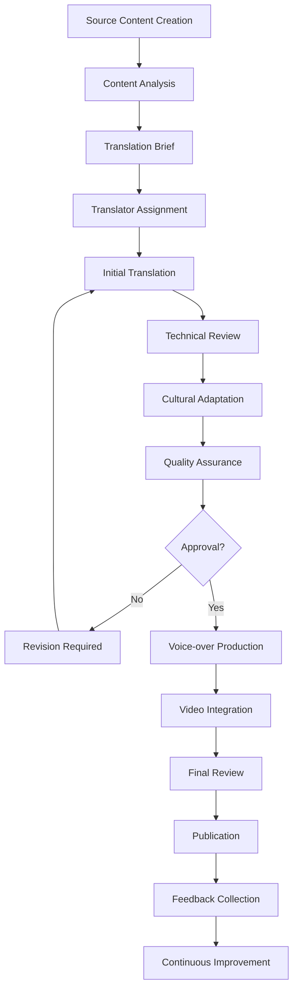

# Multi-Language Video Content Strategies

**Comprehensive guide to creating, managing, and distributing video tutorials in multiple languages for global accessibility.**

## 🌍 Internationalization Overview

Multi-language video content expands the reach of educational materials to global audiences. This guide covers translation workflows, cultural adaptation, technical implementation, and management strategies for maintaining high-quality content across multiple languages.

## 💼 Strategic Planning

### Market Analysis and Language Prioritization

#### 📈 Language Selection Framework
```markdown
**Data-Driven Language Prioritization:**

**Primary Metrics:**
- User demographics and geographic distribution
- Community engagement levels by region
- Developer population statistics
- Economic opportunity assessment

**Language Tier System:**

**Tier 1 (Full Support):**
- English (en-US) - Primary language, 100% content
- Spanish (es-ES, es-MX) - Large developer community
- French (fr-FR) - European market
- German (de-DE) - Technical precision preference
- Portuguese (pt-BR) - Growing South American market
- Japanese (ja-JP) - High-tech adoption
- Chinese Simplified (zh-CN) - Largest developer population

**Tier 2 (Selective Support):**
- Korean (ko-KR) - Advanced technology sector
- Italian (it-IT) - European expansion
- Russian (ru-RU) - Eastern European market
- Hindi (hi-IN) - Growing Indian market
- Arabic (ar-SA) - Middle Eastern expansion

**Tier 3 (Community-Driven):**
- Dutch (nl-NL), Swedish (sv-SE), Norwegian (no-NO)
- Polish (pl-PL), Czech (cs-CZ)
- Thai (th-TH), Vietnamese (vi-VN)
```

#### 🎯 Content Strategy by Language
```javascript
// Language-specific content strategy configuration
const LanguageStrategy = {
  "en-US": {
    role: "primary",
    content_coverage: 100,
    update_frequency: "immediate",
    quality_standard: "source",
    cultural_adaptation: "minimal"
  },
  "es-ES": {
    role: "tier1",
    content_coverage: 90,
    update_frequency: "within_48h",
    quality_standard: "professional_translation",
    cultural_adaptation: "moderate",
    regional_variants: ["es-MX", "es-AR"]
  },
  "zh-CN": {
    role: "tier1",
    content_coverage: 85,
    update_frequency: "within_72h",
    quality_standard: "professional_translation",
    cultural_adaptation: "high",
    special_considerations: [
      "great_firewall_compliance",
      "alternative_hosting",
      "local_platform_integration"
    ]
  },
  "ja-JP": {
    role: "tier1",
    content_coverage: 80,
    update_frequency: "within_week",
    quality_standard: "professional_translation",
    cultural_adaptation: "high",
    special_considerations: [
      "formal_language_preference",
      "detailed_explanations",
      "visual_design_adaptation"
    ]
  }
};

// Priority content selection
const ContentPrioritization = {
  calculateTranslationPriority: (content) => {
    const factors = {
      user_demand: content.viewsByLanguage,
      content_importance: content.learningObjectiveWeight,
      technical_complexity: content.translationDifficulty,
      update_frequency: content.changeRate,
      community_interest: content.communityRequests
    };
    
    return Object.entries(factors).reduce((score, [key, value]) => {
      const weights = {
        user_demand: 0.3,
        content_importance: 0.25,
        technical_complexity: -0.15, // Lower complexity = higher priority
        update_frequency: -0.1,       // Lower frequency = higher priority
        community_interest: 0.3
      };
      
      return score + (value * weights[key]);
    }, 0);
  }
};
```

### Cultural Adaptation Framework

#### 🌎 Cultural Considerations by Region
```markdown
**Regional Adaptation Guidelines:**

**East Asian Markets (China, Japan, Korea):**
- **Communication Style**: More formal, detailed explanations
- **Visual Design**: Clean, minimalist interfaces preferred
- **Learning Approach**: Step-by-step, thorough coverage
- **Technical Preferences**: Comprehensive documentation
- **Cultural Notes**: 
  - Avoid casual tone in professional content
  - Include honorifics where appropriate
  - Consider reading direction (especially for diagrams)

**European Markets (Germany, France, Italy):**
- **Communication Style**: Professional but approachable
- **Visual Design**: Information-dense layouts acceptable
- **Learning Approach**: Theoretical foundation followed by practice
- **Technical Preferences**: Precise technical terminology
- **Cultural Notes**:
  - GDPR compliance for data handling
  - Multi-language keyboard considerations
  - Regional time format preferences

**Latin American Markets (Spain, Mexico, Brazil):**
- **Communication Style**: Warm, conversational tone
- **Visual Design**: Vibrant colors, engaging visuals
- **Learning Approach**: Interactive, community-focused
- **Technical Preferences**: Practical examples over theory
- **Cultural Notes**:
  - Regional dialect variations
  - Economic considerations for tool accessibility
  - Community learning emphasis

**Arabic-Speaking Markets:**
- **Communication Style**: Respectful, formal approach
- **Visual Design**: Right-to-left layout adaptation
- **Learning Approach**: Structured, hierarchical
- **Technical Preferences**: Clear authority and sources
- **Cultural Notes**:
  - RTL text flow requirements
  - Cultural sensitivity in examples
  - Religious considerations for scheduling
```

#### 🎨 Visual Design Adaptation
```css
/* Multi-language design system */
:root {
  /* Base typography scale */
  --font-size-base: 16px;
  --line-height-base: 1.5;
  --font-weight-normal: 400;
  --font-weight-bold: 600;
}

/* Language-specific typography */
[lang="zh-CN"] {
  --font-family: 'Noto Sans SC', 'PingFang SC', 'Hiragino Sans GB', sans-serif;
  --font-size-base: 14px; /* Smaller base size for Chinese */
  --line-height-base: 1.6; /* More line spacing */
  --letter-spacing: 0.05em;
}

[lang="ja-JP"] {
  --font-family: 'Noto Sans JP', 'Hiragino Kaku Gothic ProN', sans-serif;
  --font-size-base: 15px;
  --line-height-base: 1.7; /* Extra spacing for mixed scripts */
  --font-weight-normal: 300; /* Lighter weight for readability */
}

[lang="ar-SA"] {
  --font-family: 'Noto Sans Arabic', 'Tahoma', sans-serif;
  --font-size-base: 16px;
  --line-height-base: 1.8; /* Extra spacing for Arabic script */
  direction: rtl;
  text-align: right;
}

[lang="de-DE"] {
  --font-family: 'Inter', 'Segoe UI', sans-serif;
  --font-size-base: 16px;
  --line-height-base: 1.4; /* Tighter for longer German words */
  word-break: break-word; /* Handle compound words */
}

/* RTL layout adaptations */
[dir="rtl"] .video-controls {
  flex-direction: row-reverse;
}

[dir="rtl"] .progress-bar {
  transform: scaleX(-1);
}

[dir="rtl"] .chapter-navigation {
  text-align: right;
}

[dir="rtl"] .video-overlay-text {
  right: auto;
  left: 20px;
  text-align: right;
}

/* Language-specific UI adjustments */
.tutorial-title {
  font-size: clamp(1.5rem, 4vw, 2.5rem);
}

[lang="zh-CN"] .tutorial-title,
[lang="ja-JP"] .tutorial-title {
  font-size: clamp(1.25rem, 3.5vw, 2rem); /* Smaller for CJK */
}

[lang="de-DE"] .tutorial-title {
  font-size: clamp(1.25rem, 3vw, 2rem); /* Account for longer German titles */
  hyphens: auto;
}
```

## 📝 Translation Workflow

### Professional Translation Process

#### 👥 Translation Team Structure
```markdown
**Role Definitions:**

**Translation Manager:**
- Coordinate translation projects
- Manage translator assignments
- Ensure quality and consistency
- Handle client communication

**Technical Translators:**
- Native speaker proficiency
- Technical background in software development
- Experience with developer tools and terminology
- Understanding of educational content

**Cultural Consultants:**
- Local market expertise
- Cultural adaptation guidance
- Regional preference insights
- Educational approach recommendations

**Quality Assurance Reviewers:**
- Bilingual proficiency
- Technical accuracy verification
- Cultural appropriateness review
- Consistency checking

**Audio Production Specialists:**
- Native speaker voice talent
- Audio engineering expertise
- Cultural pronunciation guidance
- Quality control for dubbed content
```

#### 🔄 Translation Workflow Steps


#### 📜 Translation Brief Template
```markdown
**Translation Project Brief**

**Project Information:**
- Tutorial Title: [English title]
- Duration: [Video length]
- Target Language: [Language and region]
- Deadline: [Completion date]
- Priority Level: [High/Medium/Low]

**Content Details:**
- Topic: [Subject matter]
- Audience Level: [Beginner/Intermediate/Advanced]
- Technical Complexity: [Scale 1-5]
- Key Terminology: [List of technical terms]

**Translation Requirements:**
- **Style Guide**: [Link to language-specific style guide]
- **Tone**: [Formal/Conversational/Educational]
- **Cultural Adaptation**: [Minimal/Moderate/Extensive]
- **Technical Accuracy**: [Critical/Important/Standard]

**Deliverables:**
- [ ] Translated script with timestamps
- [ ] Cultural adaptation notes
- [ ] Technical terminology glossary
- [ ] Voice-over production notes
- [ ] Caption/subtitle files

**Reference Materials:**
- Source video file
- English script and captions
- Previous translation examples
- Brand guidelines
- Technical documentation

**Quality Criteria:**
- Accuracy: Technical information correctly translated
- Clarity: Instructions easy to follow
- Cultural fit: Appropriate for target audience
- Consistency: Terminology aligned with glossary
- Timing: Synchronization with video content
```

### Technical Implementation

#### 📁 File Management System
```javascript
// Translation file management system
class TranslationManager {
  constructor() {
    this.languages = new Map();
    this.glossaries = new Map();
    this.versions = new Map();
  }
  
  initializeLanguage(languageCode, config) {
    this.languages.set(languageCode, {
      name: config.name,
      nativeName: config.nativeName,
      direction: config.direction || 'ltr',
      status: 'active',
      translators: config.translators || [],
      qualityReviewers: config.reviewers || [],
      lastUpdated: Date.now()
    });
    
    // Initialize empty glossary
    this.glossaries.set(languageCode, new Map());
  }
  
  addTranslation(tutorialId, languageCode, translationData) {
    const key = `${tutorialId}_${languageCode}`;
    
    const translation = {
      tutorialId,
      languageCode,
      title: translationData.title,
      description: translationData.description,
      script: translationData.script,
      captions: translationData.captions,
      metadata: {
        translator: translationData.translator,
        reviewer: translationData.reviewer,
        createdAt: Date.now(),
        lastModified: Date.now(),
        version: this.getNextVersion(key),
        status: 'draft'
      },
      culturalNotes: translationData.culturalNotes || [],
      technicalTerms: translationData.technicalTerms || []
    };
    
    this.versions.set(key, translation);
    return translation;
  }
  
  updateGlossary(languageCode, terms) {
    const glossary = this.glossaries.get(languageCode);
    
    terms.forEach(term => {
      glossary.set(term.english.toLowerCase(), {
        translation: term.translation,
        context: term.context,
        alternates: term.alternates || [],
        notes: term.notes || '',
        lastUpdated: Date.now()
      });
    });
  }
  
  validateTranslation(tutorialId, languageCode) {
    const key = `${tutorialId}_${languageCode}`;
    const translation = this.versions.get(key);
    
    if (!translation) {
      throw new Error('Translation not found');
    }
    
    const validationResults = {
      technicalAccuracy: this.validateTechnicalTerms(translation),
      completeness: this.validateCompleteness(translation),
      synchronization: this.validateTimingSync(translation),
      culturalFit: this.validateCulturalAdaptation(translation),
      overall: 'pending'
    };
    
    validationResults.overall = this.calculateOverallScore(validationResults);
    
    return validationResults;
  }
  
  exportForProduction(tutorialId, languageCode) {
    const translation = this.versions.get(`${tutorialId}_${languageCode}`);
    
    if (!translation || translation.metadata.status !== 'approved') {
      throw new Error('Translation not ready for production');
    }
    
    return {
      video: {
        language: languageCode,
        title: translation.title,
        description: translation.description,
        metadata: this.generateVideoMetadata(translation)
      },
      captions: this.generateWebVTT(translation.captions, languageCode),
      audio: {
        script: translation.script,
        timings: this.extractTimings(translation.script),
        pronunciationGuide: this.generatePronunciationGuide(translation)
      }
    };
  }
}

// Usage example
const translationManager = new TranslationManager();

// Initialize Spanish translation support
translationManager.initializeLanguage('es-ES', {
  name: 'Spanish (Spain)',
  nativeName: 'Español (España)',
  direction: 'ltr',
  translators: ['maria.rodriguez@example.com'],
  reviewers: ['carlos.garcia@example.com']
});

// Add translation
const spanishTranslation = translationManager.addTranslation('claude-flow-setup', 'es-ES', {
  title: 'Configuración del Entorno de Desarrollo Claude Flow',
  description: 'Aprende a configurar tu entorno de desarrollo...',
  script: '/* Translated script with timestamps */',
  captions: '/* WebVTT format captions */',
  translator: 'maria.rodriguez@example.com',
  culturalNotes: [
    'Use formal "usted" for professional tone',
    'Adapt examples to European Spanish terminology'
  ]
});
```

#### 🔄 Automated Translation Integration
```javascript
// AI-assisted translation workflow
class AITranslationAssistant {
  constructor(apiKey, model = 'gpt-4') {
    this.apiKey = apiKey;
    this.model = model;
    this.glossaries = new Map();
  }
  
  async generateInitialTranslation(sourceText, targetLanguage, context) {
    const prompt = this.buildTranslationPrompt(sourceText, targetLanguage, context);
    
    const response = await fetch('https://api.openai.com/v1/chat/completions', {
      method: 'POST',
      headers: {
        'Authorization': `Bearer ${this.apiKey}`,
        'Content-Type': 'application/json'
      },
      body: JSON.stringify({
        model: this.model,
        messages: [{
          role: 'system',
          content: 'You are a professional technical translator specializing in developer education content.'
        }, {
          role: 'user',
          content: prompt
        }],
        temperature: 0.3 // Lower temperature for more consistent translations
      })
    });
    
    const result = await response.json();
    return this.parseTranslationResponse(result.choices[0].message.content);
  }
  
  buildTranslationPrompt(sourceText, targetLanguage, context) {
    const glossary = this.glossaries.get(targetLanguage) || new Map();
    const glossaryText = Array.from(glossary.entries())
      .map(([term, translation]) => `"${term}" -> "${translation}"`)
      .join('\n');
    
    return `
Translate the following technical tutorial content from English to ${targetLanguage}.

Context: ${context.type} tutorial for ${context.audience} level
Tone: ${context.tone}
Technical Domain: ${context.domain}

Required terminology (use these exact translations):
${glossaryText}

Content to translate:
${sourceText}

Requirements:
1. Maintain technical accuracy
2. Preserve timing markers [HH:MM:SS]
3. Adapt cultural references appropriately
4. Use consistent terminology from the glossary
5. Maintain professional but accessible tone
6. Include translation notes for any cultural adaptations

Format the response as:
===TRANSLATION===
[translated content]
===NOTES===
[any cultural adaptation notes]
===TERMINOLOGY===
[any new technical terms discovered]
`;
  }
  
  async validateTechnicalAccuracy(original, translated, language) {
    const validationPrompt = `
Validate the technical accuracy of this translation:

Original (English): ${original}
Translated (${language}): ${translated}

Check for:
1. Technical term accuracy
2. Command/code preservation
3. Logical flow maintenance
4. Cultural appropriateness

Provide a score (1-10) and list any issues found.
`;
    
    // Implementation for validation API call
    // Return validation results
  }
  
  async suggestImprovements(translatedText, targetLanguage, feedback) {
    const improvementPrompt = `
Improve this ${targetLanguage} translation based on feedback:

Current translation: ${translatedText}
Feedback received: ${feedback}

Provide:
1. Improved translation
2. Explanation of changes
3. Alternative options
`;
    
    // Implementation for improvement suggestions
  }
}
```

## 🎥 Multi-Language Video Production

### Voice-Over Production Workflow

#### 🎤 Voice Talent Management
```markdown
**Voice Talent Selection Criteria:**

**Technical Requirements:**
- Native speaker proficiency
- Clear, professional speaking voice
- Experience with technical content
- Consistent pronunciation and pacing
- High-quality recording equipment

**Cultural Fit:**
- Understanding of target market preferences
- Appropriate accent/dialect for region
- Professional demeanor suitable for educational content
- Ability to convey enthusiasm for technology

**Production Capabilities:**
- Home studio setup or access to professional studio
- Ability to follow timing and synchronization requirements
- Experience with retakes and script revisions
- Reliable scheduling and communication

**Voice Talent Database Structure:**
```javascript
const VoiceTalentDatabase = {
  "maria-rodriguez-es": {
    name: "Maria Rodriguez",
    languages: ["es-ES", "es-MX"],
    specializations: ["technical", "educational"],
    voice_characteristics: {
      tone: "warm and professional",
      pace: "moderate",
      age_range: "25-35",
      accent: "neutral Spanish"
    },
    technical_setup: {
      microphone: "Shure SM7B",
      audio_interface: "Focusrite Scarlett 2i2",
      recording_environment: "treated home studio",
      delivery_format: "48kHz WAV"
    },
    availability: {
      timezone: "CET",
      hours_per_week: 20,
      lead_time: "48 hours",
      emergency_availability: true
    },
    portfolio: [
      "claude-flow-intro-es.mp3",
      "setup-tutorial-es.mp3"
    ],
    rates: {
      per_minute: 25,
      per_project: 200,
      rush_multiplier: 1.5
    }
  }
};
```
```

#### 🎬 Production Pipeline
```javascript
// Voice-over production management system
class VoiceOverProduction {
  constructor() {
    this.projects = new Map();
    this.talents = new Map();
    this.recordings = new Map();
  }
  
  createVoiceOverProject(tutorialId, languageCode, scriptData) {
    const projectId = `${tutorialId}_${languageCode}_vo`;
    
    const project = {
      id: projectId,
      tutorialId,
      languageCode,
      script: scriptData,
      status: 'pending_assignment',
      created: Date.now(),
      timeline: this.calculateTimeline(scriptData),
      requirements: this.generateRequirements(scriptData, languageCode)
    };
    
    this.projects.set(projectId, project);
    return project;
  }
  
  assignVoiceTalent(projectId, talentId) {
    const project = this.projects.get(projectId);
    const talent = this.talents.get(talentId);
    
    if (!project || !talent) {
      throw new Error('Project or talent not found');
    }
    
    // Verify talent can handle the language and timeline
    if (!talent.languages.includes(project.languageCode)) {
      throw new Error('Talent does not support required language');
    }
    
    project.assignedTalent = talentId;
    project.status = 'assigned';
    project.estimatedDelivery = Date.now() + talent.lead_time;
    
    this.sendAssignmentNotification(project, talent);
    return project;
  }
  
  generateRecordingScript(projectId) {
    const project = this.projects.get(projectId);
    const script = project.script;
    
    return {
      metadata: {
        project_id: projectId,
        language: project.languageCode,
        total_duration: script.estimated_duration,
        segment_count: script.segments.length
      },
      recording_instructions: {
        pace: 'moderate, allowing for comprehension',
        tone: 'professional but approachable',
        pronunciation: 'clear enunciation of technical terms',
        pauses: 'natural breathing pauses, extended at section breaks'
      },
      segments: script.segments.map((segment, index) => ({
        segment_id: `seg_${index + 1}`,
        start_time: segment.start_time,
        end_time: segment.end_time,
        text: segment.text,
        notes: segment.voice_notes || '',
        pronunciation_guide: this.generatePronunciationGuide(
          segment.text, 
          project.languageCode
        )
      }))
    };
  }
  
  processRecordingDelivery(projectId, audioFiles, metadata) {
    const project = this.projects.get(projectId);
    
    const recording = {
      projectId,
      files: audioFiles,
      metadata,
      received: Date.now(),
      status: 'processing',
      quality_checks: {
        audio_levels: null,
        background_noise: null,
        sync_accuracy: null,
        pronunciation: null
      }
    };
    
    this.recordings.set(projectId, recording);
    
    // Start automated quality checks
    this.runQualityChecks(recording);
    
    return recording;
  }
  
  async runQualityChecks(recording) {
    // Audio level analysis
    recording.quality_checks.audio_levels = await this.analyzeAudioLevels(
      recording.files.main_audio
    );
    
    // Background noise detection
    recording.quality_checks.background_noise = await this.detectBackgroundNoise(
      recording.files.main_audio
    );
    
    // Synchronization check with original timing
    recording.quality_checks.sync_accuracy = await this.checkSynchronization(
      recording.files.main_audio,
      recording.projectId
    );
    
    // Pronunciation verification (if available)
    if (recording.files.pronunciation_guide) {
      recording.quality_checks.pronunciation = await this.verifyPronunciation(
        recording.files.main_audio,
        recording.files.pronunciation_guide
      );
    }
    
    // Update status based on quality checks
    const overallQuality = this.calculateOverallQuality(recording.quality_checks);
    
    if (overallQuality >= 0.85) {
      recording.status = 'approved';
      this.processForIntegration(recording);
    } else {
      recording.status = 'revision_required';
      this.requestRevisions(recording);
    }
  }
}
```

### Multi-Language Video Integration

#### 🎥 Video Assembly Pipeline
```javascript
// Multi-language video assembly system
class MultiLanguageVideoAssembler {
  constructor() {
    this.templates = new Map();
    this.assets = new Map();
    this.renderers = new Map();
  }
  
  createLanguageVariant(baseVideoId, languageCode, assets) {
    const variantId = `${baseVideoId}_${languageCode}`;
    
    const variant = {
      id: variantId,
      baseVideoId,
      languageCode,
      assets: {
        video: assets.originalVideo,
        audio: assets.voiceOver,
        captions: assets.captions,
        graphics: assets.localizedGraphics || null
      },
      metadata: {
        title: assets.metadata.title,
        description: assets.metadata.description,
        tags: assets.metadata.tags,
        thumbnail: assets.metadata.thumbnail
      },
      status: 'processing',
      created: Date.now()
    };
    
    this.processLanguageVariant(variant);
    return variant;
  }
  
  async processLanguageVariant(variant) {
    try {
      // Step 1: Prepare audio track
      const audioTrack = await this.prepareAudioTrack(variant.assets.audio);
      
      // Step 2: Generate captions track
      const captionsTrack = await this.prepareCaptionsTrack(variant.assets.captions);
      
      // Step 3: Localize graphics if needed
      const graphicsTrack = await this.localizeGraphics(
        variant.baseVideoId,
        variant.languageCode,
        variant.assets.graphics
      );
      
      // Step 4: Compose final video
      const finalVideo = await this.composeVideo({
        base: variant.assets.video,
        audio: audioTrack,
        captions: captionsTrack,
        graphics: graphicsTrack,
        language: variant.languageCode
      });
      
      // Step 5: Generate multiple formats
      const formats = await this.generateMultipleFormats(finalVideo, variant.languageCode);
      
      variant.outputs = formats;
      variant.status = 'completed';
      
      // Step 6: Upload to distribution platforms
      await this.distributeToplatforms(variant);
      
    } catch (error) {
      variant.status = 'failed';
      variant.error = error.message;
      console.error(`Failed to process variant ${variant.id}:`, error);
    }
  }
  
  async localizeGraphics(baseVideoId, languageCode, customGraphics) {
    const baseGraphics = this.assets.get(`${baseVideoId}_graphics`);
    
    if (customGraphics) {
      return customGraphics; // Use provided localized graphics
    }
    
    // Auto-generate localized graphics
    const localizedGraphics = await Promise.all(
      baseGraphics.elements.map(async (element) => {
        if (element.type === 'text') {
          return await this.translateGraphicText(element, languageCode);
        } else if (element.type === 'ui_mockup') {
          return await this.localizeUIElements(element, languageCode);
        }
        return element; // Return unchanged for non-text elements
      })
    );
    
    return { elements: localizedGraphics };
  }
  
  async generateMultipleFormats(video, languageCode) {
    const formats = {
      youtube: {
        resolution: '1920x1080',
        framerate: 30,
        codec: 'h264',
        bitrate: '8000k',
        audio_codec: 'aac',
        audio_bitrate: '192k'
      },
      web: {
        resolution: '1280x720',
        framerate: 30,
        codec: 'h264',
        bitrate: '4000k',
        audio_codec: 'aac',
        audio_bitrate: '128k'
      },
      mobile: {
        resolution: '854x480',
        framerate: 30,
        codec: 'h264',
        bitrate: '2000k',
        audio_codec: 'aac',
        audio_bitrate: '96k'
      }
    };
    
    const renderedFormats = {};
    
    for (const [formatName, specs] of Object.entries(formats)) {
      renderedFormats[formatName] = await this.renderVideo(video, specs, {
        language: languageCode,
        format: formatName
      });
    }
    
    return renderedFormats;
  }
}
```

## 📁 Content Management and Distribution

### Multi-Language CMS Integration

#### 📋 Content Organization Strategy
```javascript
// Multi-language content management system
class MultiLanguageCMS {
  constructor() {
    this.content = new Map();
    this.languages = new Map();
    this.relationships = new Map();
  }
  
  createContentStructure(baseContentId, metadata) {
    const structure = {
      baseId: baseContentId,
      type: metadata.type,
      category: metadata.category,
      versions: new Map(),
      relationships: {
        prerequisites: metadata.prerequisites || [],
        next_steps: metadata.nextSteps || [],
        related: metadata.related || []
      },
      analytics: {
        views_by_language: new Map(),
        completion_rates: new Map(),
        user_feedback: new Map()
      },
      created: Date.now(),
      lastUpdated: Date.now()
    };
    
    this.content.set(baseContentId, structure);
    return structure;
  }
  
  addLanguageVersion(baseContentId, languageCode, versionData) {
    const content = this.content.get(baseContentId);
    
    if (!content) {
      throw new Error('Base content not found');
    }
    
    const languageVersion = {
      languageCode,
      title: versionData.title,
      description: versionData.description,
      slug: this.generateSlug(versionData.title, languageCode),
      content_url: versionData.contentUrl,
      captions_url: versionData.captionsUrl,
      transcript_url: versionData.transcriptUrl,
      thumbnail_url: versionData.thumbnailUrl,
      duration: versionData.duration,
      status: versionData.status || 'draft',
      metadata: {
        translator: versionData.translator,
        reviewer: versionData.reviewer,
        voice_talent: versionData.voiceTalent,
        created: Date.now(),
        lastModified: Date.now(),
        version: 1
      },
      seo: {
        meta_title: versionData.metaTitle || versionData.title,
        meta_description: versionData.metaDescription || versionData.description,
        keywords: versionData.keywords || [],
        structured_data: this.generateStructuredData(versionData, languageCode)
      }
    };
    
    content.versions.set(languageCode, languageVersion);
    content.lastUpdated = Date.now();
    
    return languageVersion;
  }
  
  generateStructuredData(content, languageCode) {
    return {
      "@context": "https://schema.org",
      "@type": "VideoObject",
      "name": content.title,
      "description": content.description,
      "thumbnailUrl": content.thumbnailUrl,
      "uploadDate": new Date(content.created).toISOString(),
      "duration": `PT${Math.floor(content.duration / 60)}M${content.duration % 60}S`,
      "inLanguage": languageCode,
      "learningResourceType": "Tutorial",
      "educationalLevel": content.difficulty || "Beginner",
      "audience": {
        "@type": "Audience",
        "audienceType": "Developers"
      },
      "publisher": {
        "@type": "Organization",
        "name": "Claude Flow Tutorials",
        "url": "https://tutorials.claude-flow.com"
      }
    };
  }
  
  getContentByLanguage(baseContentId, languageCode, fallbackLanguage = 'en-US') {
    const content = this.content.get(baseContentId);
    
    if (!content) {
      return null;
    }
    
    // Try to get content in requested language
    let version = content.versions.get(languageCode);
    
    // Fall back to fallback language if not available
    if (!version && fallbackLanguage) {
      version = content.versions.get(fallbackLanguage);
    }
    
    // Fall back to any available language
    if (!version) {
      const availableLanguages = Array.from(content.versions.keys());
      if (availableLanguages.length > 0) {
        version = content.versions.get(availableLanguages[0]);
      }
    }
    
    return {
      base: content,
      version: version,
      availableLanguages: Array.from(content.versions.keys()),
      isRequestedLanguage: version && version.languageCode === languageCode
    };
  }
}
```

### Platform-Specific Distribution

#### 📺 YouTube Multi-Language Strategy
```javascript
// YouTube multi-language distribution
class YouTubeMultiLanguageDistribution {
  constructor(apiKey) {
    this.apiKey = apiKey;
    this.channels = new Map();
  }
  
  setupLanguageChannels(strategy = 'unified') {
    const strategies = {
      unified: {
        // Single channel with multi-language playlists
        structure: 'single_channel',
        naming: 'Claude Flow Tutorials',
        playlists: 'language_based'
      },
      separated: {
        // Separate channels for each language
        structure: 'multiple_channels',
        naming: 'Claude Flow [Language]',
        playlists: 'topic_based'
      },
      hybrid: {
        // Main English channel + major language channels
        structure: 'hybrid',
        naming: 'conditional',
        playlists: 'mixed'
      }
    };
    
    return strategies[strategy];
  }
  
  async uploadLanguageVariant(videoData, languageConfig) {
    const uploadData = {
      snippet: {
        title: this.optimizeTitle(videoData.title, languageConfig.code),
        description: this.buildDescription(videoData, languageConfig),
        tags: this.localizeTagsForSEO(videoData.tags, languageConfig),
        categoryId: '27', // Education category
        defaultLanguage: languageConfig.code,
        defaultAudioLanguage: languageConfig.code
      },
      status: {
        privacyStatus: 'public',
        publishAt: videoData.scheduledPublishTime
      },
      localizations: this.generateLocalizations(videoData)
    };
    
    // Upload video file
    const upload = await this.uploadVideo(videoData.file, uploadData);
    
    // Add to appropriate playlists
    await this.addToPlaylists(upload.id, languageConfig);
    
    // Set thumbnail
    if (videoData.thumbnail) {
      await this.setThumbnail(upload.id, videoData.thumbnail);
    }
    
    // Add captions
    if (videoData.captions) {
      await this.uploadCaptions(upload.id, videoData.captions, languageConfig.code);
    }
    
    return upload;
  }
  
  buildDescription(videoData, languageConfig) {
    const templates = {
      'en-US': `
{description}

🔗 Useful Links:
• Documentation: {docsUrl}
• GitHub Repository: {githubUrl}
• Community Discord: {discordUrl}

📋 Chapters:
{chapters}

🌍 Available in other languages:
{languageLinks}

#ClaudeFlow #DevTutorials #Programming
`,
      'es-ES': `
{description}

🔗 Enlaces útiles:
• Documentación: {docsUrl}
• Repositorio GitHub: {githubUrl}
• Discord de la comunidad: {discordUrl}

📋 Capítulos:
{chapters}

🌍 Disponible en otros idiomas:
{languageLinks}

#ClaudeFlow #TutorialesDesarrollo #Programación
`,
      'zh-CN': `
{description}

🔗 有用链接：
• 文档：{docsUrl}
• GitHub 仓库：{githubUrl}
• 社区 Discord：{discordUrl}

📋 章节：
{chapters}

🌍 其他语言版本：
{languageLinks}

#ClaudeFlow #开发教程 #编程
`
    };
    
    const template = templates[languageConfig.code] || templates['en-US'];
    
    return template
      .replace('{description}', videoData.description)
      .replace('{docsUrl}', videoData.links.documentation)
      .replace('{githubUrl}', videoData.links.github)
      .replace('{discordUrl}', videoData.links.discord)
      .replace('{chapters}', this.formatChapters(videoData.chapters, languageConfig))
      .replace('{languageLinks}', this.generateLanguageLinks(videoData.baseId));
  }
}
```

## 📊 Analytics and Performance Tracking

### Multi-Language Analytics Framework

#### 📈 Language Performance Metrics
```javascript
// Multi-language analytics tracking
class MultiLanguageAnalytics {
  constructor() {
    this.metrics = new Map();
    this.comparisons = new Map();
  }
  
  trackLanguagePerformance(contentId, languageCode, metrics) {
    const key = `${contentId}_${languageCode}`;
    
    const performanceData = {
      contentId,
      languageCode,
      metrics: {
        views: metrics.views || 0,
        completionRate: metrics.completionRate || 0,
        engagement: metrics.engagement || 0,
        averageViewDuration: metrics.averageViewDuration || 0,
        likes: metrics.likes || 0,
        comments: metrics.comments || 0,
        shares: metrics.shares || 0,
        subscribersGained: metrics.subscribersGained || 0
      },
      demographics: {
        ageGroups: metrics.demographics.ageGroups || {},
        genderDistribution: metrics.demographics.genderDistribution || {},
        geographicDistribution: metrics.demographics.geographic || {},
        deviceTypes: metrics.demographics.devices || {}
      },
      timestamp: Date.now()
    };
    
    this.metrics.set(key, performanceData);
    this.updateComparisons(contentId, languageCode, performanceData);
    
    return performanceData;
  }
  
  generateLanguageComparison(contentId) {
    const allLanguages = Array.from(this.metrics.keys())
      .filter(key => key.startsWith(`${contentId}_`))
      .map(key => {
        const languageCode = key.split('_')[1];
        return this.metrics.get(key);
      });
    
    if (allLanguages.length === 0) {
      return null;
    }
    
    const comparison = {
      contentId,
      totalLanguages: allLanguages.length,
      baseline: allLanguages.find(lang => lang.languageCode === 'en-US'),
      performance: allLanguages.map(lang => ({
        language: lang.languageCode,
        relativePerformance: this.calculateRelativePerformance(lang, allLanguages),
        strengths: this.identifyStrengths(lang, allLanguages),
        weaknesses: this.identifyWeaknesses(lang, allLanguages),
        recommendations: this.generateRecommendations(lang, allLanguages)
      }))
    };
    
    return comparison;
  }
  
  calculateRelativePerformance(language, allLanguages) {
    const averages = this.calculateAverages(allLanguages);
    
    return {
      views: (language.metrics.views / averages.views) * 100,
      completion: (language.metrics.completionRate / averages.completionRate) * 100,
      engagement: (language.metrics.engagement / averages.engagement) * 100,
      overall: this.calculateOverallScore(language, averages)
    };
  }
  
  identifyGrowthOpportunities() {
    const opportunities = [];
    
    // Analyze underperforming languages
    this.metrics.forEach((data, key) => {
      const [contentId, languageCode] = key.split('_');
      const comparison = this.generateLanguageComparison(contentId);
      
      if (comparison) {
        const langPerf = comparison.performance.find(p => p.language === languageCode);
        
        if (langPerf.relativePerformance.overall < 70) {
          opportunities.push({
            type: 'underperforming_language',
            contentId,
            languageCode,
            currentPerformance: langPerf.relativePerformance.overall,
            recommendations: langPerf.recommendations
          });
        }
      }
    });
    
    // Identify high-demand languages without content
    const missingLanguages = this.identifyMissingLanguages();
    opportunities.push(...missingLanguages);
    
    return opportunities.sort((a, b) => b.priority - a.priority);
  }
  
  generateROIAnalysis(languageCode, period = 'monthly') {
    const languageMetrics = Array.from(this.metrics.values())
      .filter(metric => metric.languageCode === languageCode);
    
    if (languageMetrics.length === 0) {
      return null;
    }
    
    const costs = {
      translation: this.getTranslationCosts(languageCode, period),
      voiceOver: this.getVoiceOverCosts(languageCode, period),
      production: this.getProductionCosts(languageCode, period),
      distribution: this.getDistributionCosts(languageCode, period)
    };
    
    const totalCosts = Object.values(costs).reduce((sum, cost) => sum + cost, 0);
    
    const benefits = {
      viewerGrowth: this.calculateViewerGrowth(languageMetrics),
      engagement: this.calculateEngagementValue(languageMetrics),
      conversion: this.calculateConversionValue(languageMetrics),
      brandAwareness: this.calculateBrandValue(languageMetrics)
    };
    
    const totalBenefits = Object.values(benefits).reduce((sum, benefit) => sum + benefit, 0);
    
    return {
      language: languageCode,
      period,
      costs,
      benefits,
      roi: ((totalBenefits - totalCosts) / totalCosts) * 100,
      paybackPeriod: this.calculatePaybackPeriod(costs, benefits),
      recommendation: this.generateROIRecommendation(totalCosts, totalBenefits)
    };
  }
}
```

---

## 🚀 Quick Start

**Planning multi-language content?** Start with [Language Prioritization](./language-prioritization.md) and [Cultural Adaptation Guide](./cultural-adaptation.md).

**Setting up translation workflows?** Review [Translation Management](./translation-management.md) and [Quality Assurance](./quality-assurance.md).

**Ready for production?** Check [Voice-Over Production](./voice-over-production.md) and [Distribution Strategies](./distribution-strategies.md).

---

*Multi-language content significantly expands your tutorial reach. Start with high-impact languages and build systematic workflows for quality and consistency.*